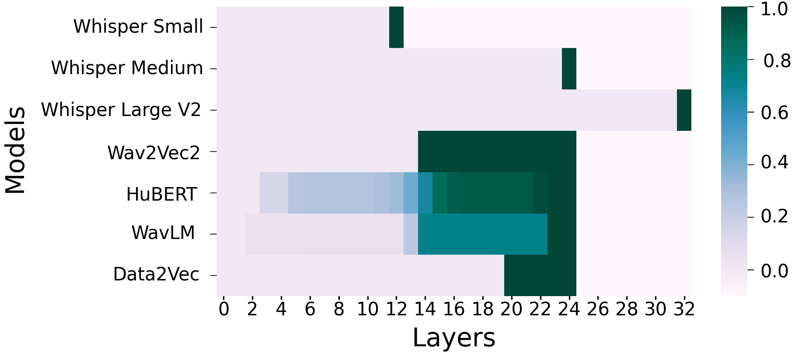

# 医疗领域中的零-shot 端到端口语问答挑战

发布时间：2024年06月09日

`LLM应用

这篇论文探讨了在口语问答（SQA）领域中，大型语言模型（LLMs）的整合及其在医疗领域的应用。特别是，它介绍了一种创新的零-shot SQA策略，并通过端到端（E2E）方法在资源消耗和准确率方面与传统级联系统进行了比较。这种应用层面的研究展示了LLM在特定领域（如医疗）的实际应用效果和效率提升，因此属于LLM应用分类。` `语音识别`

> Zero-Shot End-To-End Spoken Question Answering In Medical Domain

# 摘要

> 在口语问答（SQA）领域迅速演变的背景下，大型语言模型（LLMs）的整合已成为一项革命性的进步。传统方法常需分别使用模型处理音频转录和答案选择，导致资源消耗和错误累积。为此，我们探索了在医疗领域采用端到端（E2E）方法进行SQA的效能。本研究推出了一种创新的零-shot SQA策略，与传统级联系统相较。通过在一个包含8项医疗任务和48小时合成音频的新开放基准上进行全面评估，我们发现，与结合了13亿参数LLM和15.5亿参数ASR模型的系统相比，我们的方法资源需求降低了14.7倍，同时平均准确率提升了0.5%。这些成果凸显了在资源有限的环境下，E2E方法在SQA领域的巨大潜力。

> In the rapidly evolving landscape of spoken question-answering (SQA), the integration of large language models (LLMs) has emerged as a transformative development. Conventional approaches often entail the use of separate models for question audio transcription and answer selection, resulting in significant resource utilization and error accumulation. To tackle these challenges, we explore the effectiveness of end-to-end (E2E) methodologies for SQA in the medical domain. Our study introduces a novel zero-shot SQA approach, compared to traditional cascade systems. Through a comprehensive evaluation conducted on a new open benchmark of 8 medical tasks and 48 hours of synthetic audio, we demonstrate that our approach requires up to 14.7 times fewer resources than a combined 1.3B parameters LLM with a 1.55B parameters ASR model while improving average accuracy by 0.5\%. These findings underscore the potential of E2E methodologies for SQA in resource-constrained contexts.

[Arxiv](https://arxiv.org/abs/2406.05876)