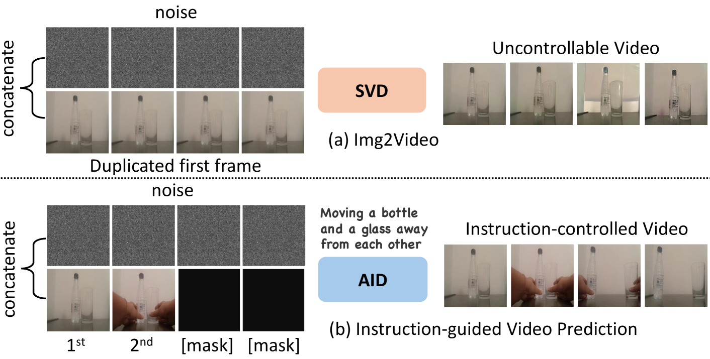
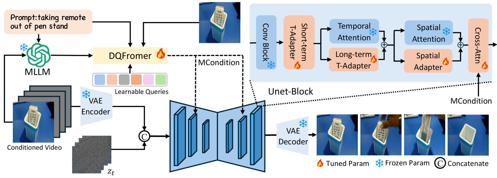
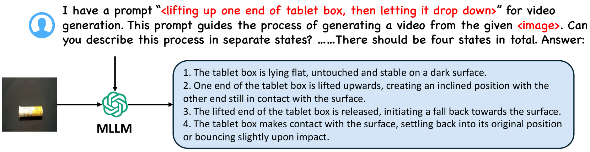
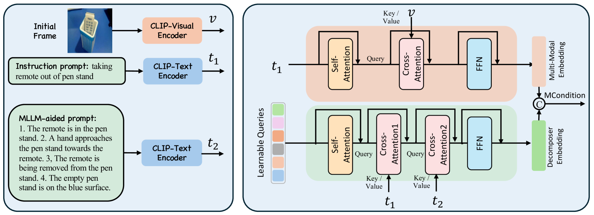
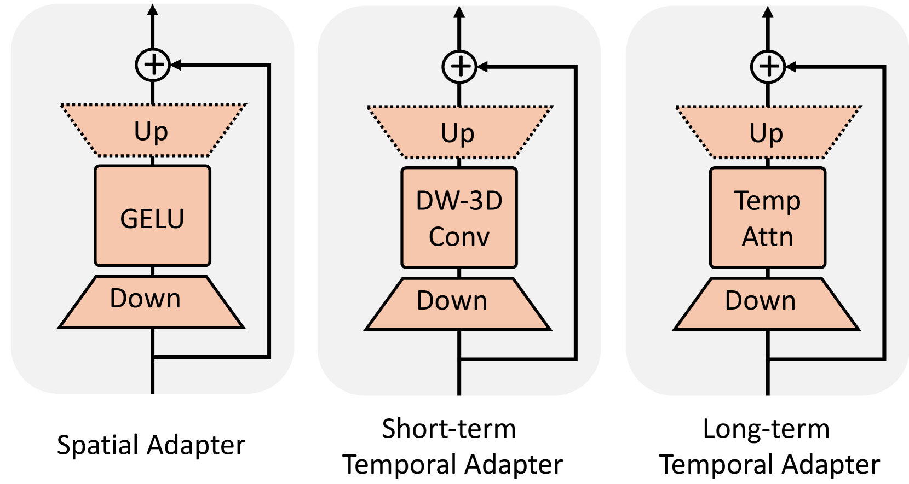

# AID：指令引导下的图像到视频扩散模型适应性预测

发布时间：2024年06月10日

`Agent

理由：这篇论文主要介绍了一种新的技术——文本引导的视频预测（TVP），并引入了多模态大型语言模型（MLLM）和双查询变换器（DQFormer）架构来改进视频预测的控制和一致性。这种方法可以被视为一个智能Agent，因为它能够根据指令（文本输入）来预测和生成视频内容，这在虚拟现实、机器人和内容创作等领域具有广泛的应用。因此，这篇论文更符合Agent分类，而不是RAG、LLM应用或LLM理论。` `虚拟现实` `内容创作`

> AID: Adapting Image2Video Diffusion Models for Instruction-guided Video Prediction

# 摘要

> 文本引导的视频预测（TVP）技术，根据指令从初始帧预测未来帧的运动，广泛应用于虚拟现实、机器人和内容创作。尽管先前的TVP方法通过稳定扩散模型取得了突破，但帧一致性和时间稳定性仍受限于视频数据集的规模。我们发现，预训练的Image2Video扩散模型虽对视频动态有良好先验，却缺乏文本控制。因此，将这些模型转移，同时注入指令控制以生成可控视频，是一项既意义重大又充满挑战的任务。为此，我们引入了多模态大型语言模型（MLLM），并设计了双查询变换器（DQFormer）架构，将指令与帧融合，预测未来帧。我们还开发了时间与空间适配器，以低成本快速适应特定场景。实验证明，我们的方法在四个数据集上超越了现有技术，特别是在Bridge和SSv2上分别实现了显著的FVD改进。更多详情，请访问我们的网站https://chenhsing.github.io/AID。

> Text-guided video prediction (TVP) involves predicting the motion of future frames from the initial frame according to an instruction, which has wide applications in virtual reality, robotics, and content creation. Previous TVP methods make significant breakthroughs by adapting Stable Diffusion for this task. However, they struggle with frame consistency and temporal stability primarily due to the limited scale of video datasets. We observe that pretrained Image2Video diffusion models possess good priors for video dynamics but they lack textual control. Hence, transferring Image2Video models to leverage their video dynamic priors while injecting instruction control to generate controllable videos is both a meaningful and challenging task. To achieve this, we introduce the Multi-Modal Large Language Model (MLLM) to predict future video states based on initial frames and text instructions. More specifically, we design a dual query transformer (DQFormer) architecture, which integrates the instructions and frames into the conditional embeddings for future frame prediction. Additionally, we develop Long-Short Term Temporal Adapters and Spatial Adapters that can quickly transfer general video diffusion models to specific scenarios with minimal training costs. Experimental results show that our method significantly outperforms state-of-the-art techniques on four datasets: Something Something V2, Epic Kitchen-100, Bridge Data, and UCF-101. Notably, AID achieves 91.2% and 55.5% FVD improvements on Bridge and SSv2 respectively, demonstrating its effectiveness in various domains. More examples can be found at our website https://chenhsing.github.io/AID.

[Arxiv](https://arxiv.org/abs/2406.06465)