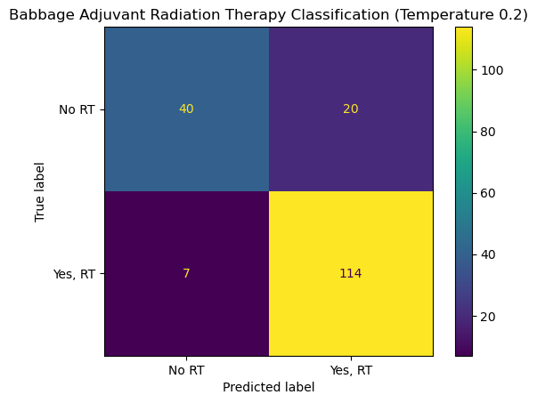
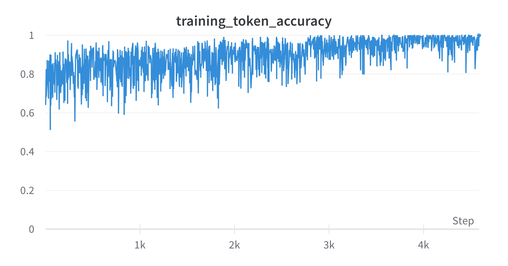

# 乳腺癌肿瘤学中的大型语言模型应用流程

发布时间：2024年06月10日

`LLM应用

这篇论文探讨了大型语言模型（LLMs）在肿瘤学领域的应用，特别是通过Langchain提示工程流程对OpenAI的模型进行微调，以提高乳腺癌治疗分类的准确率。论文还评估了模型在治疗预测中的表现，并与人类肿瘤学家的治疗质量进行了比较。这种应用层面的研究展示了LLMs在特定医疗领域中的实际应用和潜在影响，因此属于LLM应用分类。` `肿瘤学`

> A Large Language Model Pipeline for Breast Cancer Oncology

# 摘要

> 大型语言模型（LLMs）在多个学科的创新中展现出巨大潜力，但在肿瘤学领域的应用开发尚显不足。通过创新的Langchain提示工程流程，OpenAI的尖端模型针对临床数据集和指南文本进行了微调，专注于两个关键的癌症治疗因素：辅助放射治疗和化疗。在乳腺癌患者的治疗分类中，模型实现了超过0.85的高准确率。此外，通过分析人类肿瘤学家的治疗质量数据，我们估计模型在治疗预测中需超越原始肿瘤学家的场景比例为8.2%至13.3%，以证明其整体优越性。鉴于癌症治疗结果的不确定性，未来可能需要临床试验来验证这一阈值。考虑到85%的美国癌症患者在社区设施接受治疗，这类模型有望在提升护理质量方面发挥关键作用，至少达到与人类肿瘤学家相当的水平。

> Large language models (LLMs) have demonstrated potential in the innovation of many disciplines. However, how they can best be developed for oncology remains underdeveloped. State-of-the-art OpenAI models were fine-tuned on a clinical dataset and clinical guidelines text corpus for two important cancer treatment factors, adjuvant radiation therapy and chemotherapy, using a novel Langchain prompt engineering pipeline. A high accuracy (0.85+) was achieved in the classification of adjuvant radiation therapy and chemotherapy for breast cancer patients. Furthermore, a confidence interval was formed from observational data on the quality of treatment from human oncologists to estimate the proportion of scenarios in which the model must outperform the original oncologist in its treatment prediction to be a better solution overall as 8.2% to 13.3%. Due to indeterminacy in the outcomes of cancer treatment decisions, future investigation, potentially a clinical trial, would be required to determine if this threshold was met by the models. Nevertheless, with 85% of U.S. cancer patients receiving treatment at local community facilities, these kinds of models could play an important part in expanding access to quality care with outcomes that lie, at minimum, close to a human oncologist.

[Arxiv](https://arxiv.org/abs/2406.06455)