# 轻量级框架助力代码补全自适应检索，批评模型加持

发布时间：2024年06月10日

`RAG

这篇论文主要讨论了检索增强生成（RAG）技术在代码补全中的应用，并提出了一种新的评估方法CARD，用于优化检索过程，提高效率和准确性。因此，它属于RAG分类。` `软件开发` `代码补全`

> A Lightweight Framework for Adaptive Retrieval In Code Completion With Critique Model

# 摘要

> 检索增强生成（RAG）技术的最新进展极大地优化了仓库级别的代码补全。基于不同设计理念，多种RAG系统应运而生，例如通过多次检索-生成循环提升效果。但目前方法中检索的滥用导致了效率和效果的双重问题，许多检索实属多余，可能给代码模型带来误导。为此，我们推出了CARD，一种轻巧的评估方法，旨在判断检索的必要性，并从众多预测中精选出最佳答案。CARD能轻松融入各类RAG系统，我们的测试表明，它在行、API及函数补全上分别减少了21%至46%、14%至40%及6%至46.5%的检索时间，同时提升了准确性，降低了16%至83%的延迟。CARD兼容各种语言模型、检索器和编程语言，训练和推理均迅速高效。

> Recent advancements in Retrieval-Augmented Generation have significantly enhanced code completion at the repository level. Various RAG-based code completion systems are proposed based on different design choices. For instance, gaining more effectiveness at the cost of repeating the retrieval-generation process multiple times. However, the indiscriminate use of retrieval in current methods reveals issues in both efficiency and effectiveness, as a considerable portion of retrievals are unnecessary and may introduce unhelpful or even harmful suggestions to code language models. To address these challenges, we introduce CARD, a lightweight critique method designed to provide insights into the necessity of retrievals and select the optimal answer from multiple predictions. CARD can seamlessly integrate into any RAG-based code completion system. Our evaluation shows that CARD saves 21% to 46% times of retrieval for Line completion, 14% to 40% times of retrieval for API completion, and 6% to 46.5% times of retrieval for function completion respectively, while improving the accuracy. CARD reduces latency ranging from 16% to 83%. CARD is generalizable to different LMs, retrievers, and programming languages. It is lightweight with training in few seconds and inference in few milliseconds.

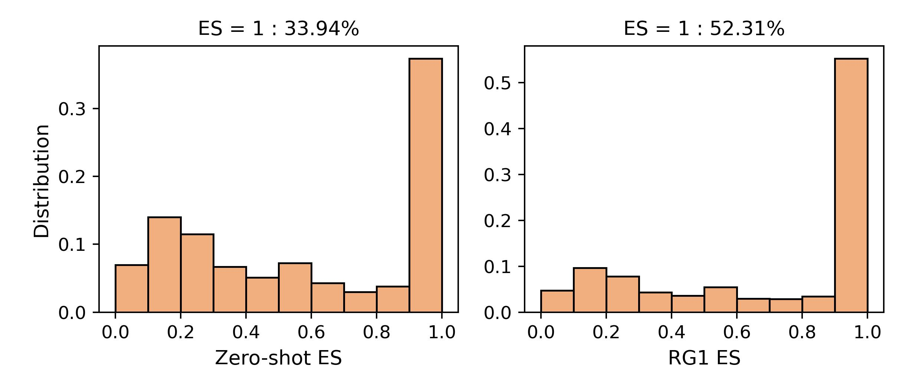

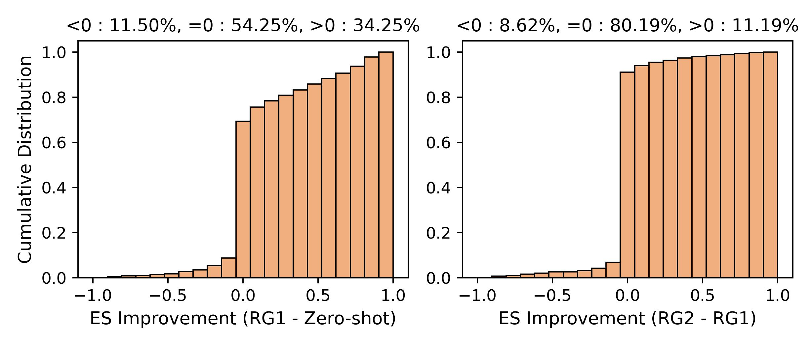

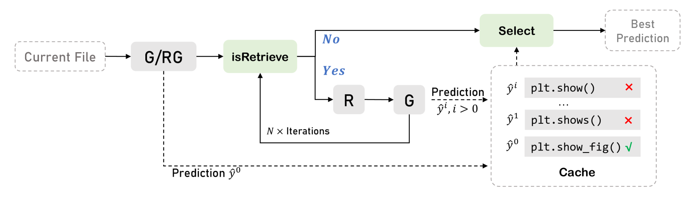

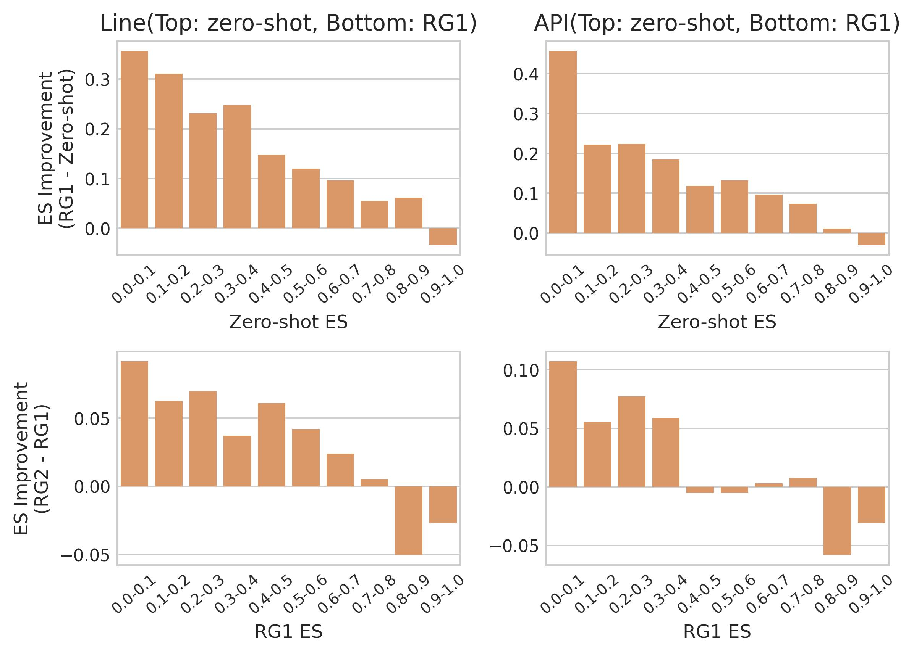

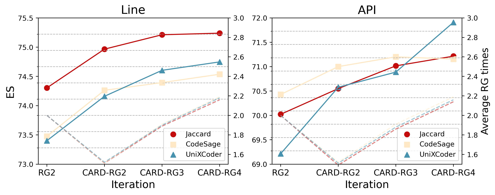

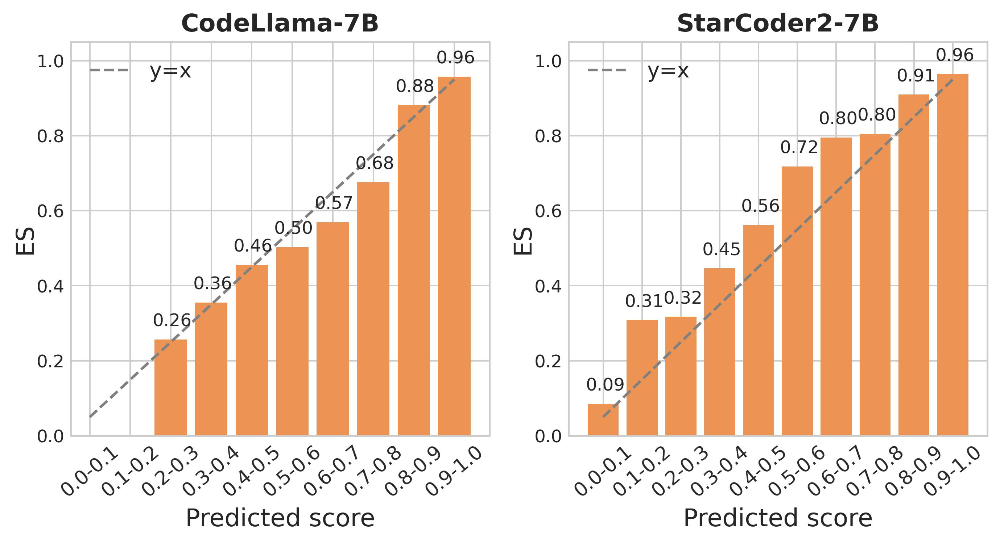

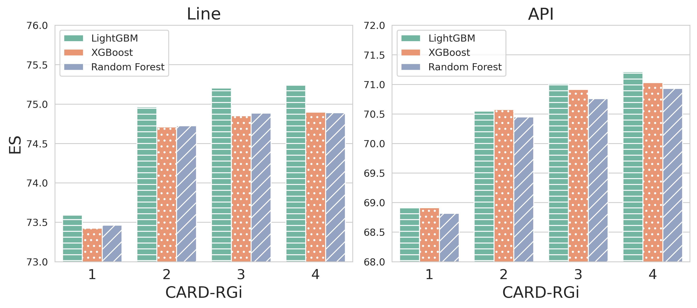

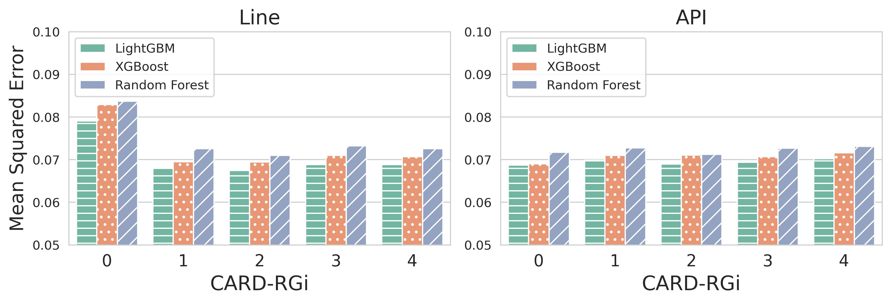

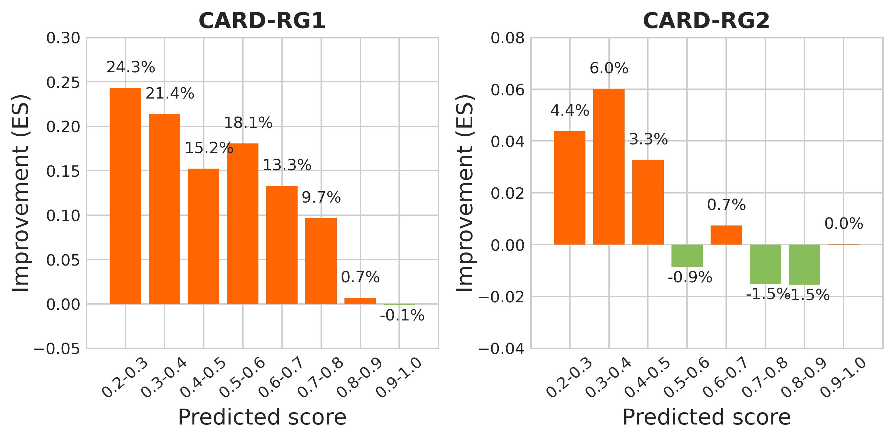

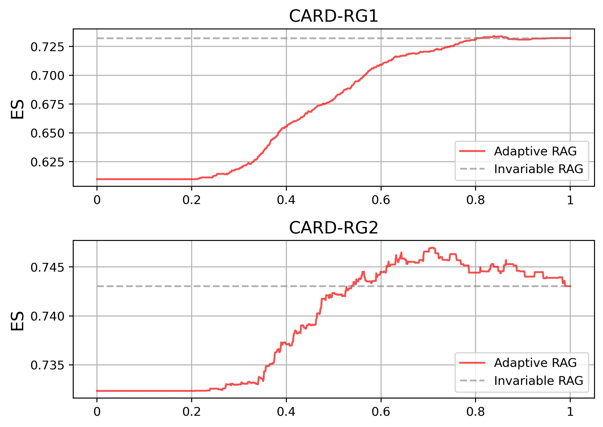

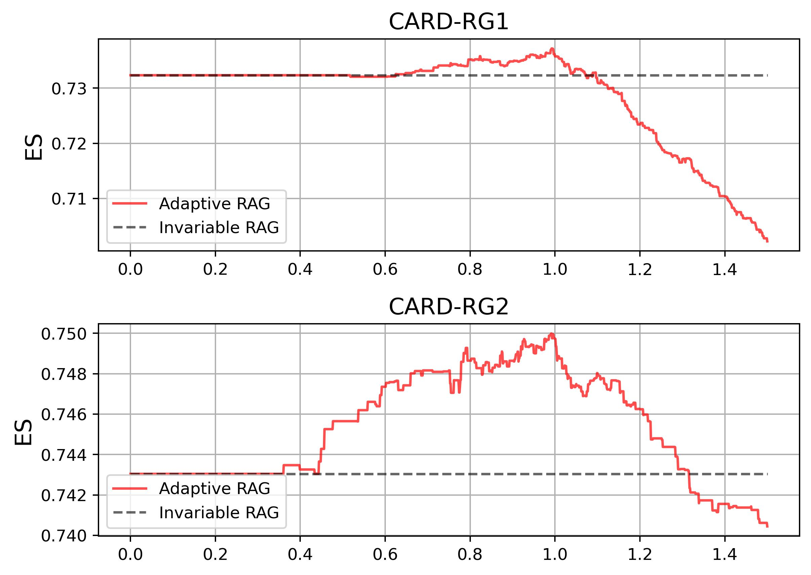

[Arxiv](https://arxiv.org/abs/2406.10263)