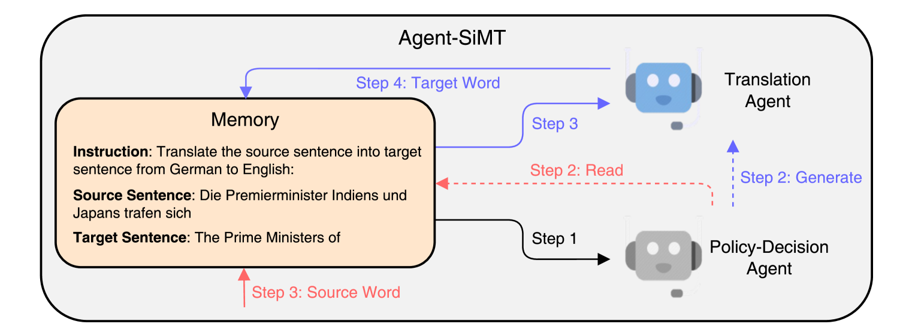
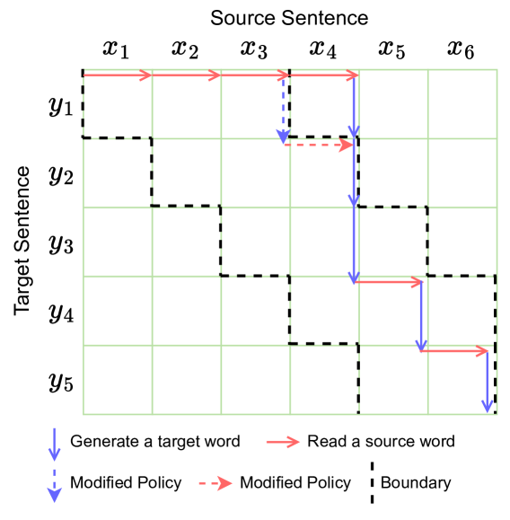
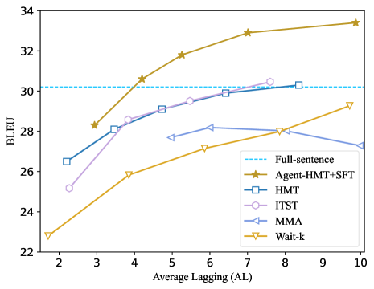
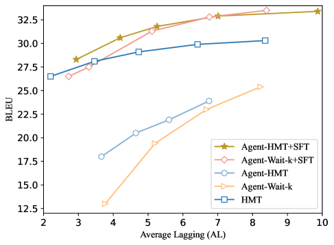
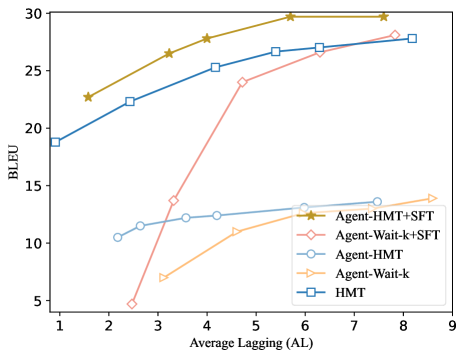
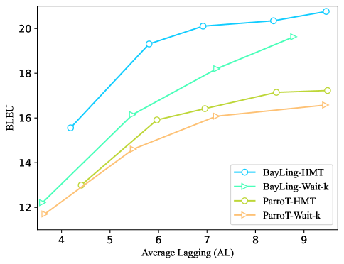
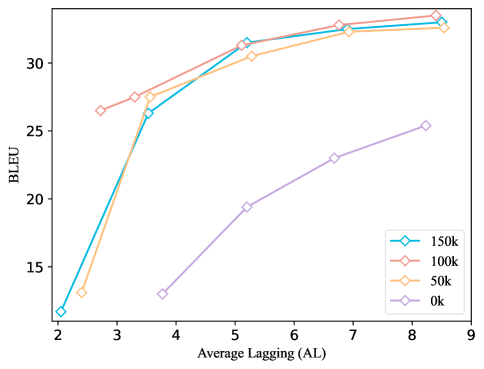
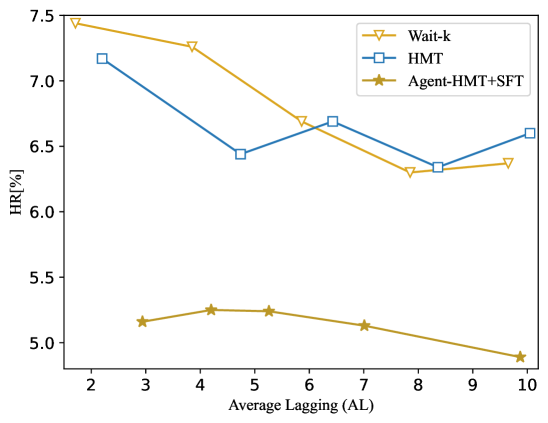
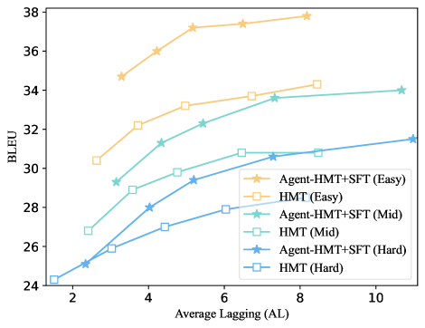
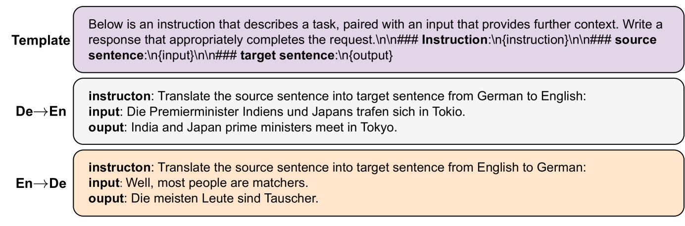

# Agent-SiMT：借助大型语言模型的代理辅助同步机器翻译

发布时间：2024年06月10日

`Agent

理由：这篇论文介绍了一个名为 Agent-SiMT 的框架，该框架结合了大型语言模型（LLMs）和传统的同时机器翻译（SiMT）方法，以提高翻译质量和策略决策。这个框架包含两个代理：策略决策代理和翻译代理，它们协同工作以优化SiMT的性能。因此，这篇论文更侧重于描述一个具体的Agent框架，用于改进机器翻译系统，而不是专注于LLM的理论研究或应用，也不是关于检索增强生成（RAG）的内容。` `机器翻译`

> Agent-SiMT: Agent-assisted Simultaneous Machine Translation with Large Language Models

# 摘要

> 同时机器翻译（SiMT）边读源句边生成目标翻译，依赖策略来把握阅读与翻译的最佳时机。现有SiMT多采用传统Transformer架构，虽策略决策精准，但翻译质量未达最佳。而大型语言模型（LLMs）虽在生成上表现卓越，却难以通过SiMT训练习得翻译策略。为此，我们提出Agent-SiMT框架，融合LLMs与传统SiMT之长。该框架包含策略决策与翻译两大代理。策略决策代理由SiMT模型驱动，依据部分源句与翻译制定策略；翻译代理则利用LLM，根据部分源句生成翻译。两者协同，使SiMT达到新高度。实验证明，Agent-SiMT性能领先。

> Simultaneous Machine Translation (SiMT) generates target translations while reading the source sentence. It relies on a policy to determine the optimal timing for reading sentences and generating translations. Existing SiMT methods generally adopt the traditional Transformer architecture, which concurrently determines the policy and generates translations. While they excel at determining policies, their translation performance is suboptimal. Conversely, Large Language Models (LLMs), trained on extensive corpora, possess superior generation capabilities, but it is difficult for them to acquire translation policy through the training methods of SiMT. Therefore, we introduce Agent-SiMT, a framework combining the strengths of LLMs and traditional SiMT methods. Agent-SiMT contains the policy-decision agent and the translation agent. The policy-decision agent is managed by a SiMT model, which determines the translation policy using partial source sentence and translation. The translation agent, leveraging an LLM, generates translation based on the partial source sentence. The two agents collaborate to accomplish SiMT. Experiments demonstrate that Agent-SiMT attains state-of-the-art performance.

[Arxiv](https://arxiv.org/abs/2406.06910)