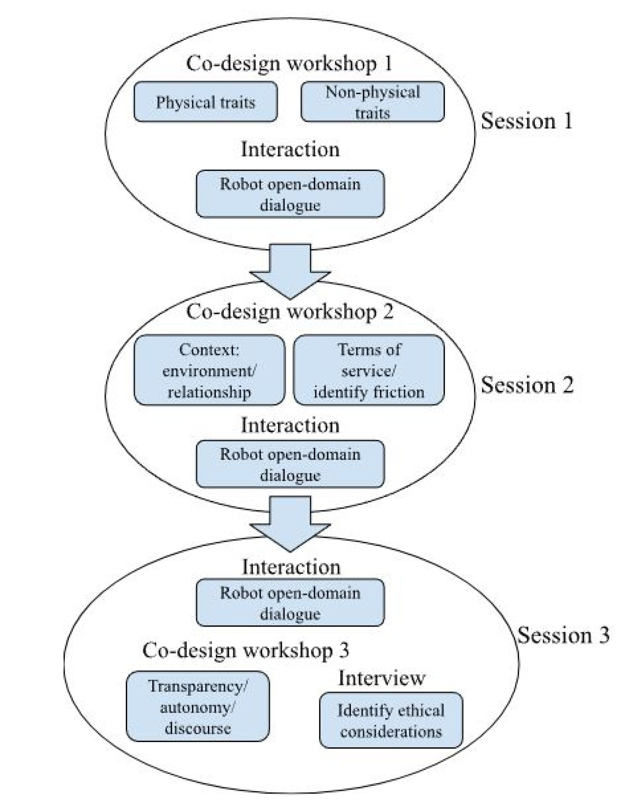

# 通过实证设计正义方法，探索大型语言模型与社会机器人交汇处的伦理考量

发布时间：2024年06月10日

`Agent

这篇论文主要探讨了将大型语言模型（LLMs）融入社交机器人时产生的伦理挑战和社会影响。它关注的是如何通过设计正义的方法来解决这些伦理问题，特别是在社交机器人的设计和交互过程中。因此，这篇论文更符合Agent分类，因为它涉及的是将LLMs应用于社交机器人这一特定类型的智能代理中，并探讨了相关的伦理和社会问题。` `社交机器人` `伦理学`

> An Empirical Design Justice Approach to Identifying Ethical Considerations in the Intersection of Large Language Models and Social Robotics

# 摘要

> 将LLMs融入社交机器人，引发了一系列独特的伦理挑战和社会影响。本研究旨在探索这两种技术结合时产生的伦理问题。虽然LLMs能增强社交机器人的自然对话能力，但同时也带来了关于错误信息、非言语沟通、情感干扰和偏见的伦理担忧。特别是，机器人的实体存在可能加剧这些伦理风险，影响社交互动和沟通。为此，研究采用了基于设计正义的实证方法，通过共同设计和交互研究来深入探讨这些伦理问题。研究不仅关注人形社交机器人作为LLM接口的设计和交互过程中的伦理考量，还评估了设计正义方法在整合LLMs与社交机器人设计中的实际应用。研究结果展示了在交互、共同设计、服务条款和关系四个维度上的伦理考量，并探讨了设计正义方法在LLMs与社交机器人交叉领域的应用潜力。

> The integration of Large Language Models (LLMs) in social robotics presents a unique set of ethical challenges and social impacts. This research is set out to identify ethical considerations that arise in the design and development of these two technologies in combination. Using LLMs for social robotics may provide benefits, such as enabling natural language open-domain dialogues. However, the intersection of these two technologies also gives rise to ethical concerns related to misinformation, non-verbal cues, emotional disruption, and biases. The robot's physical social embodiment adds complexity, as ethical hazards associated with LLM-based Social AI, such as hallucinations and misinformation, can be exacerbated due to the effects of physical embodiment on social perception and communication. To address these challenges, this study employs an empirical design justice-based methodology, focusing on identifying socio-technical ethical considerations through a qualitative co-design and interaction study. The purpose of the study is to identify ethical considerations relevant to the process of co-design of, and interaction with a humanoid social robot as the interface of a LLM, and to evaluate how a design justice methodology can be used in the context of designing LLMs-based social robotics. The findings reveal a mapping of ethical considerations arising in four conceptual dimensions: interaction, co-design, terms of service and relationship and evaluates how a design justice approach can be used empirically in the intersection of LLMs and social robotics.

[Arxiv](https://arxiv.org/abs/2406.06400)