# 自回归模型Llama在图像生成领域超越了扩散模型，展现出卓越的可扩展性。

发布时间：2024年06月10日

`LLM应用

这篇论文介绍了LlamaGen，一系列利用大型语言模型的“下一令牌预测”范式进行视觉生成的新型图像生成模型。论文详细探讨了图像标记器的设计、图像生成模型的扩展性以及训练数据的质量，并展示了这些模型在图像生成任务中的优越性能。此外，论文还提到了LLM服务框架在提升图像生成模型推理速度上的应用。这些内容均属于LLM在实际应用中的具体案例，因此将其归类为LLM应用。` `图像生成` `多模态模型`

> Autoregressive Model Beats Diffusion: Llama for Scalable Image Generation

# 摘要

> 我们推出了LlamaGen，这是一系列将大型语言模型的“下一令牌预测”范式应用于视觉生成的新型图像生成模型。这一创新证实了，即使没有视觉信号的归纳偏差，如Llama这样的原始自回归模型，在适当扩展后也能达到顶尖的图像生成效果。我们重新评估了图像标记器的设计、图像生成模型的扩展性及其训练数据的质量。此次探索的成果包括：(1) 一款在ImageNet上表现出色的图像标记器，具备16倍下采样比率、0.94 rFID的重建质量及97%的码本使用率。(2) 一系列参数从1.11亿至31亿不等的类别条件图像生成模型，在ImageNet 256x256测试中以2.18 FID超越了如LDM、DiT等流行扩散模型。(3) 一款拥有7.75亿参数的文本条件图像生成模型，通过在LAION-COCO和高美学图像上的两阶段训练，展现了卓越的视觉质量和文本对齐能力。(4) 我们证实了LLM服务框架在提升图像生成模型推理速度上的效能，实现了326%至414%的加速。我们已将所有模型和代码公开，以推动视觉生成和多模态基础模型的开源社区发展。

> We introduce LlamaGen, a new family of image generation models that apply original ``next-token prediction'' paradigm of large language models to visual generation domain. It is an affirmative answer to whether vanilla autoregressive models, e.g., Llama, without inductive biases on visual signals can achieve state-of-the-art image generation performance if scaling properly. We reexamine design spaces of image tokenizers, scalability properties of image generation models, and their training data quality. The outcome of this exploration consists of: (1) An image tokenizer with downsample ratio of 16, reconstruction quality of 0.94 rFID and codebook usage of 97% on ImageNet benchmark. (2) A series of class-conditional image generation models ranging from 111M to 3.1B parameters, achieving 2.18 FID on ImageNet 256x256 benchmarks, outperforming the popular diffusion models such as LDM, DiT. (3) A text-conditional image generation model with 775M parameters, from two-stage training on LAION-COCO and high aesthetics quality images, demonstrating competitive performance of visual quality and text alignment. (4) We verify the effectiveness of LLM serving frameworks in optimizing the inference speed of image generation models and achieve 326% - 414% speedup. We release all models and codes to facilitate open-source community of visual generation and multimodal foundation models.

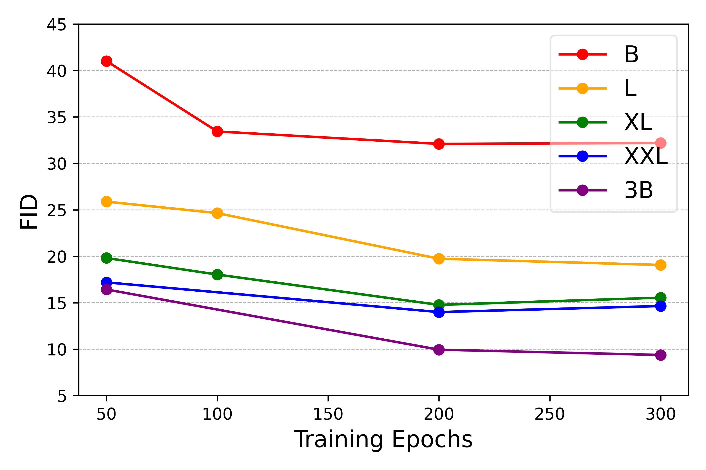

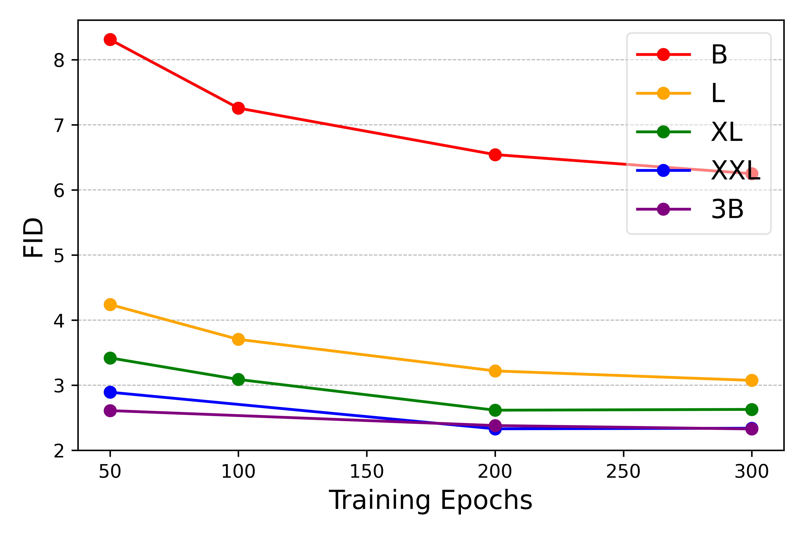

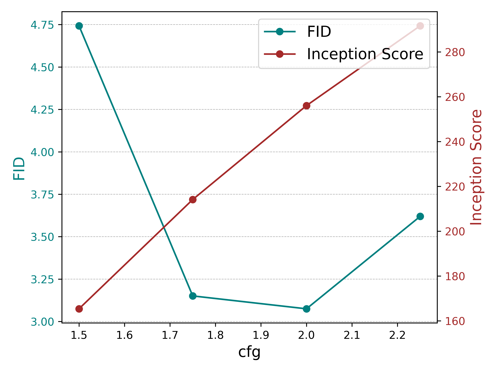

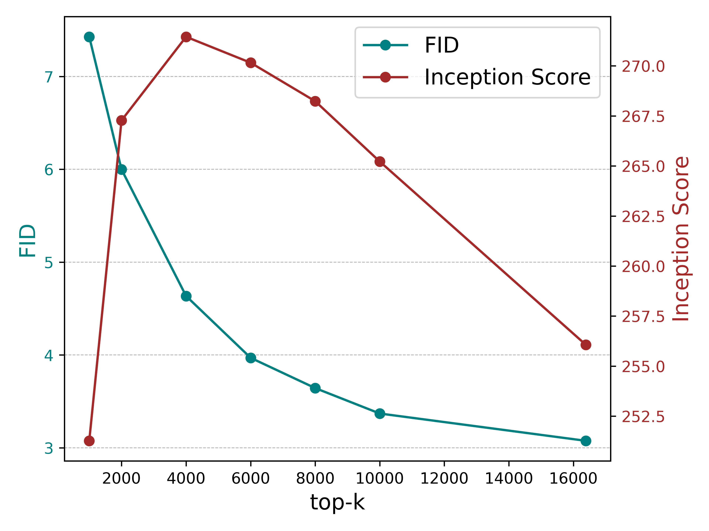

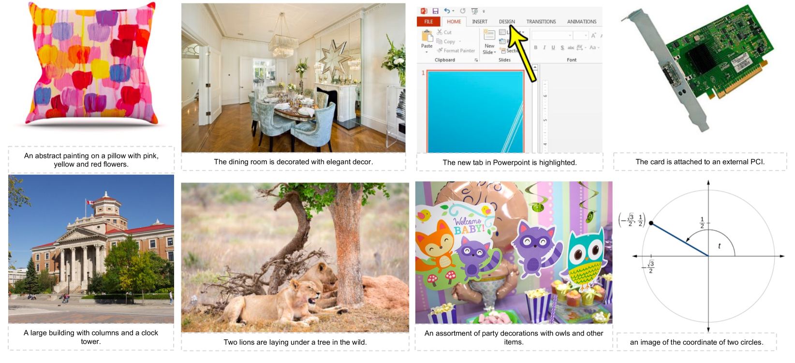

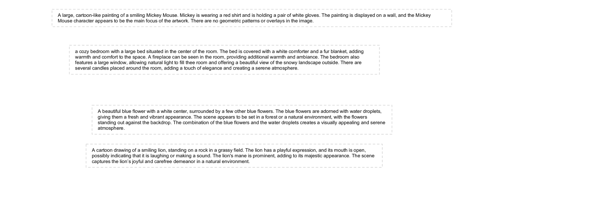

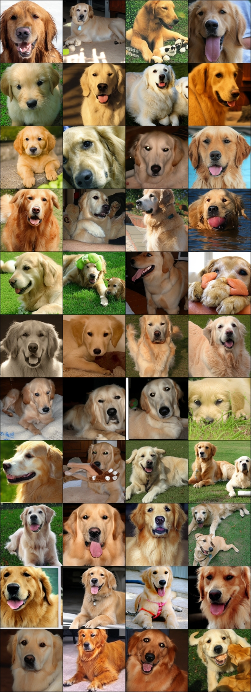

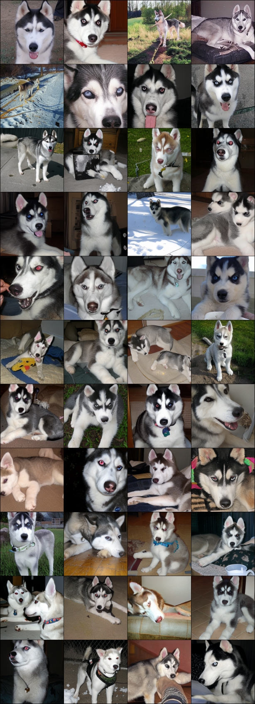

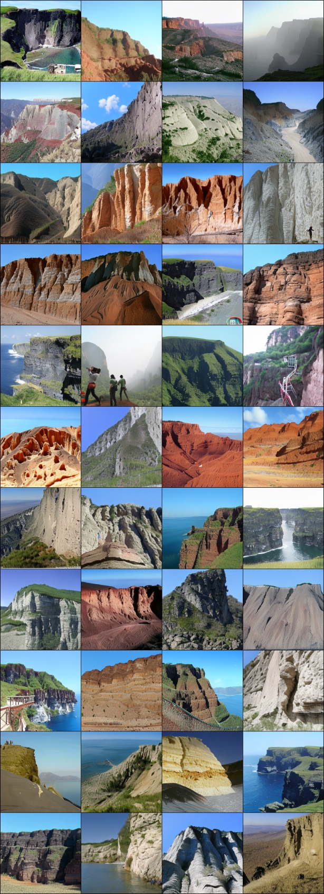

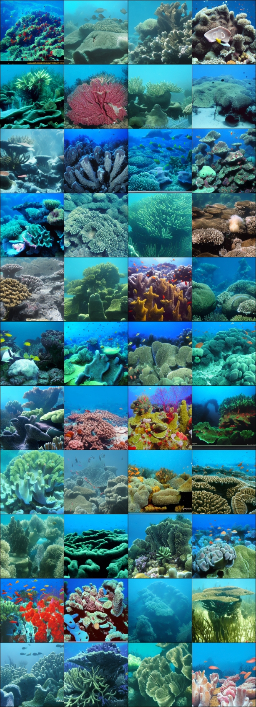

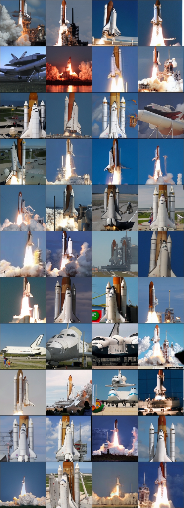

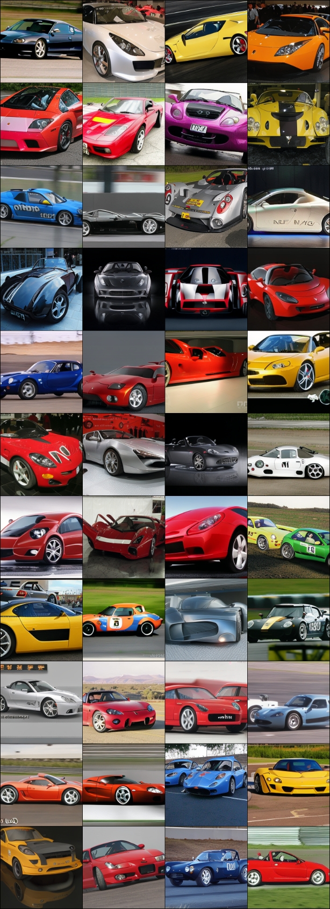

[Arxiv](https://arxiv.org/abs/2406.06525)