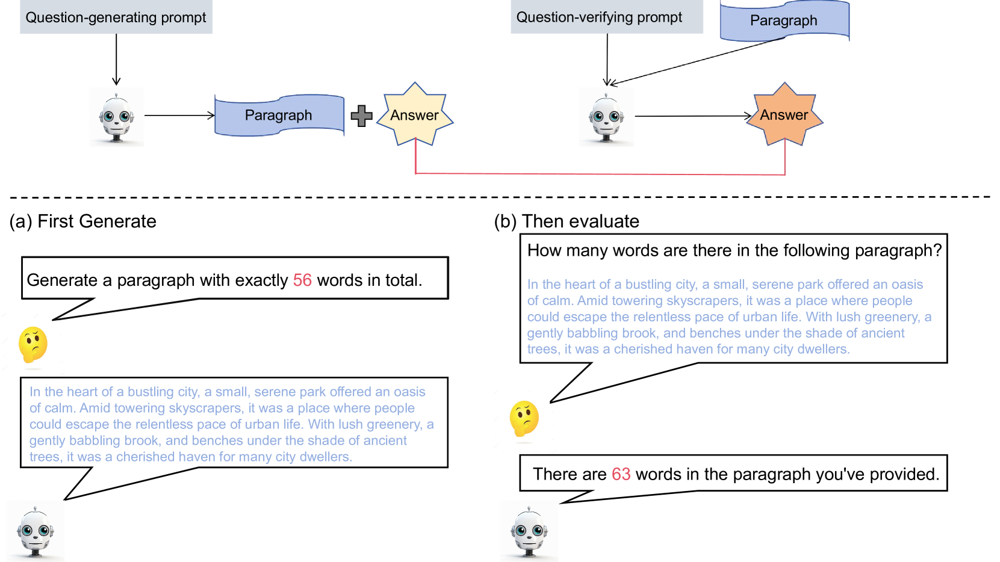

# 我能否洞悉我所创造的？大型语言模型的自我认知评估

发布时间：2024年06月10日

`LLM理论

这篇论文摘要讨论了大型语言模型（LLMs）的自我知识评估框架，这是一个理论性的研究，旨在深入理解模型的潜能和局限。通过提出和测试一种新的评估方法，研究者们探索了模型对自己生成问题的理解和回应能力，并发现了模型在自知识能力上的缺陷。这种研究不仅提供了对LLMs性能的深入洞察，还为模型的进一步优化提供了方向。因此，这项工作更偏向于LLM的理论研究，而不是具体的应用、Agent设计或RAG（Retrieval-Augmented Generation）技术。` `人工智能评估`

> Can I understand what I create? Self-Knowledge Evaluation of Large Language Models

# 摘要

> 大型语言模型（LLMs）在语言任务上的卓越表现，呼唤着强有力的评估框架来洞悉其潜能与局限。借鉴费曼的创造性理解原则，我们提出了一种简便的自知识评估框架，旨在检验模型对自己生成问题的理解和回应能力。通过对多模型在多任务上的测试，我们发现模型在自知识能力上存在显著缺陷，这可能源于与人类注意力机制的不协调。更有趣的是，针对自创数学任务的微调能显著提升模型的数学表现，这不仅彰显了该框架在模型评估上的高效与深刻，也为LLMs的进一步优化指明了方向。

> Large language models (LLMs) have achieved remarkable progress in linguistic tasks, necessitating robust evaluation frameworks to understand their capabilities and limitations. Inspired by Feynman's principle of understanding through creation, we introduce a self-knowledge evaluation framework that is easy to implement, evaluating models on their ability to comprehend and respond to self-generated questions. Our findings, based on testing multiple models across diverse tasks, reveal significant gaps in the model's self-knowledge ability. Further analysis indicates these gaps may be due to misalignment with human attention mechanisms. Additionally, fine-tuning on self-generated math task may enhance the model's math performance, highlighting the potential of the framework for efficient and insightful model evaluation and may also contribute to the improvement of LLMs.

[Arxiv](https://arxiv.org/abs/2406.06140)