# 语言模型是否能化身为基于文本的世界模拟器？

发布时间：2024年06月10日

`Agent

理由：这篇论文主要探讨了语言模型（LLM）在虚拟环境中的应用，特别是在复杂规划与决策任务中的作用，通过创建一个新的基准来评估LLMs作为文本世界模拟器的效能。这种应用涉及到模拟和预测行动对世界状态的影响，这是Agent领域的一个重要研究方向，因为它涉及到智能体在环境中的行为和决策。因此，这篇论文更适合归类到Agent分类中。` `人工智能` `游戏开发`

> Can Language Models Serve as Text-Based World Simulators?

# 摘要

> 虚拟环境在复杂规划与决策任务的评估中至关重要，但其手动构建成本高昂且复杂。我们探索了语言模型是否能作为世界模拟器，精准预测行动对世界状态的影响，从而避免繁琐的手动编码。为此，我们创建了名为ByteSized32-State-Prediction的新基准，包含文本游戏状态转换数据集及相应任务，首次直接评估了LLMs作为文本世界模拟器的效能。我们对GPT-4进行了测试，发现尽管其性能卓越，但仍需创新才能成为可靠的模拟器。此研究不仅揭示了当前LLM的潜力与局限，还设立了新基准，以追踪未来模型的进步。

> Virtual environments play a key role in benchmarking advances in complex planning and decision-making tasks but are expensive and complicated to build by hand. Can current language models themselves serve as world simulators, correctly predicting how actions change different world states, thus bypassing the need for extensive manual coding? Our goal is to answer this question in the context of text-based simulators. Our approach is to build and use a new benchmark, called ByteSized32-State-Prediction, containing a dataset of text game state transitions and accompanying game tasks. We use this to directly quantify, for the first time, how well LLMs can serve as text-based world simulators. We test GPT-4 on this dataset and find that, despite its impressive performance, it is still an unreliable world simulator without further innovations. This work thus contributes both new insights into current LLM's capabilities and weaknesses, as well as a novel benchmark to track future progress as new models appear.

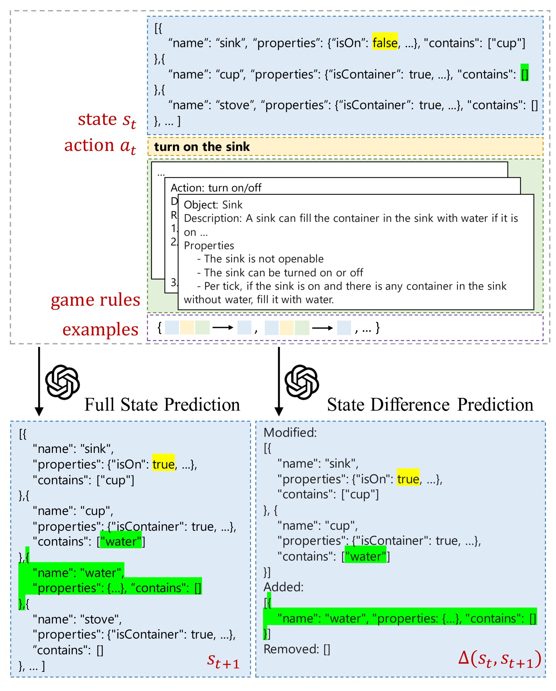

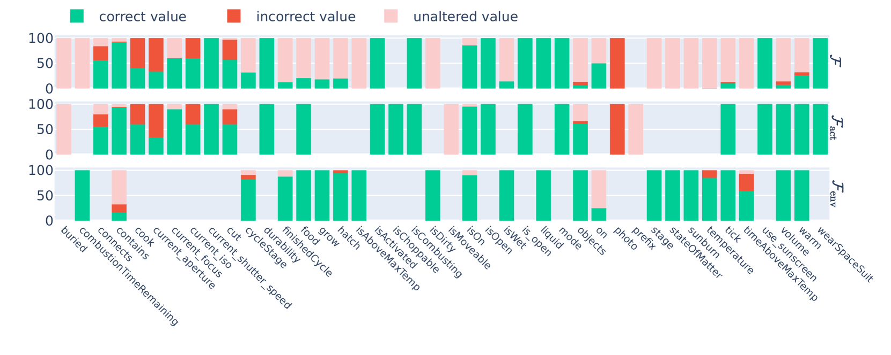

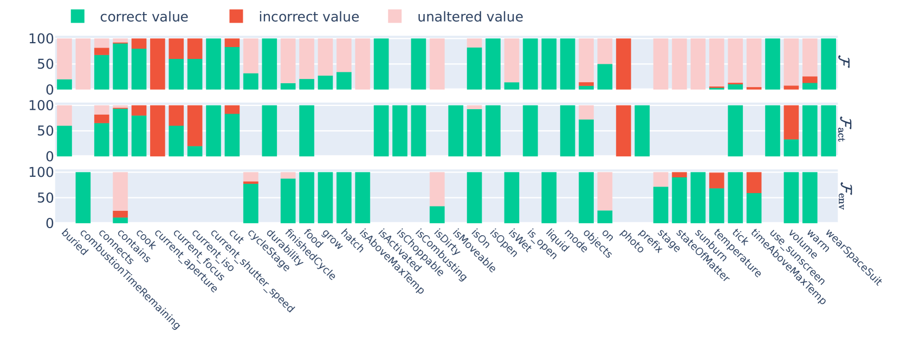

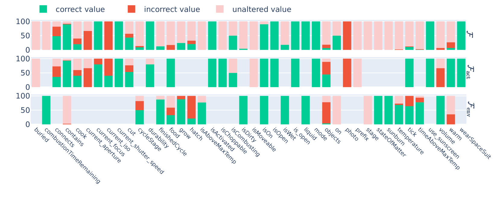

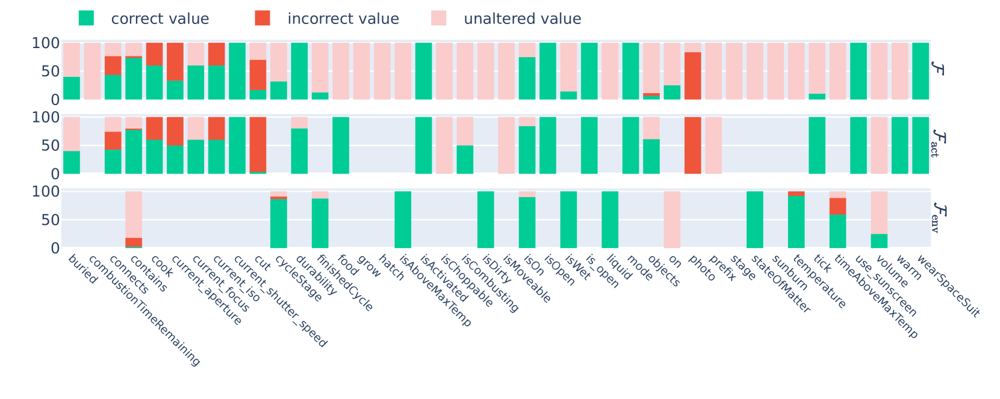

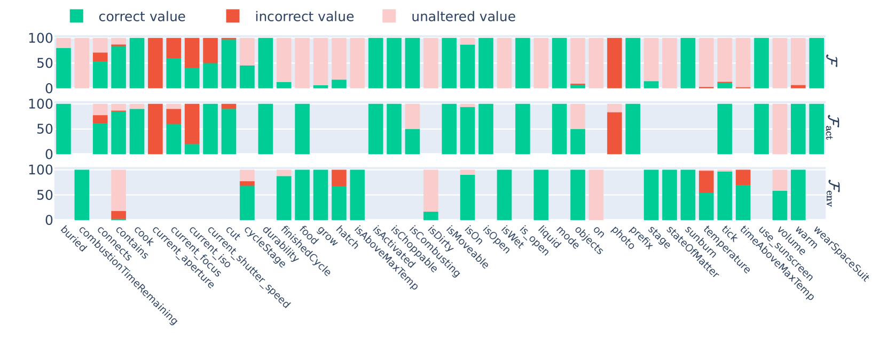

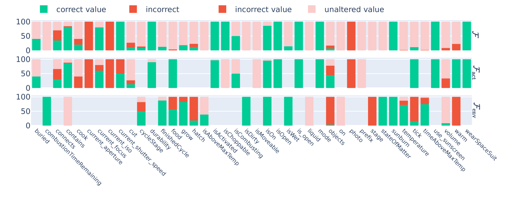

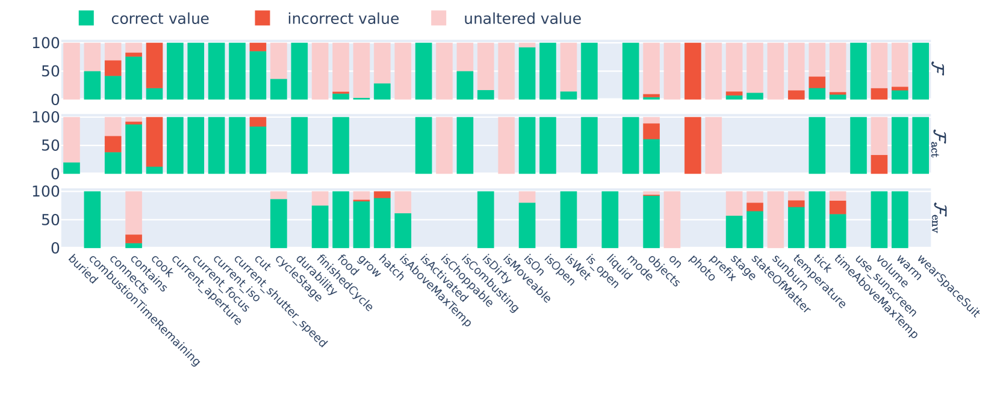

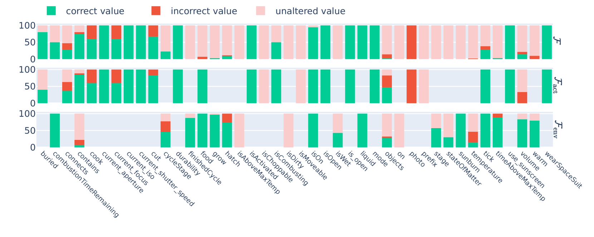

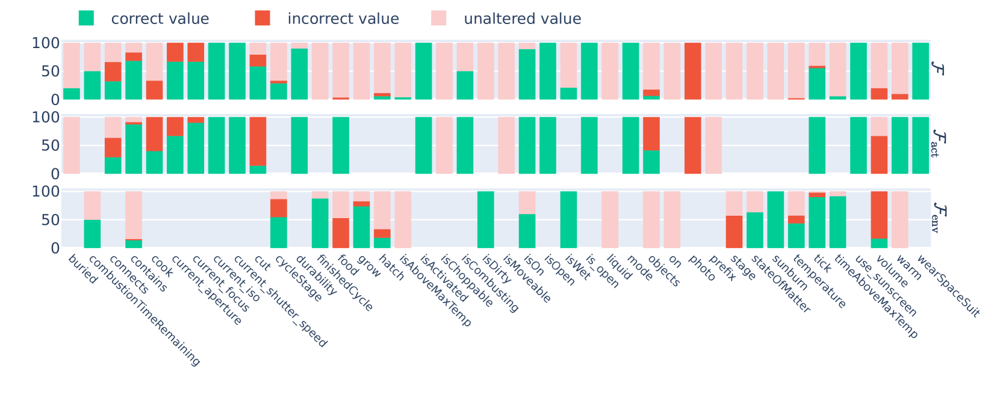

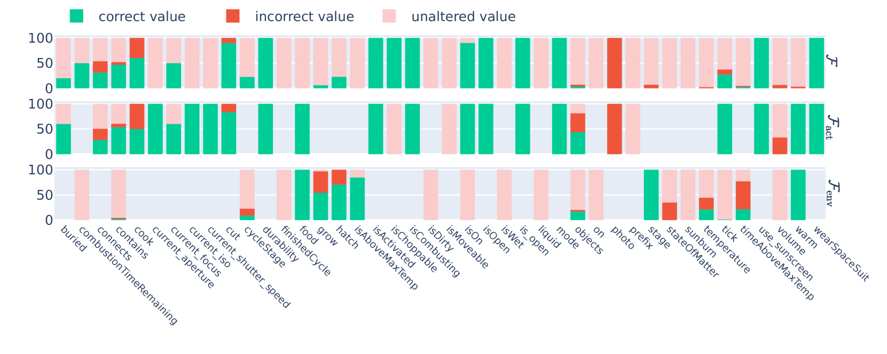

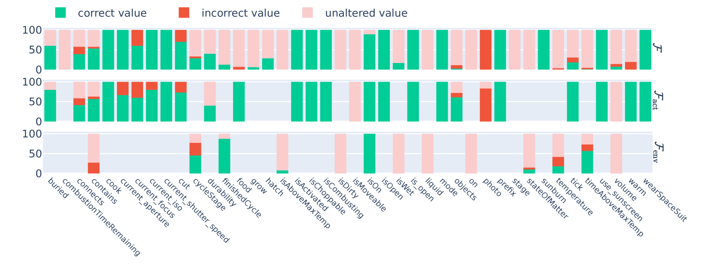

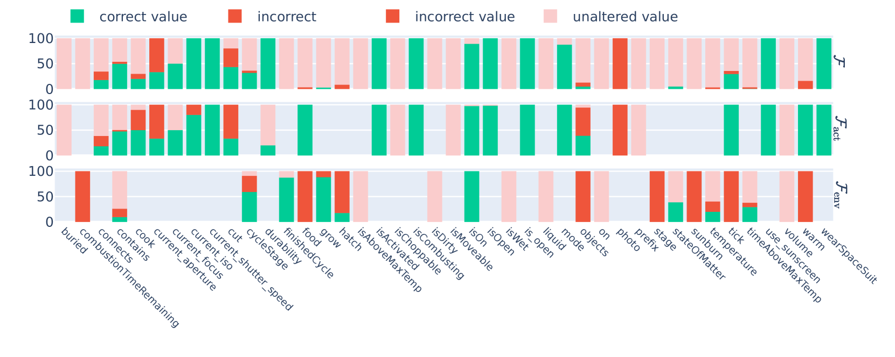

[Arxiv](https://arxiv.org/abs/2406.06485)