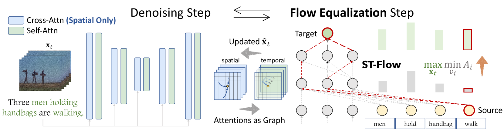
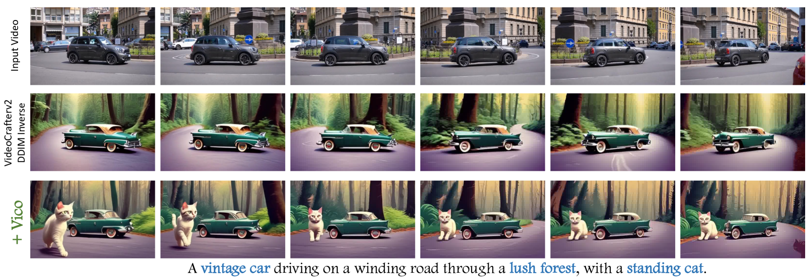

# 视频生成的组合方法，如同流量均衡的艺术

发布时间：2024年06月10日

`LLM应用` `视频制作` `人工智能`

> Compositional Video Generation as Flow Equalization

# 摘要

> 近期，大规模文本转视频（T2V）扩散模型展现了将自然语言描述转化为逼真视频的卓越能力。然而，这些模型在处理多概念与动作间的复杂交互时仍显不足，常因某些词语的主导作用而忽略其他概念。为此，我们提出了**Vico**框架，确保所有概念在视频生成中得到均衡表达。Vico 通过分析输入令牌对视频生成的影响，并调整模型以避免单一概念的过度影响，从而构建了一个时空注意力图，并利用最大流概念来评估影响。尽管直接计算注意力流在扩散模型中难以实现，我们通过子图流近似和向量化快速实现，使流计算变得可行且可微。通过平衡这些流，Vico 能够捕捉复杂交互，生成更符合文本描述的视频。实证研究显示，Vico 显著提升了视频的组合丰富性与准确性。了解更多，请访问我们的网站：[https://adamdad.github.io/vico/](https://adamdad.github.io/vico/)。

> Large-scale Text-to-Video (T2V) diffusion models have recently demonstrated unprecedented capability to transform natural language descriptions into stunning and photorealistic videos. Despite the promising results, a significant challenge remains: these models struggle to fully grasp complex compositional interactions between multiple concepts and actions. This issue arises when some words dominantly influence the final video, overshadowing other concepts.To tackle this problem, we introduce \textbf{Vico}, a generic framework for compositional video generation that explicitly ensures all concepts are represented properly. At its core, Vico analyzes how input tokens influence the generated video, and adjusts the model to prevent any single concept from dominating. Specifically, Vico extracts attention weights from all layers to build a spatial-temporal attention graph, and then estimates the influence as the \emph{max-flow} from the source text token to the video target token. Although the direct computation of attention flow in diffusion models is typically infeasible, we devise an efficient approximation based on subgraph flows and employ a fast and vectorized implementation, which in turn makes the flow computation manageable and differentiable. By updating the noisy latent to balance these flows, Vico captures complex interactions and consequently produces videos that closely adhere to textual descriptions. We apply our method to multiple diffusion-based video models for compositional T2V and video editing. Empirical results demonstrate that our framework significantly enhances the compositional richness and accuracy of the generated videos. Visit our website at~\href{https://adamdad.github.io/vico/}{\url{https://adamdad.github.io/vico/}}.

[Arxiv](https://arxiv.org/abs/2407.06182)