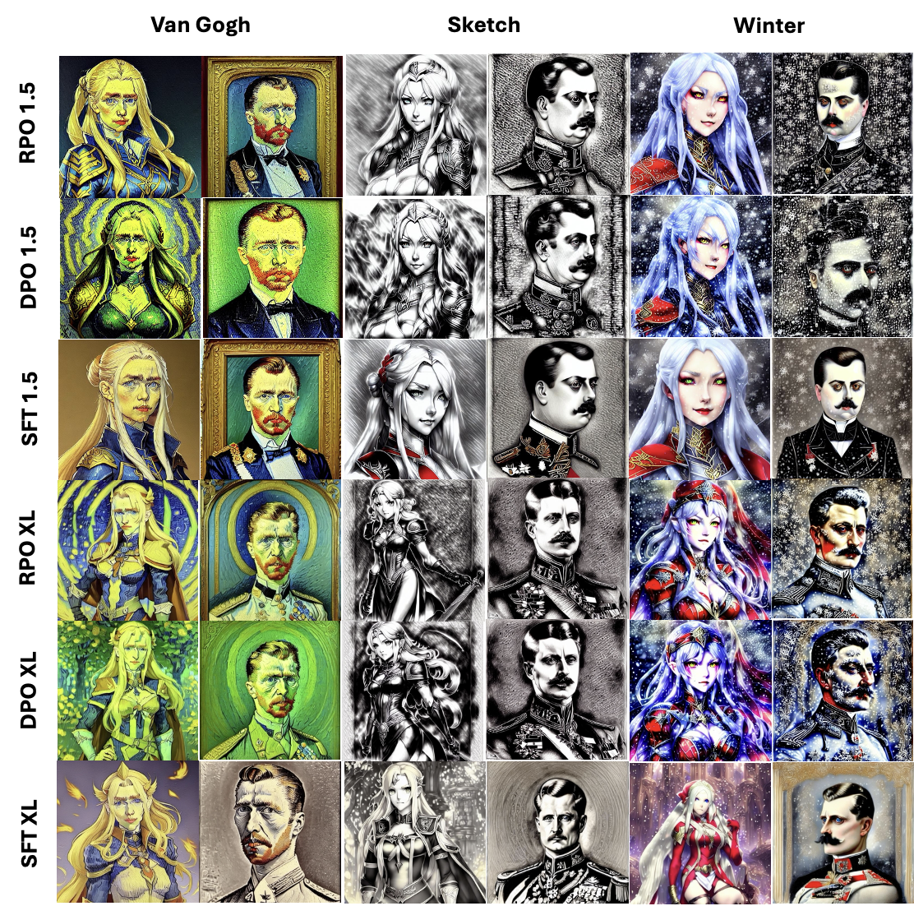
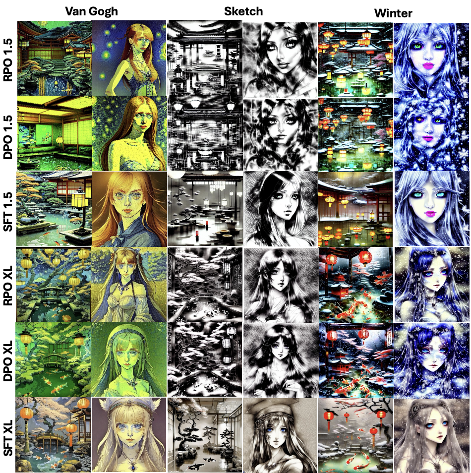

# 扩散模型对齐新策略：基于相对偏好优化的扩散-RPO

发布时间：2024年06月10日

`LLM应用

这篇论文主要探讨了如何通过扩散-RPO技术改进文本到图像生成模型，使其更好地符合人类偏好。这种方法涉及在扩散模型中实施成对偏好学习，并引入了一种新的评估指标——风格对齐。这些研究内容直接应用于大型语言模型（LLM）的实际应用中，特别是在文本到图像生成领域，因此属于LLM应用分类。` `图像生成` `人工智能`

> Diffusion-RPO: Aligning Diffusion Models through Relative Preference Optimization

# 摘要

> 在语言模型研究领域，如何让大型语言模型更好地迎合人类偏好已成为研究热点。然而，将偏好学习应用于文本到图像（T2I）生成模型，这一领域尚属探索阶段。扩散-DPO技术通过在特定文本提示的扩散模型中实施成对偏好学习，迈出了第一步。我们提出的扩散-RPO方法，旨在更高效地使基于扩散的T2I模型与人类偏好同步。该方法不仅利用了具有相同提示的图像对，还涵盖了跨模态的语义相关内容。同时，我们创新性地提出了一种新的评估指标——风格对齐，以解决当前人类偏好对齐评估中常见的高成本、低可重复性和解释性不足的问题。研究显示，扩散-RPO在稳定扩散版本1.5和XL-1.0的调整中超越了监督微调和扩散-DPO等传统方法，在自动化的人类偏好评估和风格对齐方面均取得了优异成绩。我们的代码已公开在https://github.com/yigu1008/Diffusion-RPO。

> Aligning large language models with human preferences has emerged as a critical focus in language modeling research. Yet, integrating preference learning into Text-to-Image (T2I) generative models is still relatively uncharted territory. The Diffusion-DPO technique made initial strides by employing pairwise preference learning in diffusion models tailored for specific text prompts. We introduce Diffusion-RPO, a new method designed to align diffusion-based T2I models with human preferences more effectively. This approach leverages both prompt-image pairs with identical prompts and those with semantically related content across various modalities. Furthermore, we have developed a new evaluation metric, style alignment, aimed at overcoming the challenges of high costs, low reproducibility, and limited interpretability prevalent in current evaluations of human preference alignment. Our findings demonstrate that Diffusion-RPO outperforms established methods such as Supervised Fine-Tuning and Diffusion-DPO in tuning Stable Diffusion versions 1.5 and XL-1.0, achieving superior results in both automated evaluations of human preferences and style alignment. Our code is available at https://github.com/yigu1008/Diffusion-RPO

[Arxiv](https://arxiv.org/abs/2406.06382)