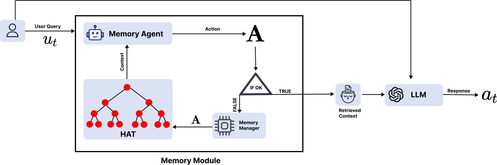
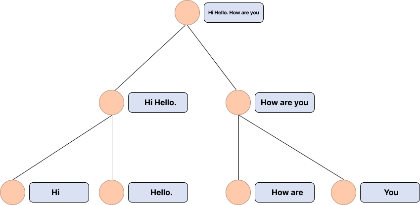

# 利用分层聚合树提升检索增强生成中的长期记忆能力

发布时间：2024年06月10日

`LLM应用

这篇论文介绍了一种名为分层聚合树（HAT）的记忆结构，用于增强大型语言模型在长对话中的推理能力。通过递归地整合相关对话信息，HAT确保了在控制深度的同时覆盖广泛内容，从而提高了对话的连贯性和摘要的准确性。这种方法直接应用于大型语言模型的实际应用中，以改善其在多轮对话中的表现，因此属于LLM应用分类。` `对话系统`

> Enhancing Long-Term Memory using Hierarchical Aggregate Tree for Retrieval Augmented Generation

# 摘要

> 大型语言模型的上下文容量有限，这阻碍了其在长对话中的推理能力。为此，我们设计了一种名为分层聚合树（HAT）的记忆结构，它通过条件树遍历递归地整合相关对话信息，确保在控制深度的同时覆盖广泛内容。我们视寻找最佳上下文为一次最优的树遍历。实验结果显示，HAT 显著提升了对话的连贯性和摘要的准确性，证明了该技术在多轮推理中无需大幅增加参数规模的有效性。这种记忆增强技术使得大型语言模型能够进行更加连贯、基于事实的长时间对话。

> Large language models have limited context capacity, hindering reasoning over long conversations. We propose the Hierarchical Aggregate Tree memory structure to recursively aggregate relevant dialogue context through conditional tree traversals. HAT encapsulates information from children nodes, enabling broad coverage with depth control. We formulate finding best context as optimal tree traversal. Experiments show HAT improves dialog coherence and summary quality over baseline contexts, demonstrating the techniques effectiveness for multi turn reasoning without exponential parameter growth. This memory augmentation enables more consistent, grounded longform conversations from LLMs

[Arxiv](https://arxiv.org/abs/2406.06124)