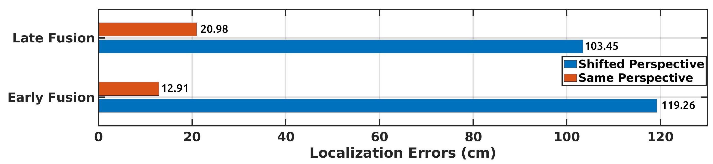
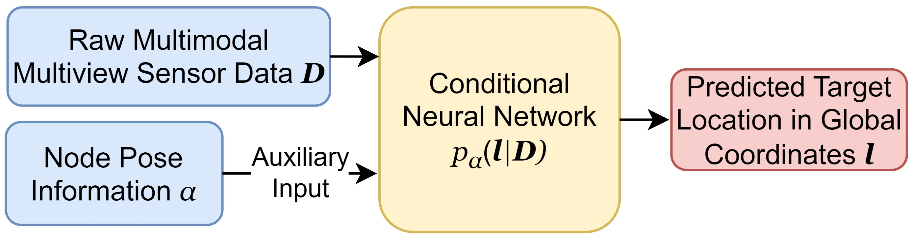
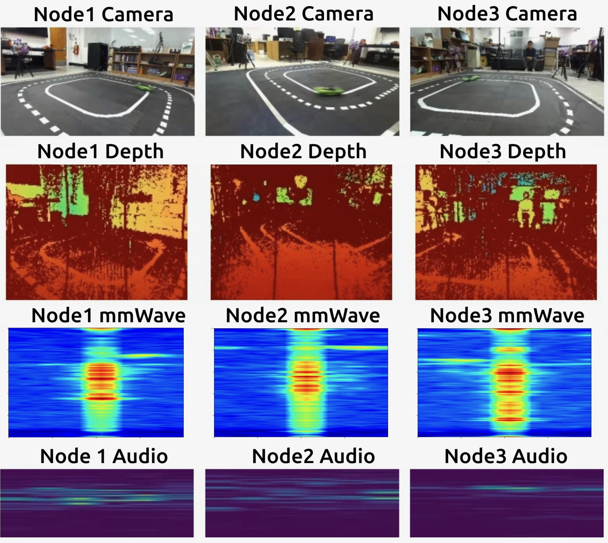
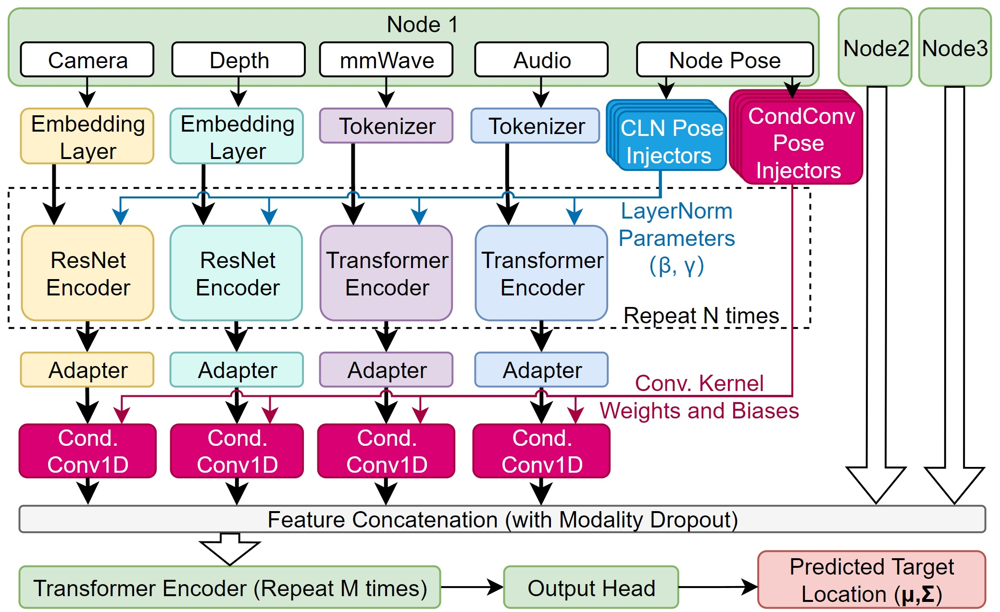
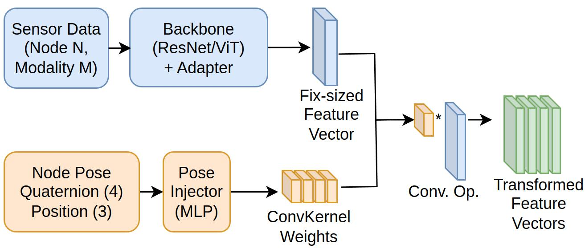
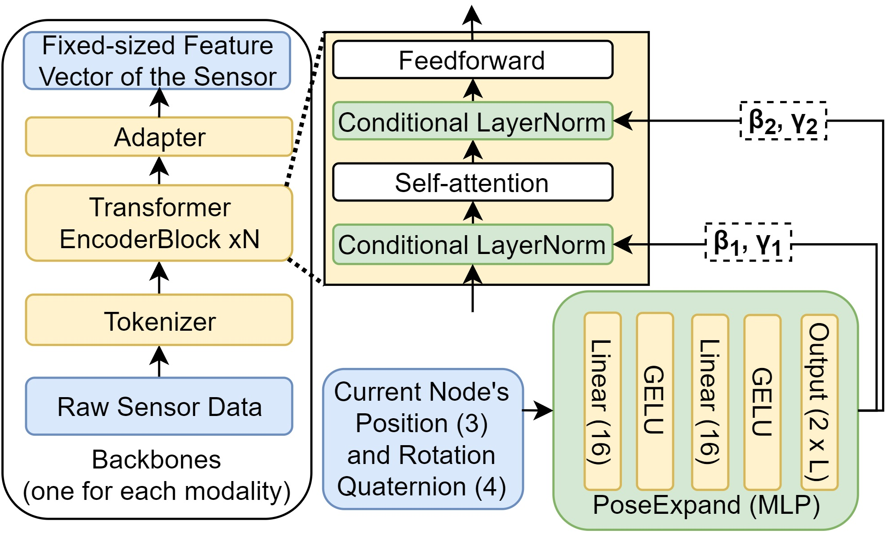
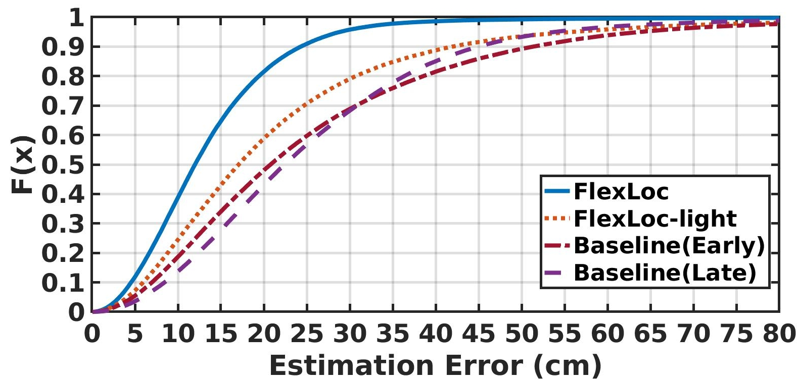
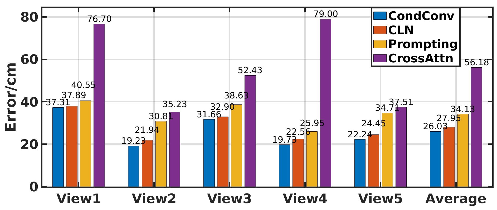
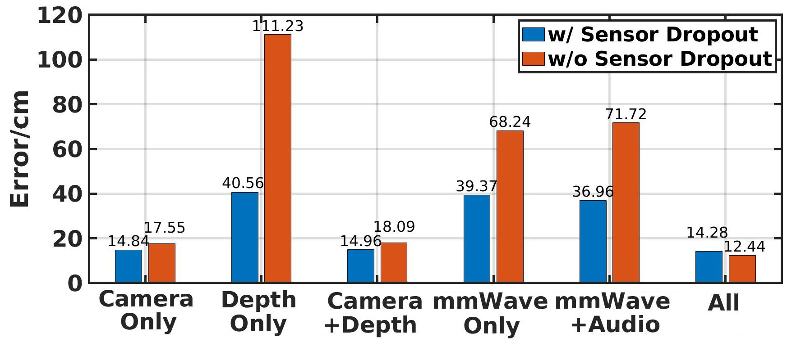

# FlexLoc：针对分布式多模态传感器在物体定位中的零-shot视角不变性，构建的条件神经网络

发布时间：2024年06月10日

`Agent

理由：这篇论文介绍了一种名为FlexLoc的新方法，该方法利用条件神经网络动态注入视角信息，以适应定位流程。这种方法在运行时根据节点姿态调整部分模型权重，从而实现对新视角的高效泛化。这种技术可以被视为一种智能代理（Agent），因为它能够根据环境变化（即传感器姿态的变化）自主调整其行为（即模型权重），以优化定位性能。因此，这篇论文更符合Agent的分类，而不是RAG、LLM应用或LLM理论。` `定位技术` `辅助生活`

> FlexLoc: Conditional Neural Networks for Zero-Shot Sensor Perspective Invariance in Object Localization with Distributed Multimodal Sensors

# 摘要

> 定位技术在导航、监视及辅助生活等多个领域至关重要。现代定位系统通过融合多视角传感器信息，并采用多模态技术，以提升定位的鲁棒性和准确性。近期，这些系统开始采用端到端深度神经网络，这些网络在大规模数据集上训练，展现出优异的性能和处理多传感器数据的能力。然而，这些模型通常仅在特定传感器姿态下训练，实际应用中微小的姿态变化可能导致定位误差剧增。为此，我们推出了FlexLoc，一种利用条件神经网络动态注入视角信息的新方法，以适应定位流程。具体而言，FlexLoc在运行时根据节点姿态调整部分模型权重，从而在无需额外数据校准的情况下，实现对新视角的高效泛化。我们的实验结果表明，在多模态、多视角室内跟踪数据集上，FlexLoc在零-shot场景下相比传统方法提升了近50%的定位精度。FlexLoc的源代码已公开，详情请访问https://github.com/nesl/FlexLoc。

> Localization is a critical technology for various applications ranging from navigation and surveillance to assisted living. Localization systems typically fuse information from sensors viewing the scene from different perspectives to estimate the target location while also employing multiple modalities for enhanced robustness and accuracy. Recently, such systems have employed end-to-end deep neural models trained on large datasets due to their superior performance and ability to handle data from diverse sensor modalities. However, such neural models are often trained on data collected from a particular set of sensor poses (i.e., locations and orientations). During real-world deployments, slight deviations from these sensor poses can result in extreme inaccuracies. To address this challenge, we introduce FlexLoc, which employs conditional neural networks to inject node perspective information to adapt the localization pipeline. Specifically, a small subset of model weights are derived from node poses at run time, enabling accurate generalization to unseen perspectives with minimal additional overhead. Our evaluations on a multimodal, multiview indoor tracking dataset showcase that FlexLoc improves the localization accuracy by almost 50% in the zero-shot case (no calibration data available) compared to the baselines. The source code of FlexLoc is available at https://github.com/nesl/FlexLoc.

[Arxiv](https://arxiv.org/abs/2406.06796)