# FoodSky：一款专为食品领域设计的大型语言模型，成功通过了专业厨师与营养师的严格考核。

发布时间：2024年06月10日

`LLM应用

这篇论文介绍了一个专为食物领域设计的大型语言模型FoodSky，它通过感知与推理深入理解食物数据，并针对中国菜的独特性与复杂性构建了全面的中国食物语料库FoodEarth。论文中提到的基于主题的选择性状态空间模型（TS3M）和分层主题检索增强生成（HTRAG）机制，都是为了提升FoodSky在食物领域的应用能力，如食谱创新、饮食建议等。因此，这篇论文更符合LLM应用分类，因为它专注于特定领域的语言模型应用，而不是理论研究或Agent的设计与实现。` `食品科技` `健康医疗`

> FoodSky: A Food-oriented Large Language Model that Passes the Chef and Dietetic Examination

# 摘要

> 食物不仅是人类的营养之源，更是文化与社交的纽带。随着全球饮食需求的日益复杂，食物智能应运而生，它帮助我们感知和推理各种食物相关任务，如食谱创新、饮食建议，乃至揭示饮食与疾病的关联。为此，我们推出了专为食物领域设计的大型语言模型FoodSky，它通过感知与推理深入理解食物数据。鉴于中国菜的独特性与复杂性，我们精心构建了全面的中国食物语料库FoodEarth，为FoodSky提供深度学习的基础。接着，我们开发了基于主题的选择性状态空间模型（TS3M）和分层主题检索增强生成（HTRAG）机制，分别提升FoodSky对精细食物语义的捕捉能力和生成上下文相关食物文本的能力。评估显示，FoodSky在厨师与营养师考试中的表现远超通用LLMs，准确率分别达到67.2%和66.4%。FoodSky不仅激发烹饪创新，引领健康饮食新风尚，更为解决食物领域实际问题的特定领域LLMs树立了新标杆。您可访问http://222.92.101.211:8200体验FoodSky的在线演示。

> Food is foundational to human life, serving not only as a source of nourishment but also as a cornerstone of cultural identity and social interaction. As the complexity of global dietary needs and preferences grows, food intelligence is needed to enable food perception and reasoning for various tasks, ranging from recipe generation and dietary recommendation to diet-disease correlation discovery and understanding. Towards this goal, for powerful capabilities across various domains and tasks in Large Language Models (LLMs), we introduce Food-oriented LLM FoodSky to comprehend food data through perception and reasoning. Considering the complexity and typicality of Chinese cuisine, we first construct one comprehensive Chinese food corpus FoodEarth from various authoritative sources, which can be leveraged by FoodSky to achieve deep understanding of food-related data. We then propose Topic-based Selective State Space Model (TS3M) and the Hierarchical Topic Retrieval Augmented Generation (HTRAG) mechanism to enhance FoodSky in capturing fine-grained food semantics and generating context-aware food-relevant text, respectively. Our extensive evaluations demonstrate that FoodSky significantly outperforms general-purpose LLMs in both chef and dietetic examinations, with an accuracy of 67.2% and 66.4% on the Chinese National Chef Exam and the National Dietetic Exam, respectively. FoodSky not only promises to enhance culinary creativity and promote healthier eating patterns, but also sets a new standard for domain-specific LLMs that address complex real-world issues in the food domain. An online demonstration of FoodSky is available at http://222.92.101.211:8200.

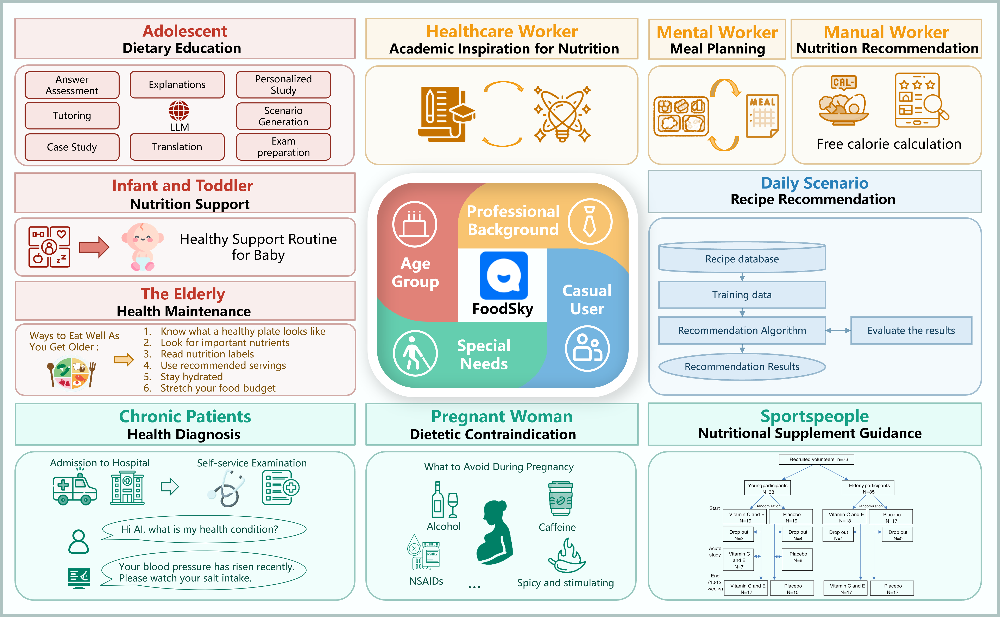

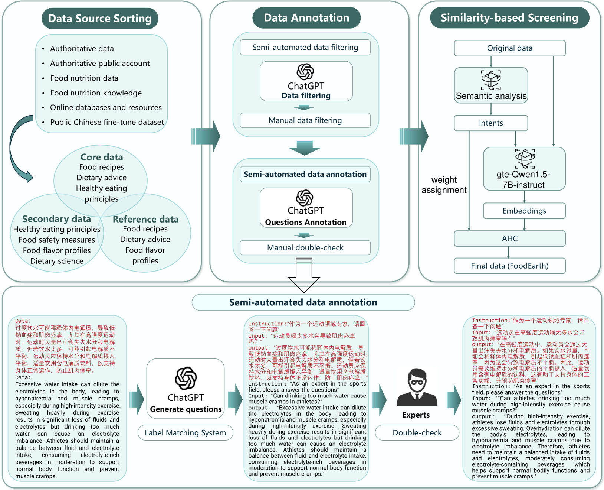

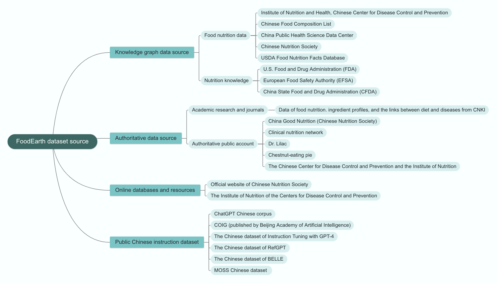

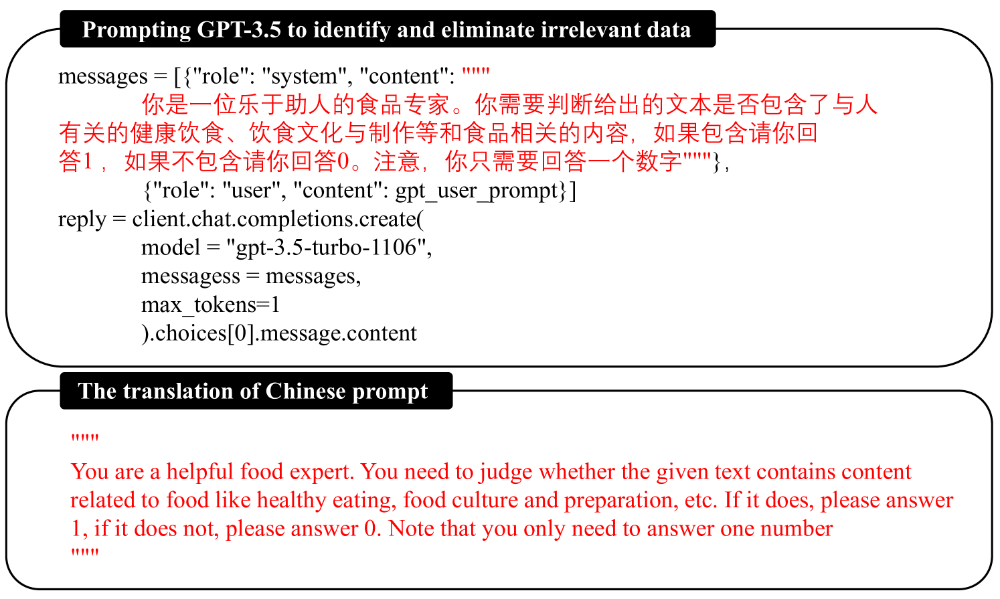

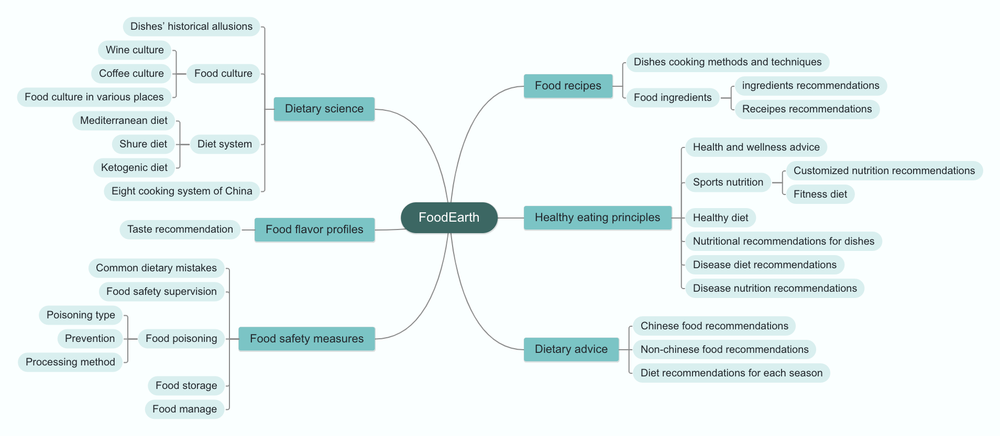

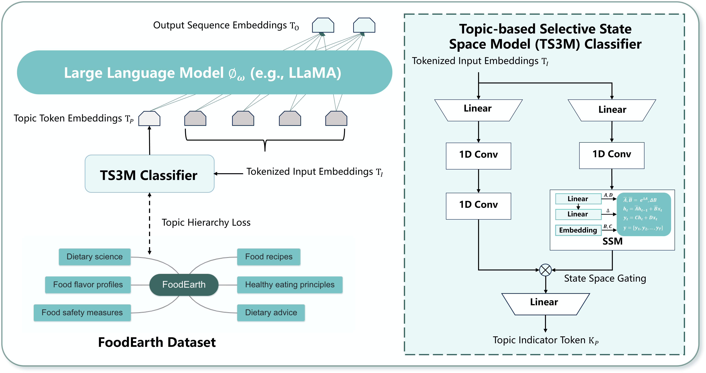

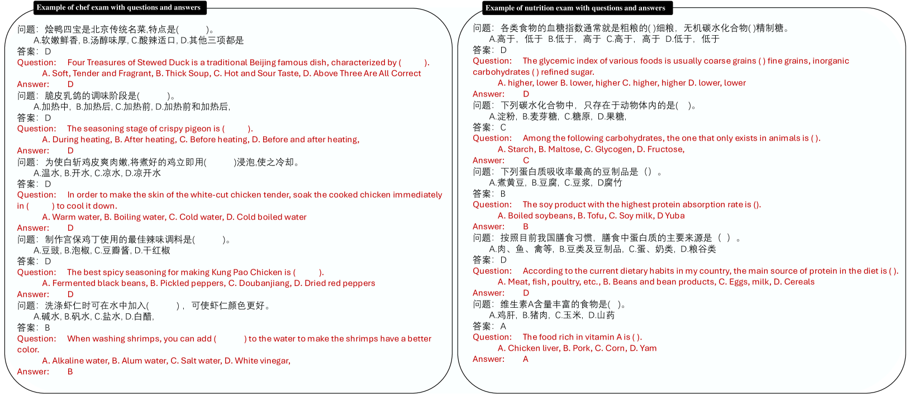

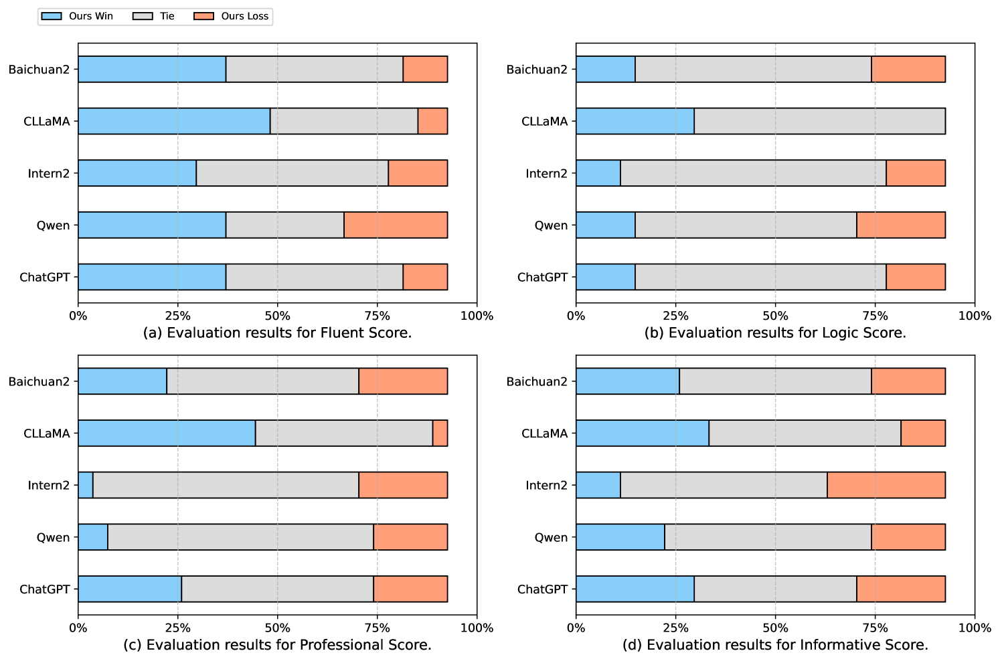

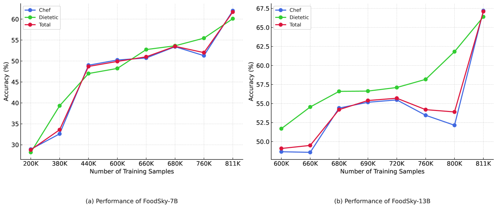

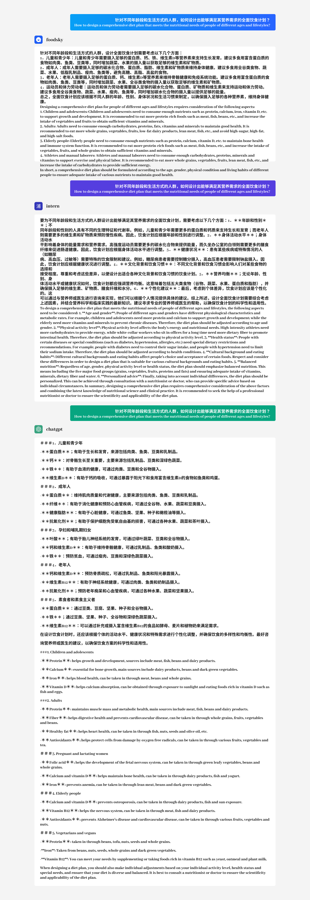

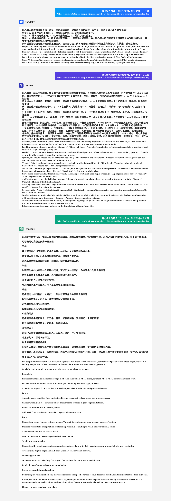

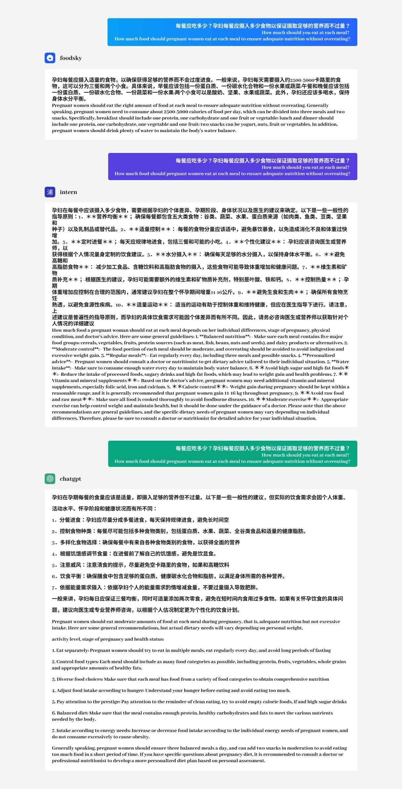

[Arxiv](https://arxiv.org/abs/2406.10261)