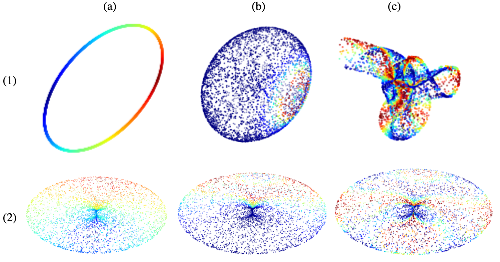

# 循环神经网络中的几何结构精简

发布时间：2024年06月10日

`LLM理论

理由：这篇论文主要探讨了针对循环神经网络（RNNs）的稀疏化技术，特别是引入了一种新型的模数正则化方法。虽然这种方法在自然语言处理任务中得到了应用，但论文的核心贡献在于理论层面的创新，即通过几何正则项为神经网络的稀疏结构提供了预先定义。这与大型语言模型（LLM）的理论研究相关，因为它涉及神经网络结构的优化和理论基础，而不仅仅是应用层面的实现或特定的Agent或RAG（Retrieval-Augmented Generation）技术。因此，将其归类为LLM理论是合适的。` `导航系统`

> Geometric sparsification in recurrent neural networks

# 摘要

> 为了降低大型神经网络的计算成本，稀疏化技术应运而生，它通过在训练中移除部分神经连接来实现。这种技术使得稀疏模型在保持顶尖准确性的同时，运行成本更为经济。然而，稀疏网络的底层结构复杂难解，且在不同训练模型和稀疏策略间缺乏一致性。本文提出了一种针对循环神经网络（RNNs）的新型稀疏化方法——模数正则化，辅以幅度剪枝。该方法利用RNNs的循环结构所产生的动力系统，在隐藏状态的神经元间建立几何联系。通过明确引入几何正则项，我们首次（据我们所知）为神经网络的理想稀疏结构提供了预先定义。我们验证了该方法在导航和自然语言处理任务中的有效性。导航任务具有明确的几何结构，存在已知的模数空间，我们发现，只有当正则化系数与合适的模数空间相匹配时，才能在保持性能的同时实现90%的稀疏度。而对于自然语言处理，尽管不存在已知的模数空间，我们的模数正则化方法仍能促进更稳定的RNNs构建，并在高达98%的稀疏度下，生成高保真模型。

> A common technique for ameliorating the computational costs of running large neural models is sparsification, or the removal of neural connections during training. Sparse models are capable of maintaining the high accuracy of state of the art models, while functioning at the cost of more parsimonious models. The structures which underlie sparse architectures are, however, poorly understood and not consistent between differently trained models and sparsification schemes. In this paper, we propose a new technique for sparsification of recurrent neural nets (RNNs), called moduli regularization, in combination with magnitude pruning. Moduli regularization leverages the dynamical system induced by the recurrent structure to induce a geometric relationship between neurons in the hidden state of the RNN. By making our regularizing term explicitly geometric, we provide the first, to our knowledge, a priori description of the desired sparse architecture of our neural net. We verify the effectiveness of our scheme for navigation and natural language processing RNNs. Navigation is a structurally geometric task, for which there are known moduli spaces, and we show that regularization can be used to reach 90% sparsity while maintaining model performance only when coefficients are chosen in accordance with a suitable moduli space. Natural language processing, however, has no known moduli space in which computations are performed. Nevertheless, we show that moduli regularization induces more stable recurrent neural nets with a variety of moduli regularizers, and achieves high fidelity models at 98% sparsity.

[Arxiv](https://arxiv.org/abs/2406.06290)