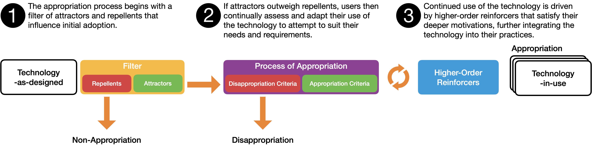
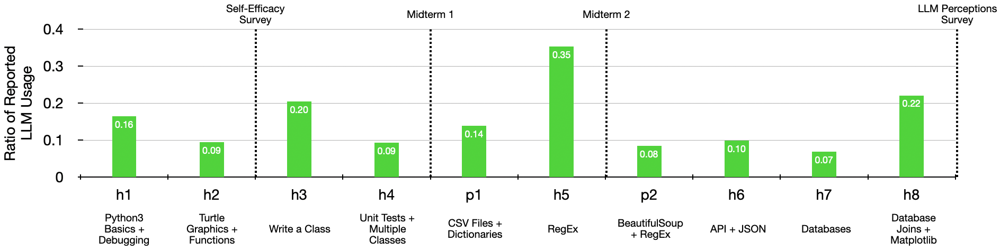
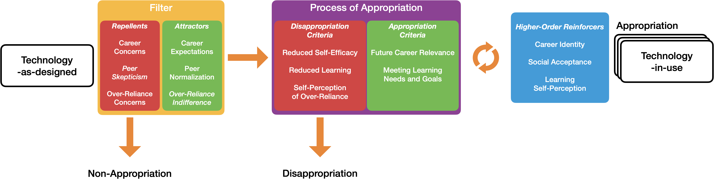

# 社会塑造理论视角下的洞见：大型语言模型在本科编程课程中的采纳与应用

发布时间：2024年06月10日

`LLM应用

这篇论文探讨了大型语言模型（LLMs）在本科编程教育中的应用及其对学生社会认知的影响。研究通过分析学生的社会认知、自我效能感以及课程成绩，揭示了LLMs在教育环境中的实际应用和潜在影响。这与LLMs的理论研究不同，因为它关注的是LLMs在实际教育场景中的应用效果和学生反应，而不是LLMs本身的理论或技术细节。因此，这篇论文属于LLM应用分类。` `编程教育` `教育研究`

> Insights from Social Shaping Theory: The Appropriation of Large Language Models in an Undergraduate Programming Course

# 摘要

> 大型语言模型（LLMs）在代码生成、调试和解释方面的能力，激发了本科编程教育领域研究者和教育者的浓厚兴趣，他们预见到了LLMs在编程教育中的巨大变革潜力。然而，如何以及为何将LLMs融入编程教育，这一决策过程远不止是对LLMs技术能力的简单评估。本研究以技术社会塑造理论为框架，深入探讨了学生的社会认知如何塑造他们对LLMs的使用。我们进一步探究了学生自我报告的LLMs使用与其自我效能感及本科编程课程中期成绩之间的关联。通过整合匿名课程结束学生调查（n=158）、中期自我效能感调查（n=158）、学生访谈（n=10）、家庭作业中自我报告的LLMs使用情况以及中期成绩的数据，我们揭示了学生对LLMs的使用与其对未来职业的期望和同伴使用情况的认知紧密相连。此外，我们发现，早期自我报告的LLMs使用与较低的自我效能感和中期成绩相关，而学生对LLMs的过度依赖感（而非使用本身）与课程后期自我效能感的下降相关。

> The capability of large language models (LLMs) to generate, debug, and explain code has sparked the interest of researchers and educators in undergraduate programming, with many anticipating their transformative potential in programming education. However, decisions about why and how to use LLMs in programming education may involve more than just the assessment of an LLM's technical capabilities. Using the social shaping of technology theory as a guiding framework, our study explores how students' social perceptions influence their own LLM usage. We then examine the correlation of self-reported LLM usage with students' self-efficacy and midterm performances in an undergraduate programming course. Triangulating data from an anonymous end-of-course student survey (n = 158), a mid-course self-efficacy survey (n=158), student interviews (n = 10), self-reported LLM usage on homework, and midterm performances, we discovered that students' use of LLMs was associated with their expectations for their future careers and their perceptions of peer usage. Additionally, early self-reported LLM usage in our context correlated with lower self-efficacy and lower midterm scores, while students' perceived over-reliance on LLMs, rather than their usage itself, correlated with decreased self-efficacy later in the course.

[Arxiv](https://arxiv.org/abs/2406.06451)