# LINGOLY：低资源与已灭绝语言的奥赛级语言推理谜题基准

发布时间：2024年06月10日

`LLM理论

理由：这篇论文介绍了LingOly基准，这是一个专门设计来测试大型语言模型（LLM）的高级推理能力的基准。它通过使用语言学奥林匹克难题来评估模型在识别和归纳语言模式以及执行复杂任务指令方面的能力。论文的重点在于评估和分析LLM的理论推理能力，而不是它们的实际应用、代理行为或检索增强生成（RAG）技术。因此，它更符合LLM理论的分类。` `语言学` `人工智能`

> LINGOLY: A Benchmark of Olympiad-Level Linguistic Reasoning Puzzles in Low-Resource and Extinct Languages

# 摘要

> 本文推出了LingOly基准，专为测试大型语言模型的高级推理能力而设计。我们利用语言学奥林匹克难题，考察模型在极低资源或已灭绝语言中识别和归纳语言模式的能力，以及执行复杂任务指令的能力。LingOly基准包含超过90种低资源语言，有效避免了数据污染，并提供了1,133个问题，涵盖6种格式和5个难度级别。我们通过直接准确性和与无上下文基线的对比来评估模型，以防止记忆效应。结果显示，即使是顶尖的11个LLM也发现该基准极具挑战性，尤其是在高难度问题上表现不佳。顶级模型在难题上的准确率仅为35.3%，比无上下文基线提高了21.7%。通常，大型封闭模型优于开放模型，且语言资源越丰富，得分越高。这表明，在排除记忆因素后，多步骤跨领域推理仍是当前语言模型的难题。

> In this paper, we present the LingOly benchmark, a novel benchmark for advanced reasoning abilities in large language models. Using challenging Linguistic Olympiad puzzles, we evaluate (i) capabilities for in-context identification and generalisation of linguistic patterns in very low-resource or extinct languages, and (ii) abilities to follow complex task instructions. The LingOly benchmark covers more than 90 mostly low-resource languages, minimising issues of data contamination, and contains 1,133 problems across 6 formats and 5 levels of human difficulty. We assess performance with both direct accuracy and comparison to a no-context baseline to penalise memorisation. Scores from 11 state-of-the-art LLMs demonstrate the benchmark to be challenging, and models perform poorly on the higher difficulty problems. On harder problems, even the top model only achieved 35.3% accuracy, 21.7% improvement over the no-context baseline. Large closed models typically outperform open models, and in general, the higher resource the language, the better the scores. These results indicate, in absence of memorisation, true multi-step out-of-domain reasoning remains a challenge for current language models.

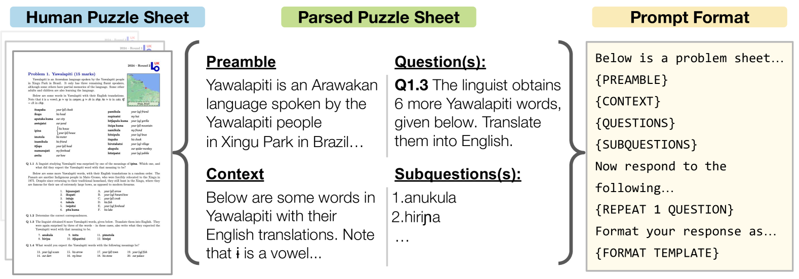

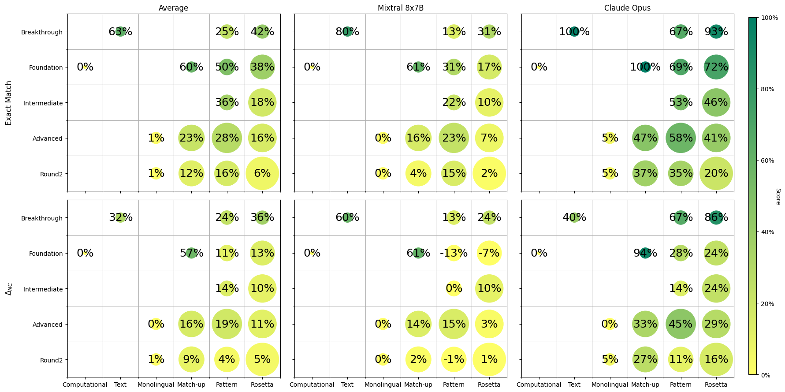

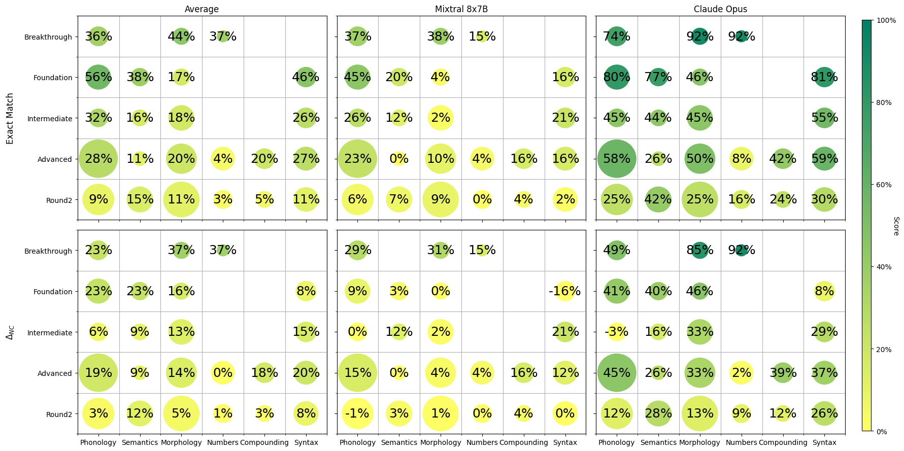

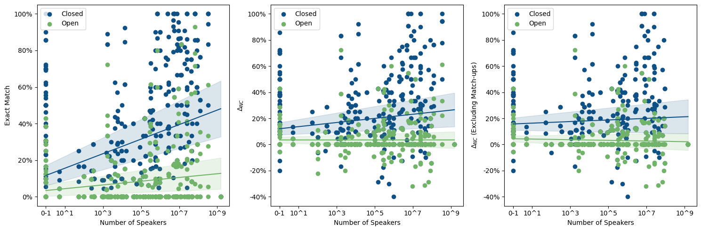

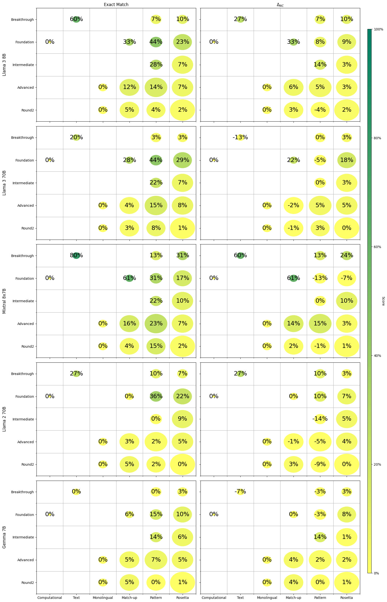

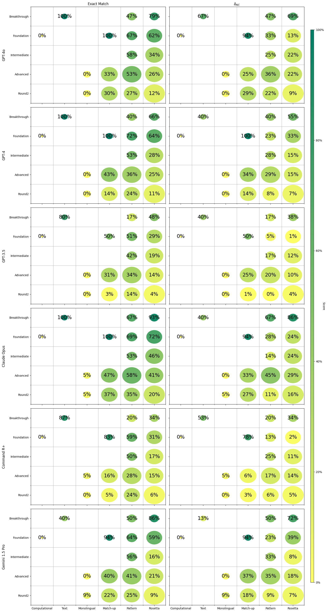

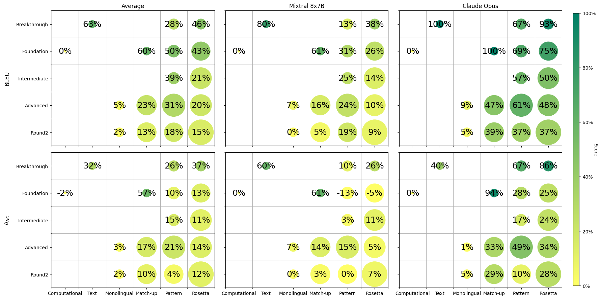

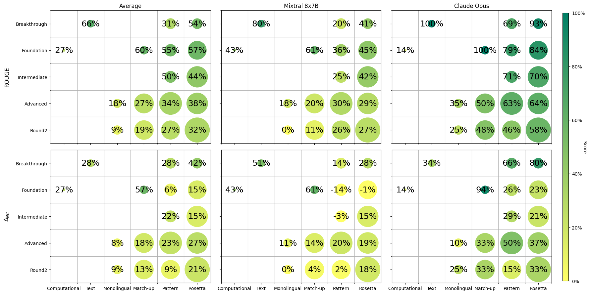

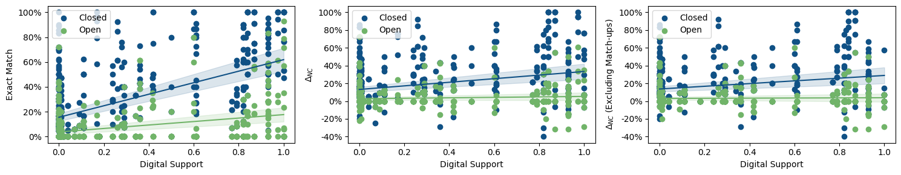

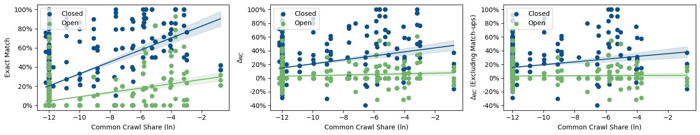

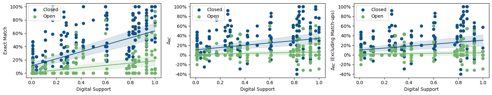

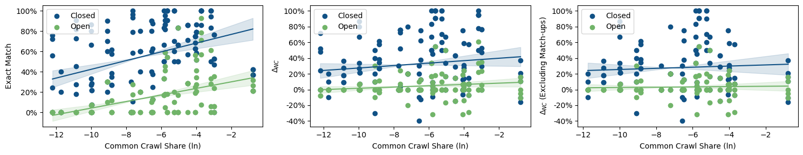

[Arxiv](https://arxiv.org/abs/2406.06196)