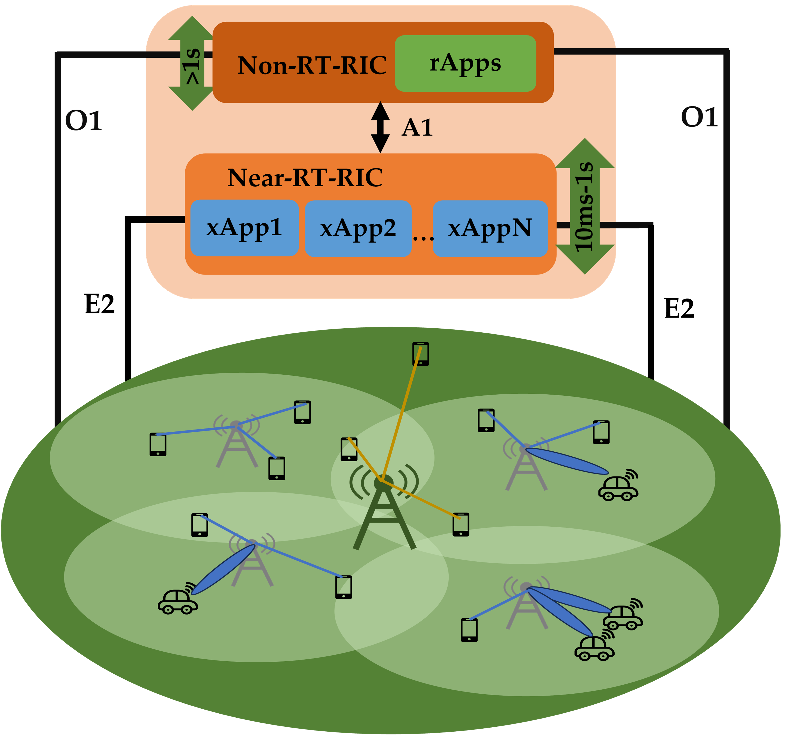
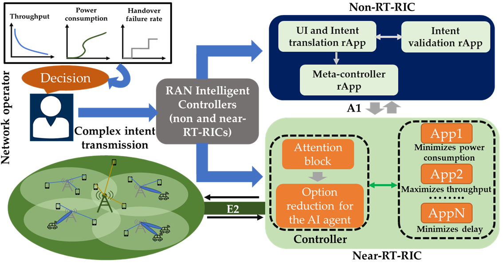
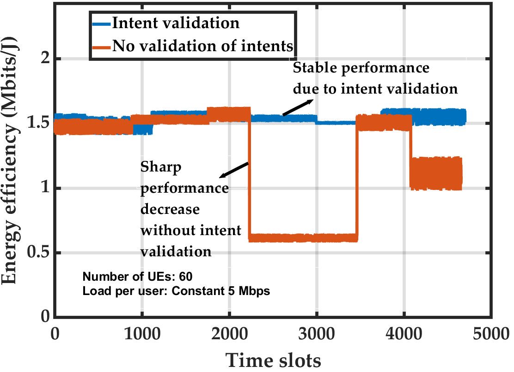
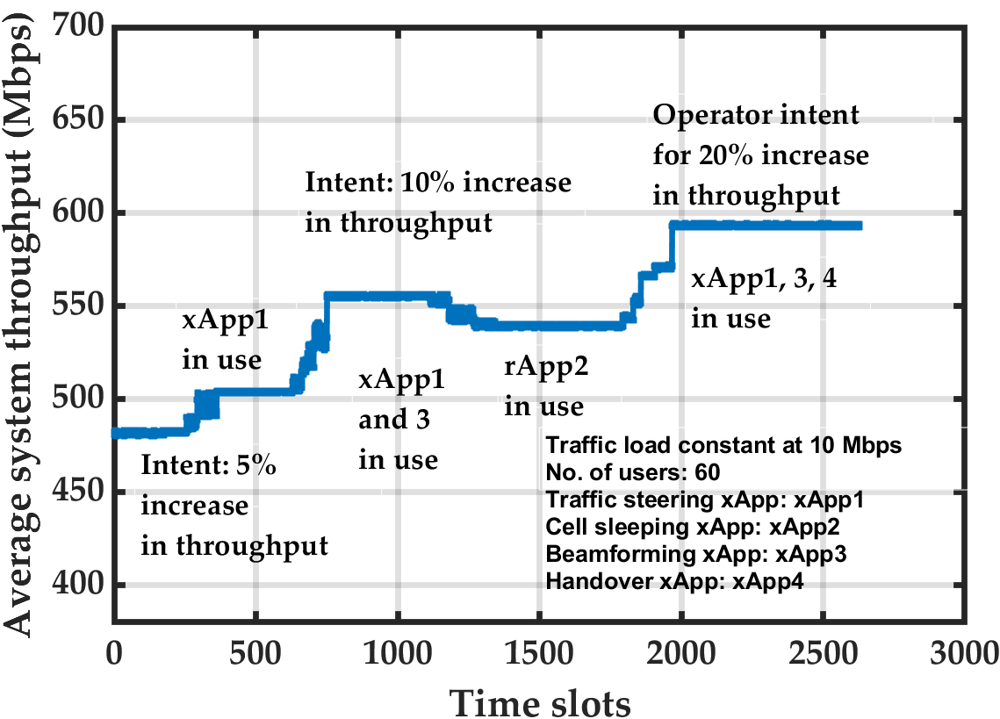
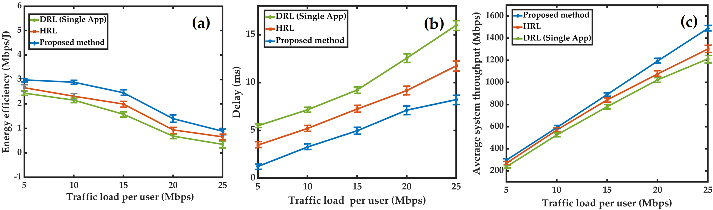

# 利用基于注意力的分层强化学习，优化网络并处理基于大型语言模型（LLM）的意图

发布时间：2024年06月10日

`Agent

理由：这篇论文主要讨论了基于意图的网络自动化，并提出了一种三步走的策略来处理和优化网络管理。其中，利用轻量级LLM处理意图，并通过机器学习优化应用来提升网络性能。这些应用采用了基于注意力的分层强化学习算法，能够精准响应运营商的意图。这表明论文的核心在于开发和应用智能Agent来优化网络管理，因此归类为Agent。` `网络管理` `通信技术`

> LLM-Based Intent Processing and Network Optimization Using Attention-Based Hierarchical Reinforcement Learning

# 摘要

> 基于意图的网络自动化为简化网络管理提供了新途径，但仍需克服几大挑战：首先，需精确识别并处理意图中的逻辑和参数；其次，确保意图与实时网络状态相匹配；最后，通过O-RAN中的xApps和rApps等优化工具实现意图。本文提出了一种三步走的策略：首先，利用轻量级LLM高效处理意图；接着，将处理后的意图与未来流量模式进行校验；最后，开发了一系列基于机器学习的优化应用，显著提升了吞吐量、降低了延迟并提高了能源效率。通过采用基于注意力的分层强化学习算法，这些应用能够精准响应运营商的意图。模拟结果表明，该方法在吞吐量上提升了至少12%，能源效率提高了17.1%，网络延迟降低了26.5%，远超传统算法。

> Intent-based network automation is a promising tool to enable easier network management however certain challenges need to be effectively addressed. These are: 1) processing intents, i.e., identification of logic and necessary parameters to fulfill an intent, 2) validating an intent to align it with current network status, and 3) satisfying intents via network optimizing functions like xApps and rApps in O-RAN. This paper addresses these points via a three-fold strategy to introduce intent-based automation for O-RAN. First, intents are processed via a lightweight Large Language Model (LLM). Secondly, once an intent is processed, it is validated against future incoming traffic volume profiles (high or low). Finally, a series of network optimization applications (rApps and xApps) have been developed. With their machine learning-based functionalities, they can improve certain key performance indicators such as throughput, delay, and energy efficiency. In this final stage, using an attention-based hierarchical reinforcement learning algorithm, these applications are optimally initiated to satisfy the intent of an operator. Our simulations show that the proposed method can achieve at least 12% increase in throughput, 17.1% increase in energy efficiency, and 26.5% decrease in network delay compared to the baseline algorithms.

[Arxiv](https://arxiv.org/abs/2406.06059)