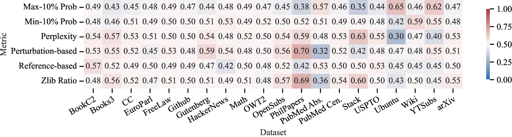

# 大型语言模型数据集推理：您的模型是否曾在我提供的数据集上进行过训练？

发布时间：2024年06月10日

`LLM应用

这篇论文主要关注大型语言模型（LLMs）在版权争议背景下的应用问题，特别是成员推断攻击（MIAs）的有效性和局限性。论文提出了一种新的数据集推断方法，用于识别LLMs的训练数据集，这在处理版权问题时尤为重要。因此，这篇论文属于LLM应用分类，因为它探讨了LLMs在实际应用中的一个具体问题，即如何处理和解决与版权相关的挑战。` `数据隐私`

> LLM Dataset Inference: Did you train on my dataset?

# 摘要

> 大型语言模型（LLMs）的普及引发了版权争议，多家公司因使用未经授权的网络数据训练模型而面临诉讼。近期研究提出了成员推断攻击（MIAs），用以判断特定文本是否被用于模型训练。然而，我们发现MIAs的成功往往是因为选择了与训练数据分布不同的非成员文本。当面对同一分布的文本时，MIAs的准确率并不高于随机猜测。即便MIAs有效，它们在不同分布样本的成员推断上也表现不一。为此，我们提出了一种新的数据集推断方法，旨在精准识别LLMs的训练数据集。这种方法在当前版权争议中尤为重要，因为它涉及的是基于多文档（如整本书）而非单一文段的训练。我们通过整合对特定分布有积极影响的MIAs，并进行统计测试，有效区分了Pile数据集不同子集的训练与测试部分，且结果具有统计显著性，无误报。

> The proliferation of large language models (LLMs) in the real world has come with a rise in copyright cases against companies for training their models on unlicensed data from the internet. Recent works have presented methods to identify if individual text sequences were members of the model's training data, known as membership inference attacks (MIAs). We demonstrate that the apparent success of these MIAs is confounded by selecting non-members (text sequences not used for training) belonging to a different distribution from the members (e.g., temporally shifted recent Wikipedia articles compared with ones used to train the model). This distribution shift makes membership inference appear successful. However, most MIA methods perform no better than random guessing when discriminating between members and non-members from the same distribution (e.g., in this case, the same period of time). Even when MIAs work, we find that different MIAs succeed at inferring membership of samples from different distributions. Instead, we propose a new dataset inference method to accurately identify the datasets used to train large language models. This paradigm sits realistically in the modern-day copyright landscape, where authors claim that an LLM is trained over multiple documents (such as a book) written by them, rather than one particular paragraph. While dataset inference shares many of the challenges of membership inference, we solve it by selectively combining the MIAs that provide positive signal for a given distribution, and aggregating them to perform a statistical test on a given dataset. Our approach successfully distinguishes the train and test sets of different subsets of the Pile with statistically significant p-values < 0.1, without any false positives.

[Arxiv](https://arxiv.org/abs/2406.06443)