# 语言模型对对齐存在抗拒性

发布时间：2024年06月10日

`LLM理论

这篇论文主要探讨了大型语言模型（LLMs）在微调过程中的“弹性”现象，即模型在进一步微调时倾向于恢复到预训练阶段的行为模式。研究通过理论分析和实证研究揭示了这一现象，并运用压缩理论证明了微调过程对调整的破坏远大于预训练。此外，论文还探讨了模型弹性的增强与模型规模和预训练数据的增加之间的关系。这些内容属于对LLMs理论层面的深入分析，因此应归类为LLM理论。` `人工智能` `模型调整`

> Language Models Resist Alignment

# 摘要

> 大型语言模型（LLMs）有时会表现出不良行为，为此，研究者们正努力调整这些模型以防止有害内容生成。然而，研究表明，即使是最精细的调整过程也可能轻易被绕过。那么，微调调整是否真的能深入影响模型，还是只是表面功夫？本研究通过理论分析和实证研究，揭示了调整后模型的“弹性”现象——即在进一步微调时，模型倾向于恢复到预训练阶段的行为模式。我们运用压缩理论证明，这种微调过程对调整的破坏远大于预训练，可能达到数量级的差异。实验验证了不同规模和类型的模型中均存在这种弹性。我们发现，模型性能在恢复到预训练状态前会迅速下降，之后下降速度大幅减缓。此外，我们还发现模型弹性的增强与模型规模和预训练数据的增加呈正相关。这一发现强调了控制LLMs固有弹性的重要性，以克服其对微调调整的内在抵抗。

> Large language models (LLMs) may exhibit undesirable behaviors. Recent efforts have focused on aligning these models to prevent harmful generation. Despite these efforts, studies have shown that even a well-conducted alignment process can be easily circumvented, whether intentionally or accidentally. Do alignment fine-tuning have robust effects on models, or are merely superficial? In this work, we answer this question through both theoretical and empirical means. Empirically, we demonstrate the elasticity of post-alignment models, i.e., the tendency to revert to the behavior distribution formed during the pre-training phase upon further fine-tuning. Using compression theory, we formally derive that such fine-tuning process \textit{disproportionately} undermines alignment compared to pre-training, potentially by orders of magnitude. We conduct experimental validations to confirm the presence of elasticity across models of varying types and sizes. Specifically, we find that model performance declines rapidly before reverting to the pre-training distribution, after which the rate of decline drops significantly. We further reveal that elasticity positively correlates with increased model size and the expansion of pre-training data. Our discovery signifies the importance of taming the inherent elasticity of LLMs, thereby overcoming the resistance of LLMs to alignment finetuning.

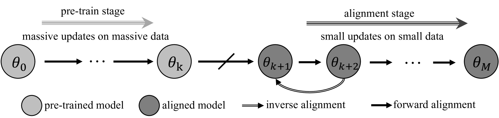

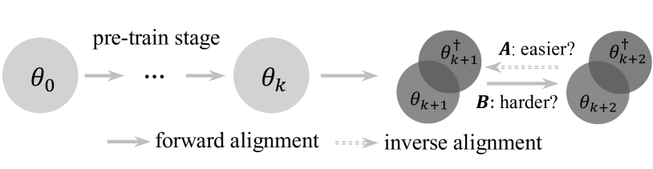

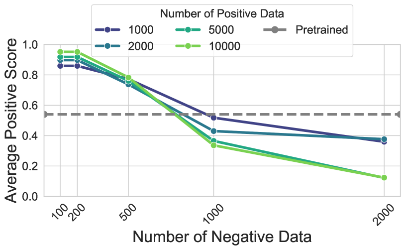

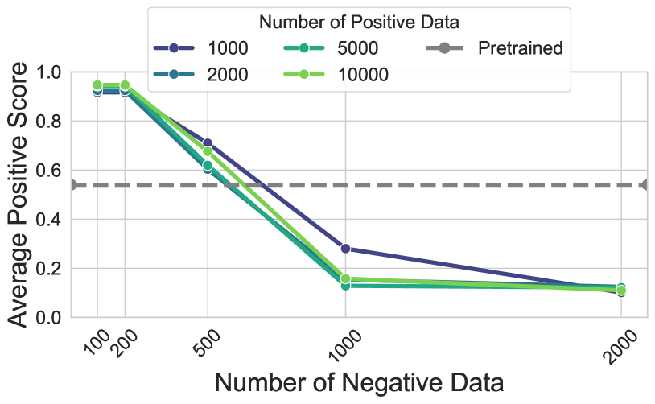

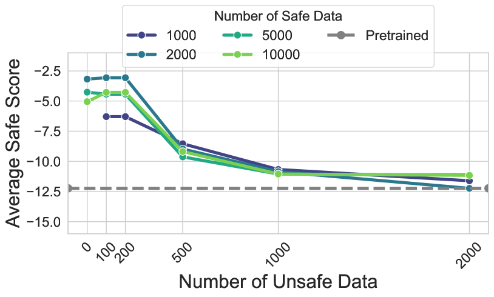

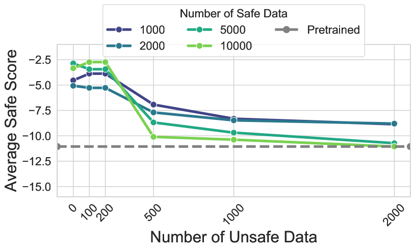

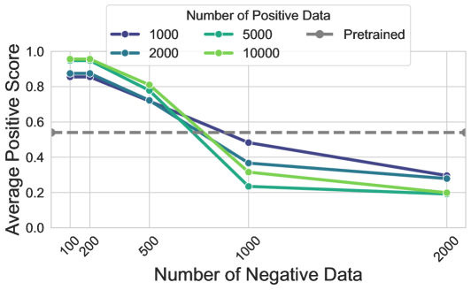

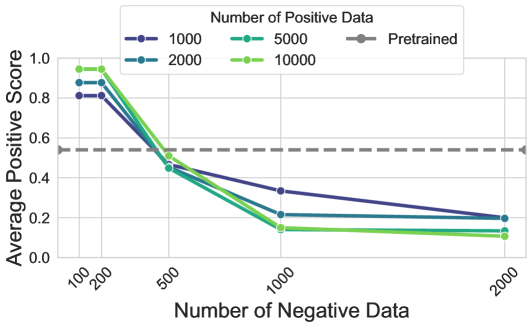

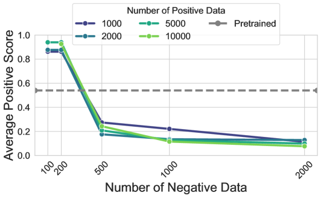

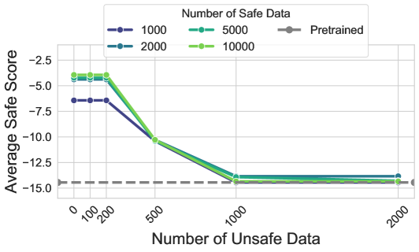

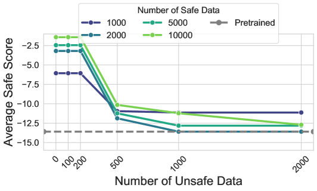

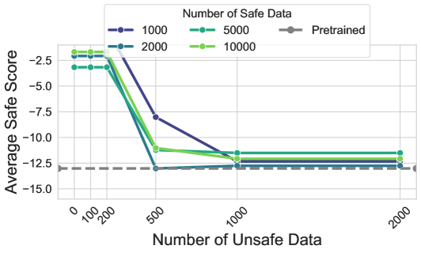

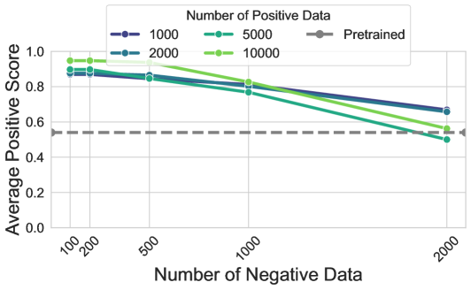

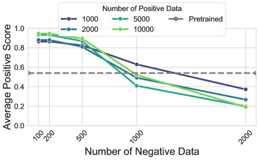

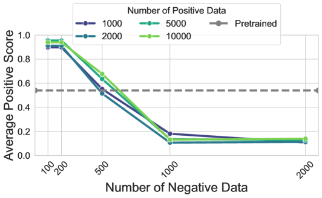

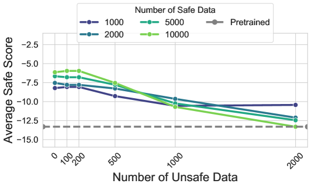

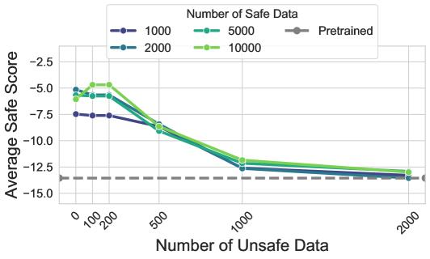

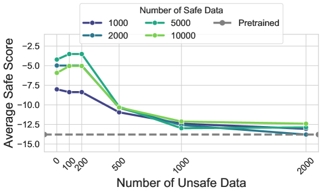

[Arxiv](https://arxiv.org/abs/2406.06144)