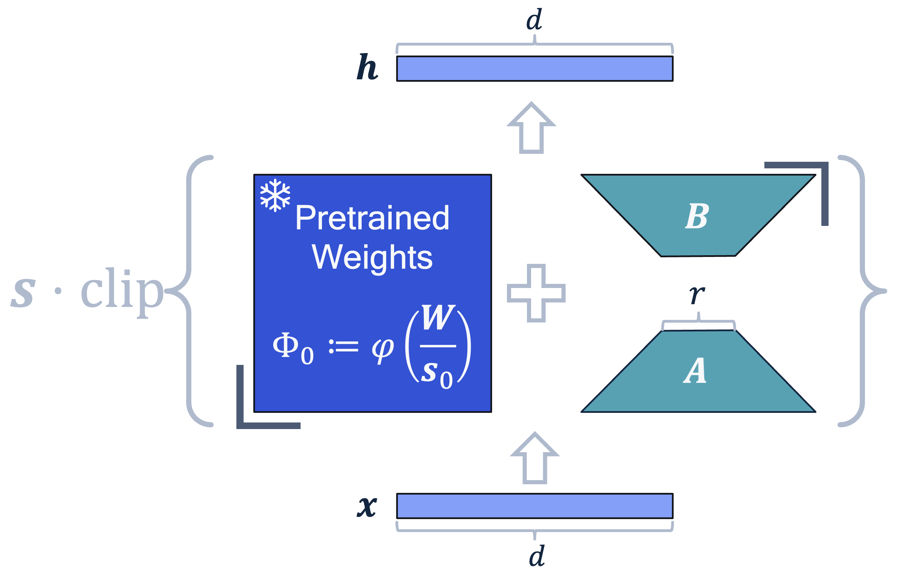
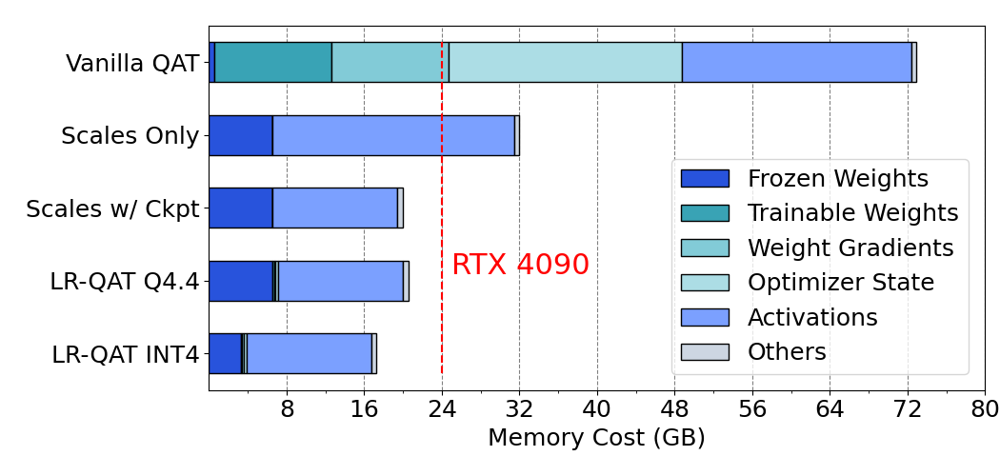

# 大型语言模型中的低秩量化感知训练

发布时间：2024年06月10日

`LLM应用

这篇论文主要讨论了大型语言模型（LLMs）的量化技术，特别是量化感知训练（QAT）的改进方法，即LR-QAT。该方法旨在提高LLMs的效率和内存使用，同时保持性能。论文中提到的LR-QAT是一种专为LLMs设计的轻量级且内存高效的QAT算法，它通过使用低秩辅助权重和其他技术来节省内存，并在推理时保持高效。此外，论文还展示了LR-QAT在实际模型（如LLaMA-2/3和Mistral）上的应用和性能验证。因此，这篇论文属于LLM应用分类，因为它关注的是LLMs的实际应用和优化技术。` `人工智能` `机器学习`

> Low-Rank Quantization-Aware Training for LLMs

# 摘要

> 大型语言模型（LLMs）虽无处不在，但因其日益增长的计算和内存需求，实际部署颇具挑战。量化技术是提升其效率的关键，而量化感知训练（QAT）虽能带来最佳性能，却因训练时间长和内存消耗大而在LLMs应用中显得不切实际。借鉴参数高效微调（PEFT）和低秩适应（LoRA）的研究，我们开发了LR-QAT——一种轻巧且内存高效的QAT算法，专为LLMs设计。LR-QAT通过低秩辅助权重、定点或双打包整数的下转换操作及检查点等技术，有效节省内存，同时保持预测性能。我们的方法在推理上高效，无额外开销，可作为通用预训练框架的扩展，适用于多种量化设置，并能与多种PTQ技术结合。在LLaMA-2/3和Mistral模型上应用LR-QAT，并在多个下游任务中验证了其优越性，以更少的内存达到了与全模型QAT相当的性能。例如，我们能在单个24GB内存的消费级GPU上训练7B的LLM。

> Large language models (LLMs) are omnipresent, however their practical deployment is challenging due to their ever increasing computational and memory demands. Quantization is one of the most effective ways to make them more compute and memory efficient. Quantization-aware training (QAT) methods, generally produce the best quantized performance, however it comes at the cost of potentially long training time and excessive memory usage, making it impractical when applying for LLMs. Inspired by parameter-efficient fine-tuning (PEFT) and low-rank adaptation (LoRA) literature, we propose LR-QAT -- a lightweight and memory-efficient QAT algorithm for LLMs. LR-QAT employs several components to save memory without sacrificing predictive performance: (a) low-rank auxiliary weights that are aware of the quantization grid; (b) a downcasting operator using fixed-point or double-packed integers and (c) checkpointing. Unlike most related work, our method (i) is inference-efficient, leading to no additional overhead compared to traditional PTQ; (ii) can be seen as a general extended pretraining framework, meaning that the resulting model can still be utilized for any downstream task afterwards; (iii) can be applied across a wide range of quantization settings, such as different choices quantization granularity, activation quantization, and seamlessly combined with many PTQ techniques. We apply LR-QAT to the LLaMA-2/3 and Mistral model families and validate its effectiveness on several downstream tasks. Our method outperforms common post-training quantization (PTQ) approaches and reaches the same model performance as full-model QAT at the fraction of its memory usage. Specifically, we can train a 7B LLM on a single consumer grade GPU with 24GB of memory.

[Arxiv](https://arxiv.org/abs/2406.06385)