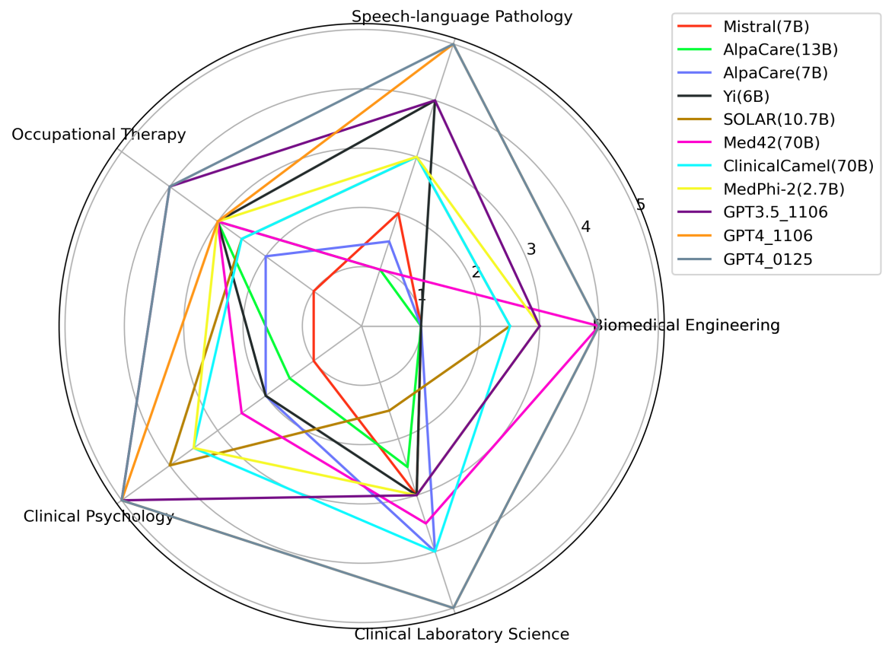
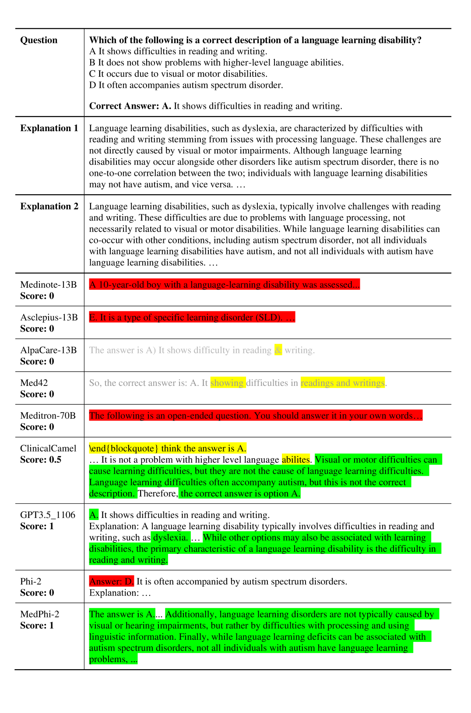

# MedExQA：医学问答的多解释基准

发布时间：2024年06月10日

`LLM应用

这篇论文介绍了MedExQA，一个医学问答评估基准，专注于评估大型语言模型（LLMs）在医学领域的理解和解释能力。它不仅构建了一个包含多个医学领域的数据集，还提供了多种解释来评估LLMs的性能。此外，论文还开发了一个新的模型MedPhi-2，用于在资源受限的环境中提升解释生成能力。这些内容都直接关联到LLMs在特定应用场景（即医学问答）中的实际应用和性能评估，因此属于LLM应用分类。` `语言模型评估`

> MedExQA: Medical Question Answering Benchmark with Multiple Explanations

# 摘要

> 本文推出了MedExQA，一个创新的医学问答评估基准，旨在通过解释性测试大型语言模型（LLMs）对医学知识的理解深度。我们构建了涵盖五个较少被关注的医学领域的数据集，并为每个问答对提供多种解释，填补了现有医学问答基准中对LLMs生成复杂医学解释能力评估的空白。本研究强调了医学LLMs解释性的关键作用，提出了一种超越传统分类准确性评估的新方法，并指出了包括GPT4在内的LLMs在言语语言病理学领域的理解短板。研究结果表明，采用多种解释的生成评估更贴近人类评价标准，为LLMs的理解能力评估提供了新的视角。此外，为了丰富开源医学LLMs的多样性（目前多基于Llama2），我们开发了基于Phi-2（2.7B）的新模型MedPhi-2，其在资源受限的医学领域中，解释生成能力超越了基于Llama2-70B的模型。我们计划公开分享这些基准数据集及训练模型。

> This paper introduces MedExQA, a novel benchmark in medical question-answering, to evaluate large language models' (LLMs) understanding of medical knowledge through explanations. By constructing datasets across five distinct medical specialties that are underrepresented in current datasets and further incorporating multiple explanations for each question-answer pair, we address a major gap in current medical QA benchmarks which is the absence of comprehensive assessments of LLMs' ability to generate nuanced medical explanations. Our work highlights the importance of explainability in medical LLMs, proposes an effective methodology for evaluating models beyond classification accuracy, and sheds light on one specific domain, speech language pathology, where current LLMs including GPT4 lack good understanding. Our results show generation evaluation with multiple explanations aligns better with human assessment, highlighting an opportunity for a more robust automated comprehension assessment for LLMs. To diversify open-source medical LLMs (currently mostly based on Llama2), this work also proposes a new medical model, MedPhi-2, based on Phi-2 (2.7B). The model outperformed medical LLMs based on Llama2-70B in generating explanations, showing its effectiveness in the resource-constrained medical domain. We will share our benchmark datasets and the trained model.

[Arxiv](https://arxiv.org/abs/2406.06331)