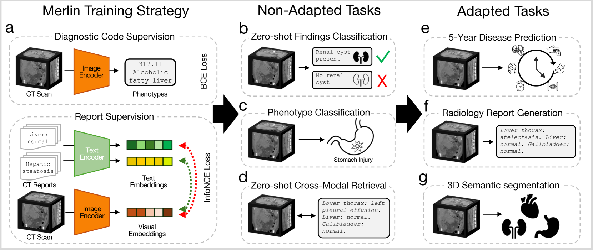
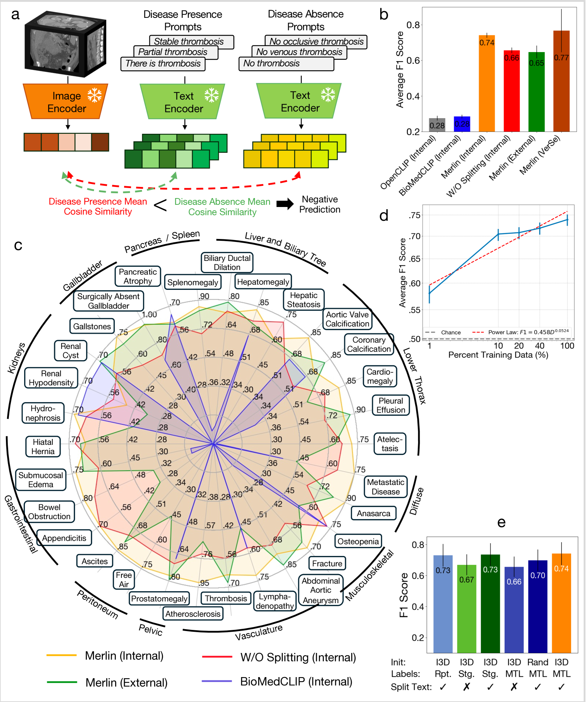
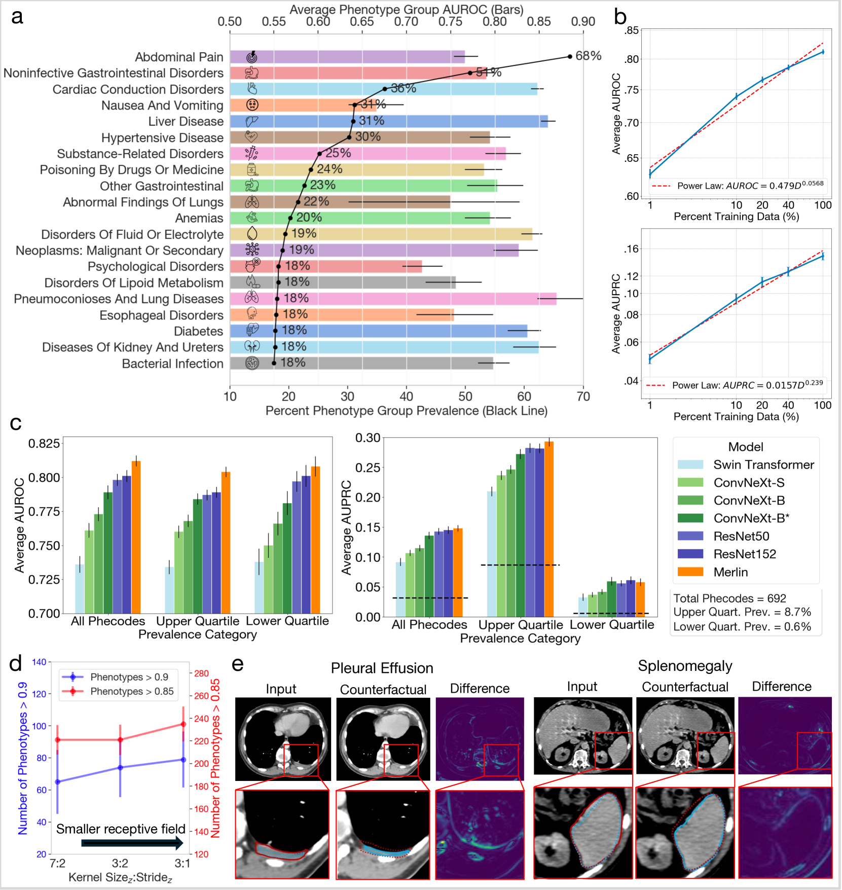
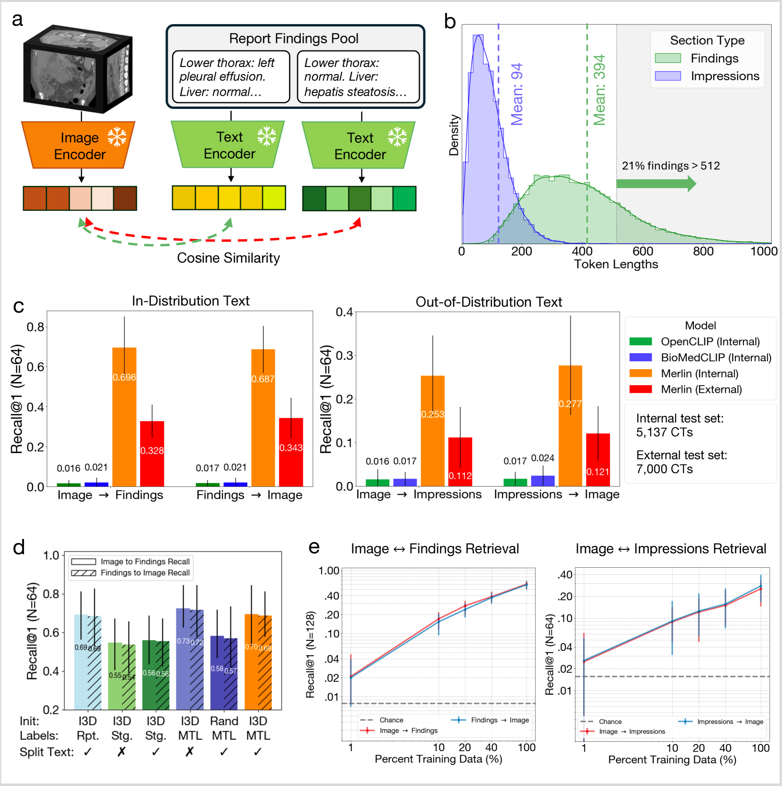
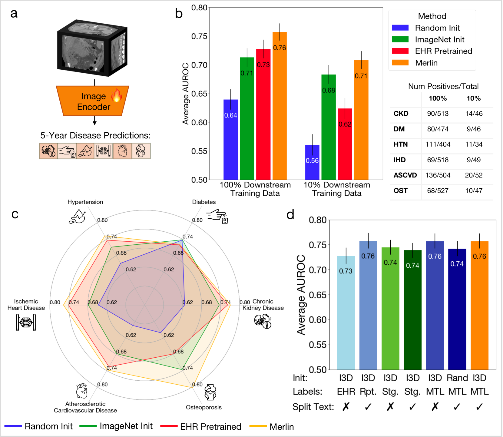
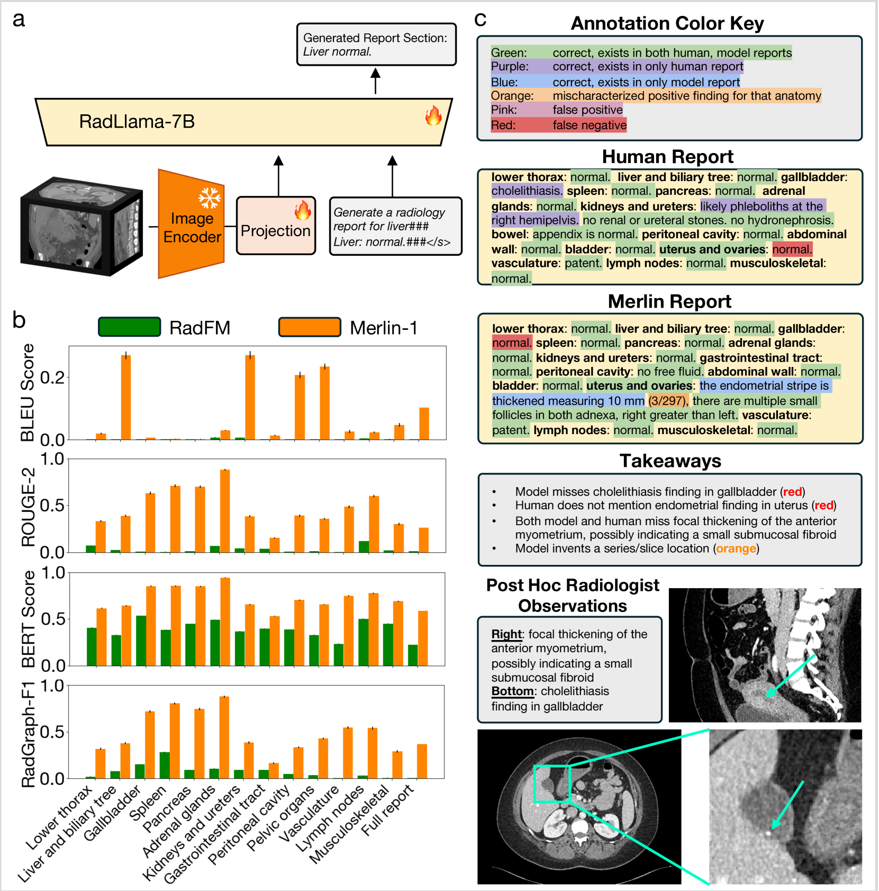
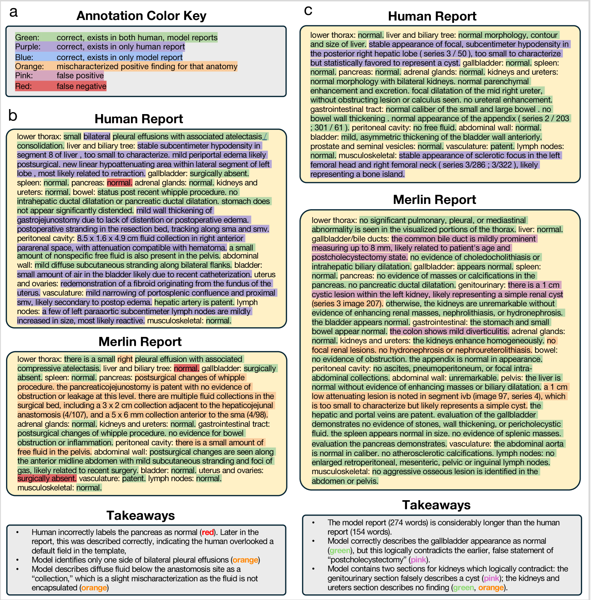

# Merlin：专为3D CT扫描设计的视觉语言基础模型

发布时间：2024年06月10日

`LLM应用

理由：这篇论文介绍了一个名为Merlin的3D视觉语言模型（VLM），它被用于自动化医学图像解读，特别是在CT扫描的分析中。论文详细描述了Merlin的训练过程、评估方法以及其在多种任务上的表现。这表明Merlin是一个具体的应用实例，利用了大型语言模型（LLM）的技术来解决实际问题，即医学图像的自动化解读。因此，这篇论文属于LLM应用类别。` `人工智能`

> Merlin: A Vision Language Foundation Model for 3D Computed Tomography

# 摘要

> 美国每年进行的CT扫描超过8500万次，其中腹部扫描占四分之一。面对放射科医生短缺的现状，利用人工智能减轻解读复杂影像的负担显得尤为迫切。以往的自动化医学图像解读技术依赖于视觉语言模型（VLMs），但这些模型多限于2D图像和简短报告，并未充分利用电子健康记录（EHR）数据。我们开发的Merlin是一个3D VLM，通过15,331次CT扫描的600多万张图像、180多万个EHR诊断代码和600多万个放射学报告令牌进行训练。我们对Merlin进行了包括零-shot发现分类、表型分类、跨模态检索等在内的6种任务类型和752个独立任务的评估。此外，我们还进行了5年疾病预测、放射学报告生成和3D语义分割等模型适应性任务。通过在5,137次CT的测试集上进行内部验证，以及在7,000次临床CT和两个公共CT数据集上进行外部验证，我们展示了Merlin在各种网络架构和训练策略下的优越性能。我们还推导了数据缩放定律，以评估为达到下游任务性能所需的训练数据量。值得一提的是，与传统VLMs需要数百个GPU不同，Merlin的所有训练均在单个GPU上完成。

> Over 85 million computed tomography (CT) scans are performed annually in the US, of which approximately one quarter focus on the abdomen. Given the current radiologist shortage, there is a large impetus to use artificial intelligence to alleviate the burden of interpreting these complex imaging studies. Prior state-of-the-art approaches for automated medical image interpretation leverage vision language models (VLMs). However, current medical VLMs are generally limited to 2D images and short reports, and do not leverage electronic health record (EHR) data for supervision. We introduce Merlin - a 3D VLM that we train using paired CT scans (6+ million images from 15,331 CTs), EHR diagnosis codes (1.8+ million codes), and radiology reports (6+ million tokens). We evaluate Merlin on 6 task types and 752 individual tasks. The non-adapted (off-the-shelf) tasks include zero-shot findings classification (31 findings), phenotype classification (692 phenotypes), and zero-shot cross-modal retrieval (image to findings and image to impressions), while model adapted tasks include 5-year disease prediction (6 diseases), radiology report generation, and 3D semantic segmentation (20 organs). We perform internal validation on a test set of 5,137 CTs, and external validation on 7,000 clinical CTs and on two public CT datasets (VerSe, TotalSegmentator). Beyond these clinically-relevant evaluations, we assess the efficacy of various network architectures and training strategies to depict that Merlin has favorable performance to existing task-specific baselines. We derive data scaling laws to empirically assess training data needs for requisite downstream task performance. Furthermore, unlike conventional VLMs that require hundreds of GPUs for training, we perform all training on a single GPU.

[Arxiv](https://arxiv.org/abs/2406.06512)