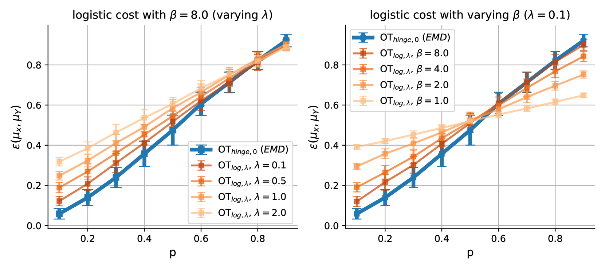
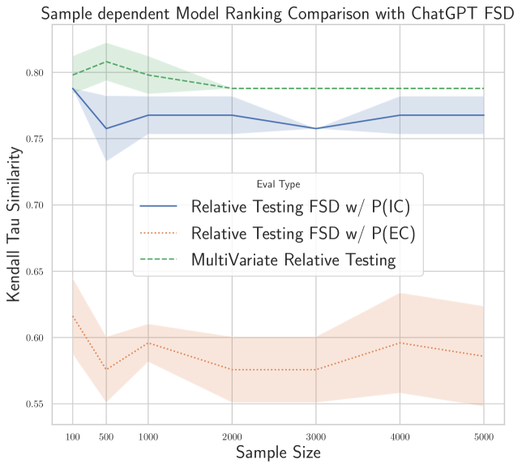

# 利用最优传输理论探讨多变量随机优势，并将其应用于模型基准测试的分析中。

发布时间：2024年06月10日

`Agent

理由：这篇论文主要关注的是多变量决策场景中的随机优势，特别是在代理人的偏好和决策制定方面。它通过耦合特性和最优传输理论来评估多变量近似随机优势，并构建了一个假设检验框架。这种方法虽然涉及到了大型语言模型（LLM）的比较和评估，但其核心贡献在于开发了一个用于理解代理人偏好的统计工具，因此更符合Agent分类的定义，即关注于代理人的行为和决策过程。` `计量经济学`

> Multivariate Stochastic Dominance via Optimal Transport and Applications to Models Benchmarking

# 摘要

> 随机优势在概率论、计量经济学和社会选择理论中扮演着关键角色，它帮助我们理解代理人在随机结果间的偏好。尽管单变量情况已有广泛研究，但多变量决策场景的研究却相对匮乏。我们通过耦合特性定义了多变量第一随机优势，并在此基础上，利用最优传输理论中的平滑成本函数，开发了一个评估多变量近似随机优势的统计量。进一步，我们对该统计量进行了熵正则化处理，并证明了其中心极限定理和自助法的一致性。基于此，我们构建了一个假设检验框架，并利用Sinkhorn算法实现了高效检验。我们的方法在比较和评估大型语言模型时表现出色，通过捕捉多指标间的相互依赖，我们能够做出基于统计显著性的模型性能比较决策。

> Stochastic dominance is an important concept in probability theory, econometrics and social choice theory for robustly modeling agents' preferences between random outcomes. While many works have been dedicated to the univariate case, little has been done in the multivariate scenario, wherein an agent has to decide between different multivariate outcomes. By exploiting a characterization of multivariate first stochastic dominance in terms of couplings, we introduce a statistic that assesses multivariate almost stochastic dominance under the framework of Optimal Transport with a smooth cost. Further, we introduce an entropic regularization of this statistic, and establish a central limit theorem (CLT) and consistency of the bootstrap procedure for the empirical statistic. Armed with this CLT, we propose a hypothesis testing framework as well as an efficient implementation using the Sinkhorn algorithm. We showcase our method in comparing and benchmarking Large Language Models that are evaluated on multiple metrics. Our multivariate stochastic dominance test allows us to capture the dependencies between the metrics in order to make an informed and statistically significant decision on the relative performance of the models.

[Arxiv](https://arxiv.org/abs/2406.06425)