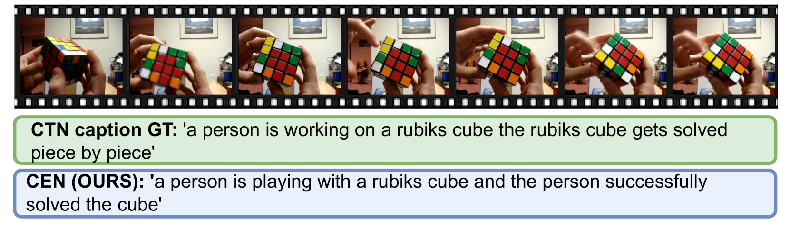

# 叙事桥梁：借助因果时间叙事提升视频字幕质量

发布时间：2024年06月10日

`LLM应用

理由：这篇论文介绍了一个名为NarrativeBridge的系统，该系统利用大型语言模型（LLM）来改进视频字幕模型，特别是在捕捉视频中的因果时间叙事方面。论文中提到的CTN字幕基准和因果网络（CEN）都是为了更好地利用LLM的能力来处理视频字幕任务。因此，这项工作属于LLM的应用范畴，即如何将LLM技术应用于特定的任务（视频字幕）中，以提高性能和效果。` `视频字幕` `人工智能`

> NarrativeBridge: Enhancing Video Captioning with Causal-Temporal Narrative

# 摘要

> 当前的视频字幕模型未能充分捕捉视频中的因果时间叙事，即由角色驱动的、随时间展开的因果事件序列。为此，我们推出了NarrativeBridge，它包括：(1) 一个创新的CTN字幕基准，利用大型语言模型和少量样本提示，自动评估并确保字幕的质量和相关性，明确编码视频中的因果时间关系；(2) 一个专用的因果网络（CEN），通过独立的编码器捕捉因果动态，有效生成具有因果时间叙事的字幕。实验证明，CEN在捕捉视频的因果和时间方面优于其他模型，如在MSVD和MSR-VTT数据集上分别达到17.88和17.44 CIDEr。NarrativeBridge能理解和生成包含复杂因果时间叙事的视频描述，有效解决了视频字幕领域的一大短板。更多项目信息，请访问https://narrativebridge.github.io/。

> Existing video captioning benchmarks and models lack coherent representations of causal-temporal narrative, which is sequences of events linked through cause and effect, unfolding over time and driven by characters or agents. This lack of narrative restricts models' ability to generate text descriptions that capture the causal and temporal dynamics inherent in video content. To address this gap, we propose NarrativeBridge, an approach comprising of: (1) a novel Causal-Temporal Narrative (CTN) captions benchmark generated using a large language model and few-shot prompting, explicitly encoding cause-effect temporal relationships in video descriptions, evaluated automatically to ensure caption quality and relevance; and (2) a dedicated Cause-Effect Network (CEN) architecture with separate encoders for capturing cause and effect dynamics independently, enabling effective learning and generation of captions with causal-temporal narrative. Extensive experiments demonstrate that CEN is more accurate in articulating the causal and temporal aspects of video content than the second best model (GIT): 17.88 and 17.44 CIDEr on the MSVD and MSR-VTT datasets, respectively. The proposed framework understands and generates nuanced text descriptions with intricate causal-temporal narrative structures present in videos, addressing a critical limitation in video captioning. For project details, visit https://narrativebridge.github.io/.

[Arxiv](https://arxiv.org/abs/2406.06499)