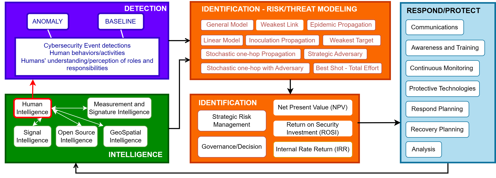
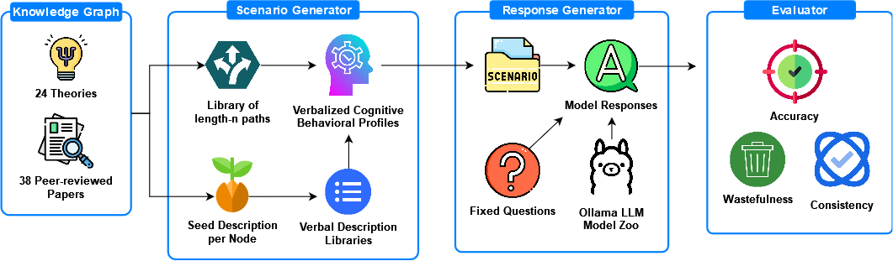
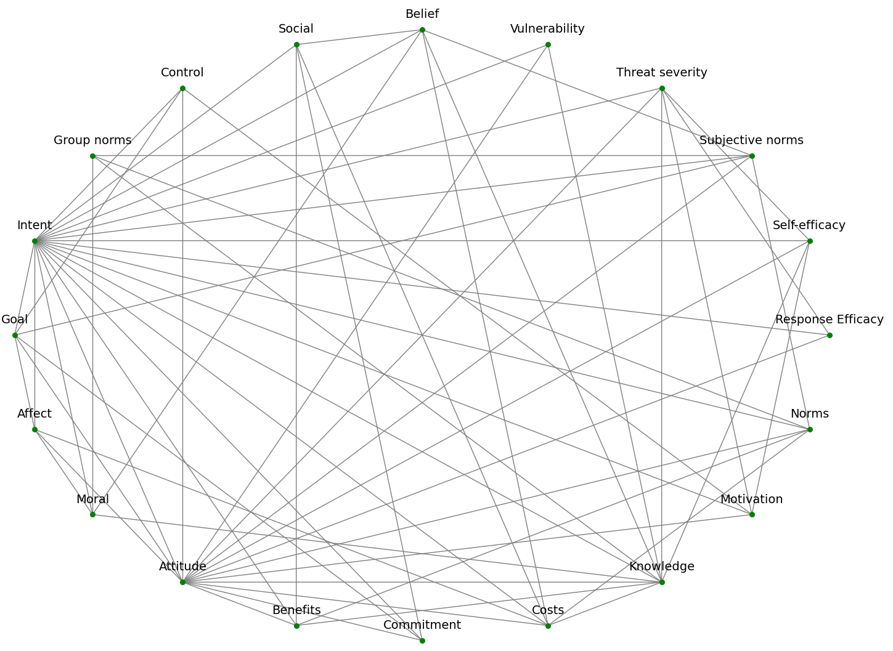
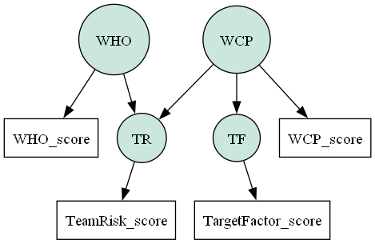
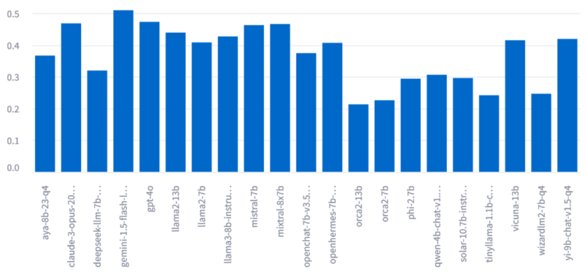
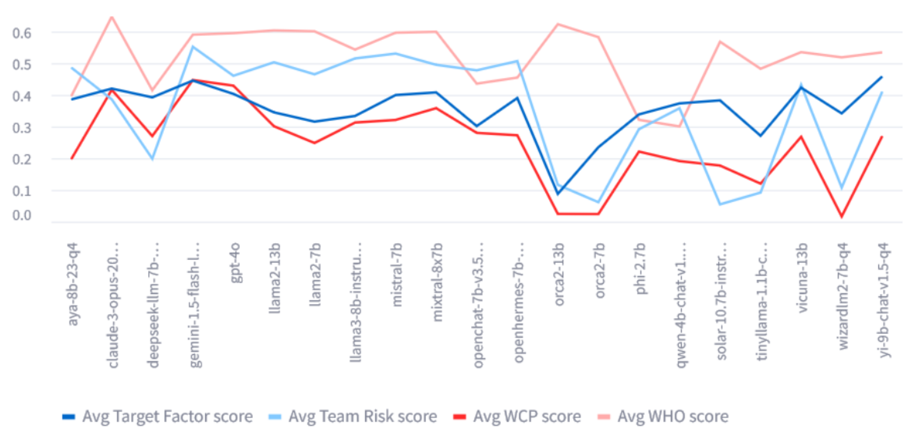
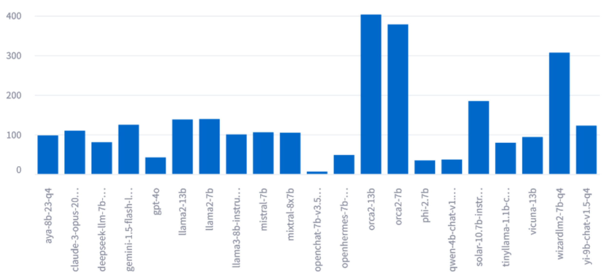

# Ollabench：探究大型语言模型在以人为本的相互依赖网络安全领域中的推理表现

发布时间：2024年06月10日

`Agent

理由：这篇论文主要关注的是大型语言模型（LLMs）在网络安全领域的应用，特别是在基于代理的建模中的作用。论文提出了一种新的评估框架（OllaBench），用于评估LLMs在处理网络安全合规与不合规场景时的性能。这表明论文的重点在于如何利用LLMs来增强网络安全系统的建模和风险管理，这与Agent分类中的代理系统在复杂环境中的应用和评估相关。虽然论文涉及LLMs的应用，但其核心在于通过评估框架来优化基于代理的网络安全建模，因此更适合归类于Agent。` `网络安全` `认知计算`

> Ollabench: Evaluating LLMs' Reasoning for Human-centric Interdependent Cybersecurity

# 摘要

> 大型语言模型（LLMs）能够通过精确描绘复杂的网络安全系统，提升基于代理的建模，从而优化网络安全威胁建模与风险管理。但在法律合规与应用开发方面，对LLMs的评估至关重要。现有评估框架往往忽略了人类因素与认知计算能力，这些对相互依赖的网络安全至关重要。为此，我提出了OllaBench，一种创新的评估框架，专门用于检验LLMs在处理信息安全合规与不合规场景问题时的准确性、效率与一致性。OllaBench基于24种认知行为理论，并结合了38篇同行评审论文的实证研究。该框架评估了21种LLMs，涵盖了OpenAI、Anthropic、Google、Microsoft、Meta等公司的开放权重与商业模型。结果表明，尽管商业LLMs总体表现最佳，但仍有提升空间。小型开放权重LLMs表现不俗，且各模型在令牌效率与一致性上存在显著差异。OllaBench界面友好，支持多种LLM平台，成为以人为中心的网络安全研究与开发领域的宝贵工具。

> Large Language Models (LLMs) have the potential to enhance Agent-Based Modeling by better representing complex interdependent cybersecurity systems, improving cybersecurity threat modeling and risk management. However, evaluating LLMs in this context is crucial for legal compliance and effective application development. Existing LLM evaluation frameworks often overlook the human factor and cognitive computing capabilities essential for interdependent cybersecurity. To address this gap, I propose OllaBench, a novel evaluation framework that assesses LLMs' accuracy, wastefulness, and consistency in answering scenario-based information security compliance and non-compliance questions. OllaBench is built on a foundation of 24 cognitive behavioral theories and empirical evidence from 38 peer-reviewed papers. OllaBench was used to evaluate 21 LLMs, including both open-weight and commercial models from OpenAI, Anthropic, Google, Microsoft, Meta and so on. The results reveal that while commercial LLMs have the highest overall accuracy scores, there is significant room for improvement. Smaller low-resolution open-weight LLMs are not far behind in performance, and there are significant differences in token efficiency and consistency among the evaluated models. OllaBench provides a user-friendly interface and supports a wide range of LLM platforms, making it a valuable tool for researchers and solution developers in the field of human-centric interdependent cybersecurity and beyond.

[Arxiv](https://arxiv.org/abs/2406.06863)