# PowerInfer-2：让大型语言模型在智能手机上飞驰

发布时间：2024年06月10日

`LLM应用

这篇论文摘要描述了PowerInfer-2框架，这是一个专为在智能手机上高效运行大型语言模型（LLM）而设计的系统。它通过利用智能手机的异构资源，采用细粒度神经元集群计算和多态神经元引擎，以及引入分段神经元缓存和细粒度流水线技术，显著提高了LLM的推理速度并降低了内存使用。这些特性表明该框架是针对LLM在实际应用中的优化，特别是在资源受限的移动设备上的部署，因此属于LLM应用分类。` `智能手机` `人工智能`

> PowerInfer-2: Fast Large Language Model Inference on a Smartphone

# 摘要

> PowerInfer-2框架专为智能手机上的大型语言模型高速推理设计，尤其擅长处理超出设备内存容量的模型。其核心创新在于通过细粒度神经元集群计算，巧妙利用智能手机的异构资源。该框架配备了一个多态神经元引擎，能针对LLM推理的不同阶段灵活调整计算策略，并引入分段神经元缓存和细粒度流水线技术，大幅降低I/O操作的负担。实测表明，PowerInfer-2在两款手机上支持多种LLM，速度提升高达29.2倍，更是首个在手机上实现TurboSparse-Mixtral-47B模型每秒11.68个令牌生成速率的系统。即便对于内存适配的模型，也能在保持推理速度的同时，将内存使用降低约40%。欲了解更多，包括演示视频，请访问www.powerinfer.ai/v2。

> This paper introduces PowerInfer-2, a framework designed for high-speed inference of Large Language Models (LLMs) on smartphones, particularly effective for models whose sizes exceed the device's memory capacity. The key insight of PowerInfer-2 is to utilize the heterogeneous computation, memory, and I/O resources in smartphones by decomposing traditional matrix computations into fine-grained neuron cluster computations. Specifically, PowerInfer-2 features a polymorphic neuron engine that adapts computational strategies for various stages of LLM inference. Additionally, it introduces segmented neuron caching and fine-grained neuron-cluster-level pipelining, which effectively minimize and conceal the overhead caused by I/O operations. The implementation and evaluation of PowerInfer-2 demonstrate its capability to support a wide array of LLM models on two smartphones, achieving up to a 29.2x speed increase compared with state-of-the-art frameworks. Notably, PowerInfer-2 is the first system to serve the TurboSparse-Mixtral-47B model with a generation rate of 11.68 tokens per second on a smartphone. For models that fit entirely within the memory, PowerInfer-2 can achieve approximately a 40% reduction in memory usage while maintaining inference speeds comparable to llama.cpp and MLC-LLM. For more details, including a demonstration video, please visit the project site at www.powerinfer.ai/v2.

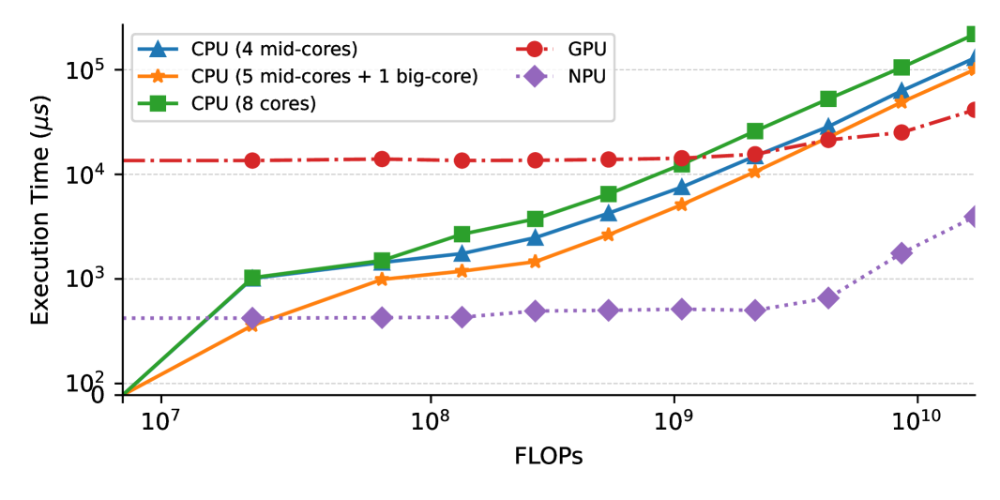

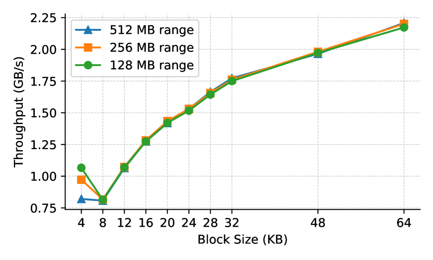

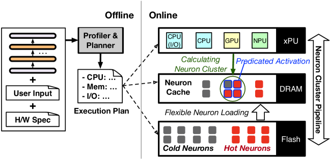

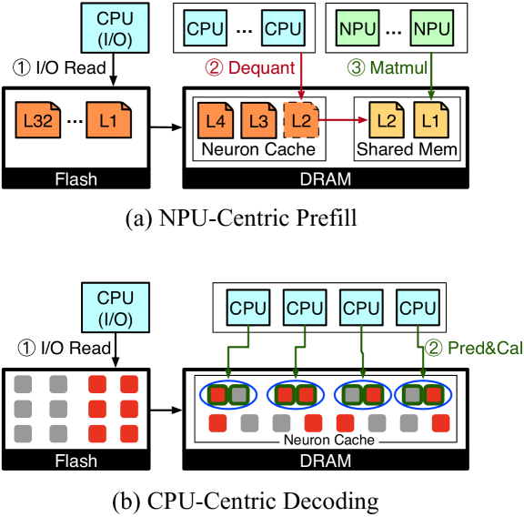

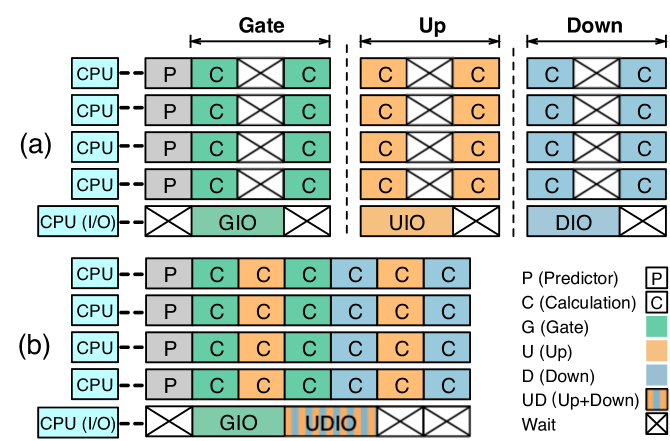

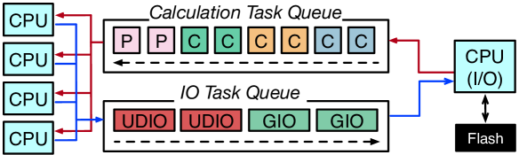

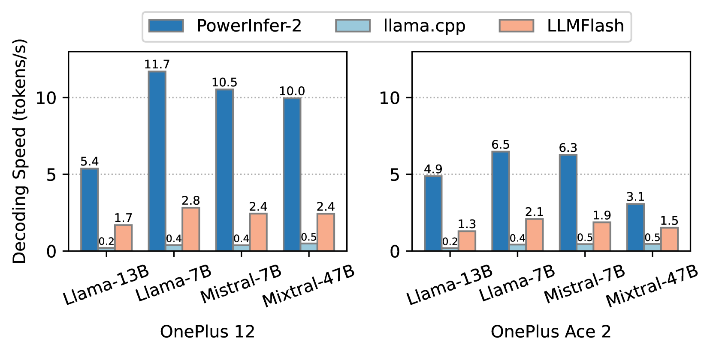

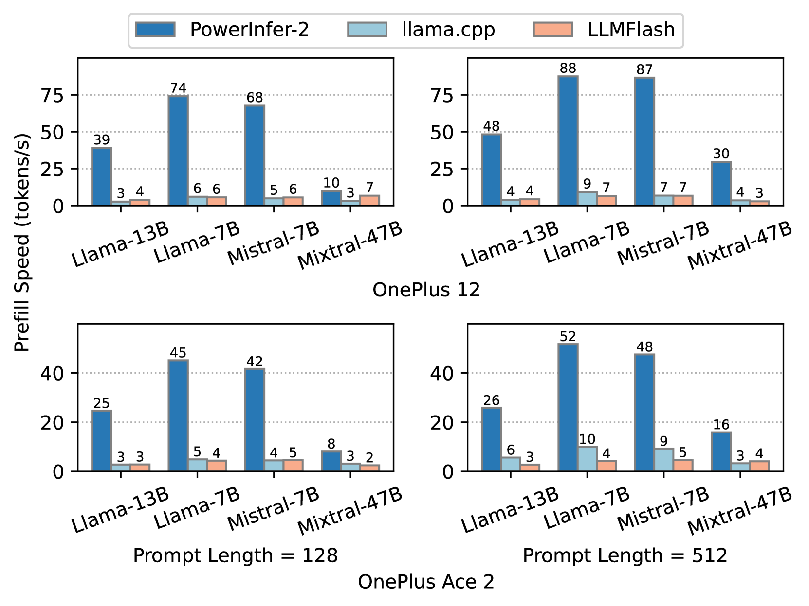

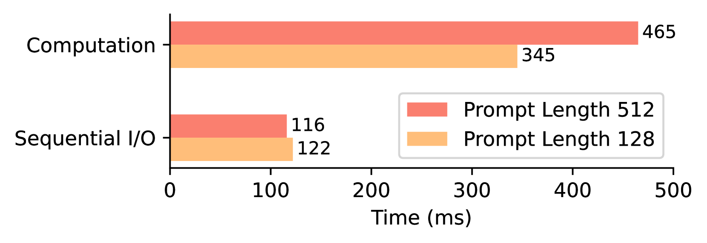

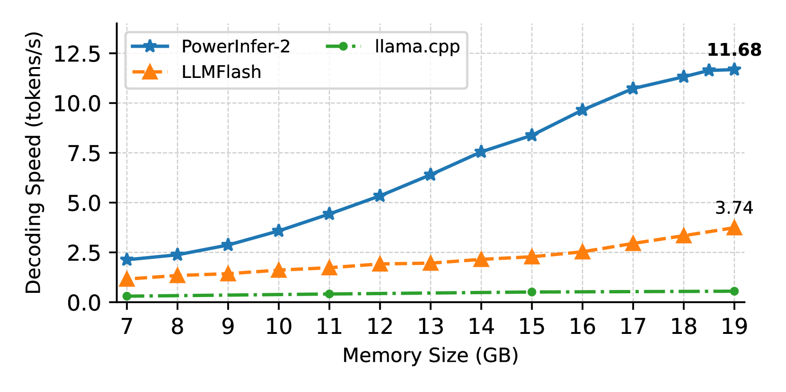

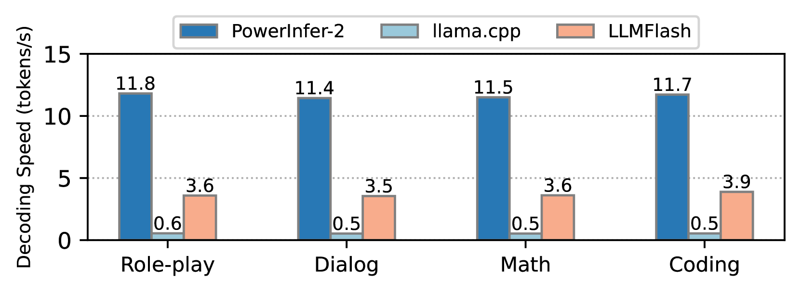

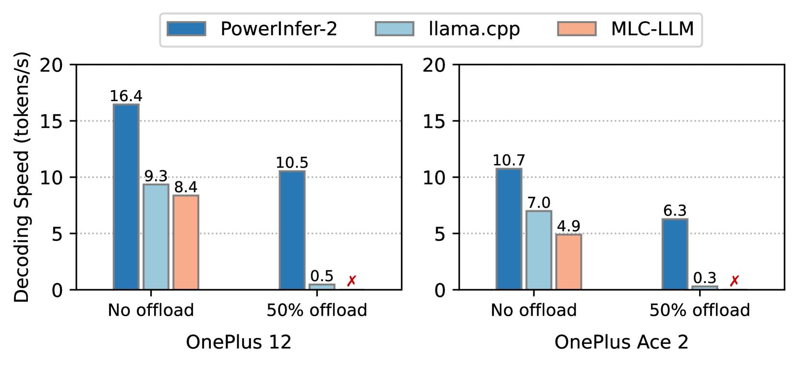

[Arxiv](https://arxiv.org/abs/2406.06282)