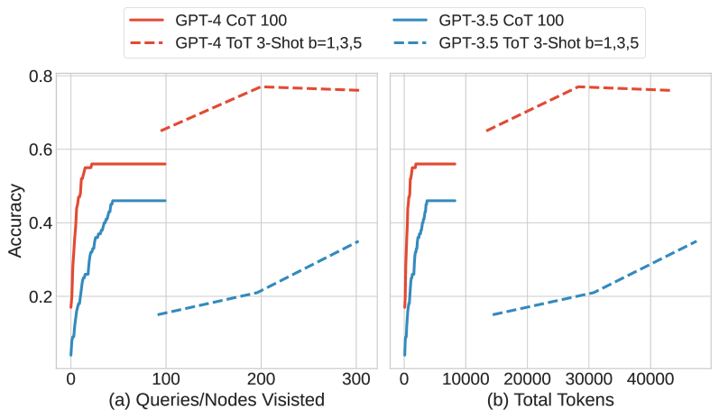
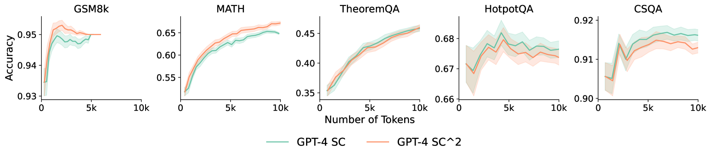
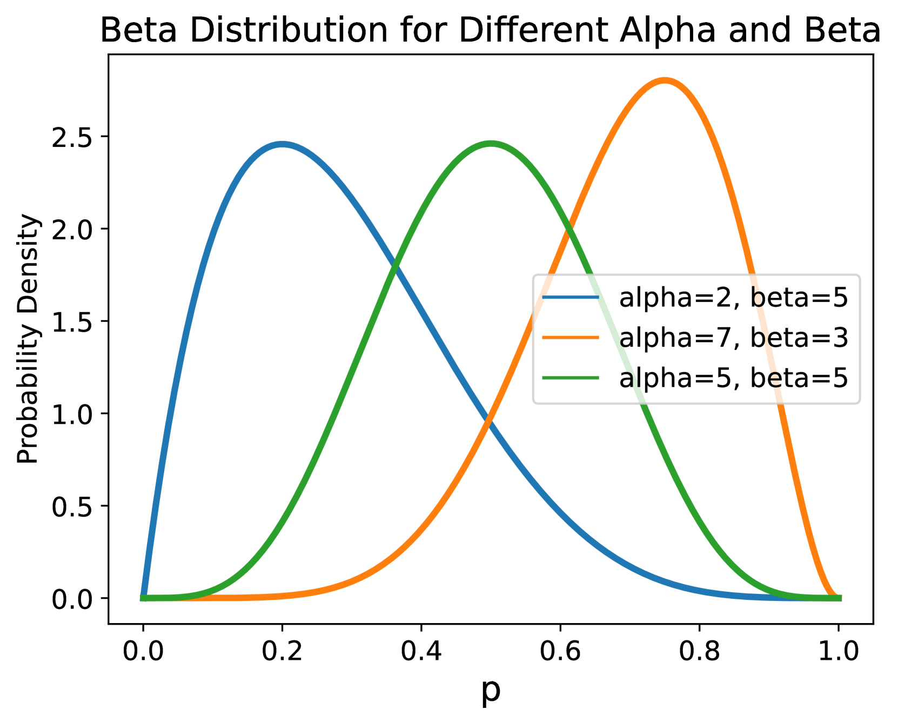
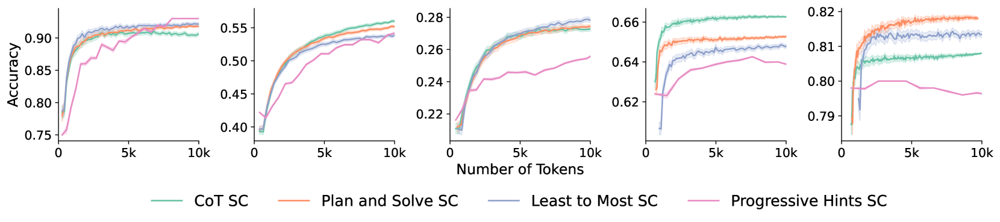

# Token经济中的推理：评估大型语言模型推理策略的预算感知方法

发布时间：2024年06月10日

`LLM理论

这篇论文探讨了大型语言模型（LLM）的推理策略评估方法，特别关注了计算效率与性能之间的关系。论文提出了一种新的评估框架，该框架考虑了计算预算，旨在更全面地理解不同推理策略的效率。这种分析不仅关注性能指标，还考虑了计算资源的分配，从而揭示了某些策略在特定计算预算下的实际表现。这与LLM的理论研究紧密相关，因为它涉及对模型推理机制的深入理解和评估方法的改进。因此，这篇论文应归类于LLM理论。` `人工智能` `计算效率`

> Reasoning in Token Economies: Budget-Aware Evaluation of LLM Reasoning Strategies

# 摘要

> 为了激发大型语言模型的潜能，研究者们提出了各式各样的推理策略。然而，本文指出，传统的评估方法过于侧重性能指标，却忽略了额外计算带来的效率提升这一关键因素。这种忽视导致了对策略效率的片面理解。为此，本文提出了一种新的评估框架，它将计算预算纳入考量，从而在比较中同时考虑了性能和成本。在这种预算敏感的视角下，我们发现复杂的推理策略之所以超越简单基准，往往不是因为算法本身的巧妙，而是因为它们拥有更多的计算资源。当简单的基准，如思维链自我一致性，获得同等计算资源时，它们往往能超越文献中的复杂策略。此外，我们发现，与自我一致性不同，某些策略，如多智能体辩论或反射，在增加计算预算时，其表现反而可能下降。

> A diverse array of reasoning strategies has been proposed to elicit the capabilities of large language models. However, in this paper, we point out that traditional evaluations which focus solely on performance metrics miss a key factor: the increased effectiveness due to additional compute. By overlooking this aspect, a skewed view of strategy efficiency is often presented. This paper introduces a framework that incorporates the compute budget into the evaluation, providing a more informative comparison that takes into account both performance metrics and computational cost. In this budget-aware perspective, we find that complex reasoning strategies often don't surpass simpler baselines purely due to algorithmic ingenuity, but rather due to the larger computational resources allocated. When we provide a simple baseline like chain-of-thought self-consistency with comparable compute resources, it frequently outperforms reasoning strategies proposed in the literature. In this scale-aware perspective, we find that unlike self-consistency, certain strategies such as multi-agent debate or Reflexion can become worse if more compute budget is utilized.

[Arxiv](https://arxiv.org/abs/2406.06461)