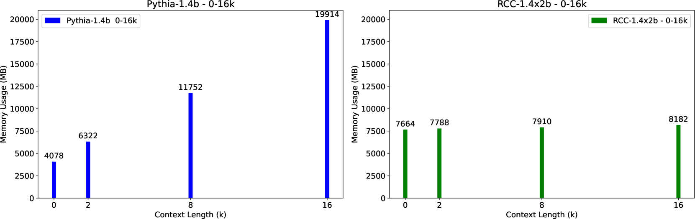
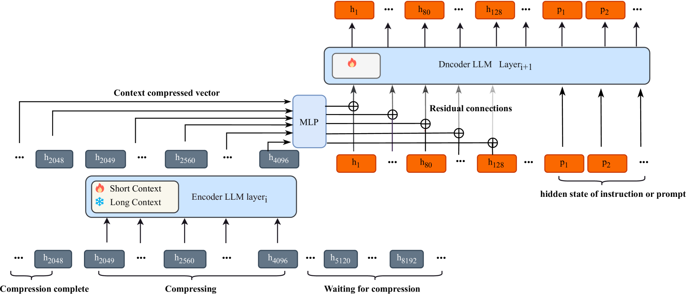
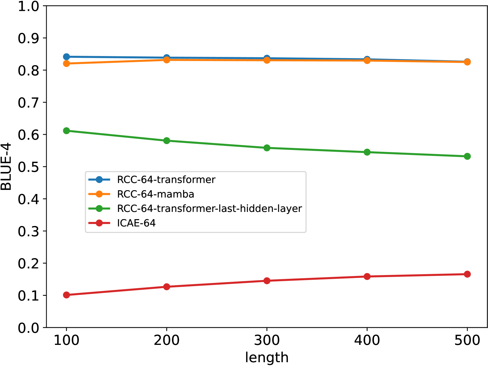
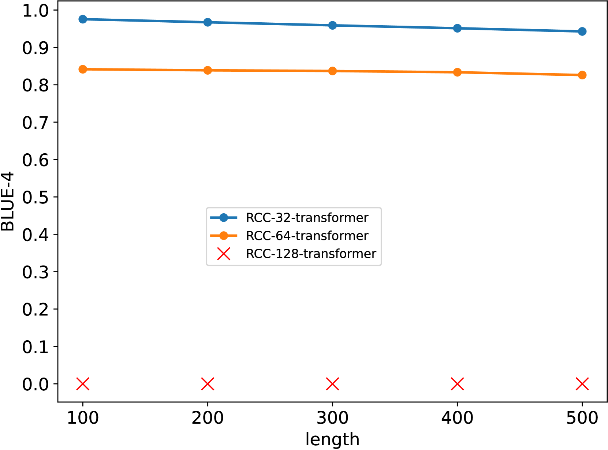
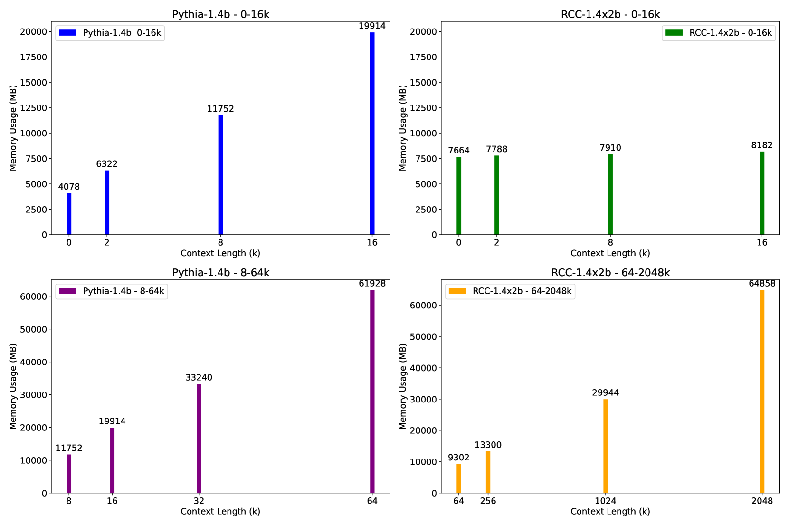

# 循环上下文压缩：提升LLM上下文窗口效率的扩展方法

发布时间：2024年06月10日

`LLM应用

这篇论文主要介绍了一种名为“循环上下文压缩（RCC）”的技术，该技术旨在扩展大型语言模型（LLMs）的上下文窗口，同时节省计算资源和内存容量。论文中还提出了指令重建策略来改善因上下文压缩导致的模型响应问题。这些内容主要关注于LLM的实际应用，特别是在提高模型处理长文本能力的同时优化资源使用，因此属于LLM应用分类。` `机器学习`

> Recurrent Context Compression: Efficiently Expanding the Context Window of LLM

# 摘要

> 为了突破Transformer大型语言模型（LLMs）的上下文长度限制，提升理解力，我们常受限于计算资源和内存容量。为此，我们开发了循环上下文压缩（RCC）技术，有效扩展LLMs的上下文窗口，同时节省空间。针对下游任务中指令与上下文压缩导致的模型响应不佳，我们提出了指令重建策略以改善此问题。实验证明，我们的方法在文本重建任务中实现了高达32倍的压缩率，BLEU4分数接近0.95，通行码检索任务准确率近100%。在长文本问答任务中，RCC展现出与非压缩方法相当的性能，同时在长文本推理中大幅节约了存储资源。所有代码、模型及演示均可在https://github.com/WUHU-G/RCC_Transformer查看。

> To extend the context length of Transformer-based large language models (LLMs) and improve comprehension capabilities, we often face limitations due to computational resources and bounded memory storage capacity. This work introduces a method called Recurrent Context Compression (RCC), designed to efficiently expand the context window length of LLMs within constrained storage space. We also investigate the issue of poor model responses when both instructions and context are compressed in downstream tasks, and propose an instruction reconstruction method to mitigate this problem. We validated the effectiveness of our approach on multiple tasks, achieving a compression rate of up to 32x on text reconstruction tasks with a BLEU4 score close to 0.95, and nearly 100\% accuracy on a passkey retrieval task with a sequence length of 1M. Finally, our method demonstrated competitive performance in long-text question-answering tasks compared to non-compressed methods, while significantly saving storage resources in long-text inference tasks. Our code, models, and demo are available at https://github.com/WUHU-G/RCC_Transformer

[Arxiv](https://arxiv.org/abs/2406.06110)