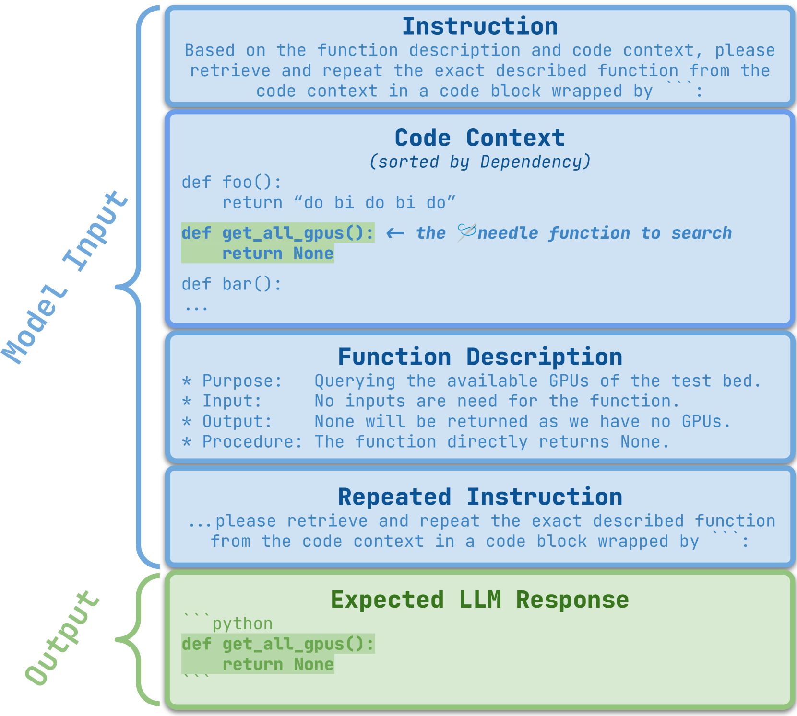

# RepoQA：探究长篇代码理解能力

发布时间：2024年06月10日

`LLM应用

这篇论文主要探讨了大型语言模型（LLMs）在处理长上下文代码方面的能力，并为此推出了RepoQA基准，专门评估LLMs对长上下文代码的理解能力。这一研究直接应用于LLMs的实际使用场景，即代码库的理解和搜索，因此属于LLM应用分类。论文中提到的RepoQA基准和其对LLMs的评估，都是为了更好地理解和改进LLMs在特定应用场景下的性能，这与理论研究或Agent、RAG的特定技术不同。` `软件开发` `代码分析`

> RepoQA: Evaluating Long Context Code Understanding

# 摘要

> 近期，大型语言模型（LLMs）的上下文处理能力有了显著提升。为了准确衡量LLMs处理长文本的能力，诸如“干草堆中的针”等评估工具应运而生，专门测试LLMs在大量原始文本上的表现。然而，这些评估忽略了LLMs如何应对长上下文代码，即代码库的挑战。为此，我们推出了RepoQA基准，专门评估LLMs对长上下文代码的理解能力。与传统评估不同，RepoQA中的首个任务——搜索针函数（SNF）要求LLMs根据自然语言描述精准搜索函数，考验其对描述和代码的深入理解。RepoQA涵盖500个代码搜索任务，源自50个流行代码库，支持5种编程语言，体现了其多语言和全面性。通过评估26种LLMs，我们揭示了：(i) 开源与专有模型间仍存差距；(ii) 模型在不同语言上表现各异；(iii) 无注释时，模型对代码的理解可能更佳。

> Recent advances have been improving the context windows of Large Language Models (LLMs). To quantify the real long-context capabilities of LLMs, evaluators such as the popular Needle in a Haystack have been developed to test LLMs over a large chunk of raw texts. While effective, current evaluations overlook the insight of how LLMs work with long-context code, i.e., repositories. To this end, we initiate the RepoQA benchmark to evaluate LLMs on long-context code understanding. Traditional needle testers ask LLMs to directly retrieve the answer from the context without necessary deep understanding. In RepoQA, we built our initial task, namely Searching Needle Function (SNF), which exercises LLMs to search functions given their natural-language description, i.e., LLMs cannot find the desired function if they cannot understand the description and code. RepoQA is multilingual and comprehensive: it includes 500 code search tasks gathered from 50 popular repositories across 5 modern programming languages. By evaluating 26 general and code-specific LLMs on RepoQA, we show (i) there is still a small gap between the best open and proprietary models; (ii) different models are good at different languages; and (iii) models may understand code better without comments.

[Arxiv](https://arxiv.org/abs/2406.06025)