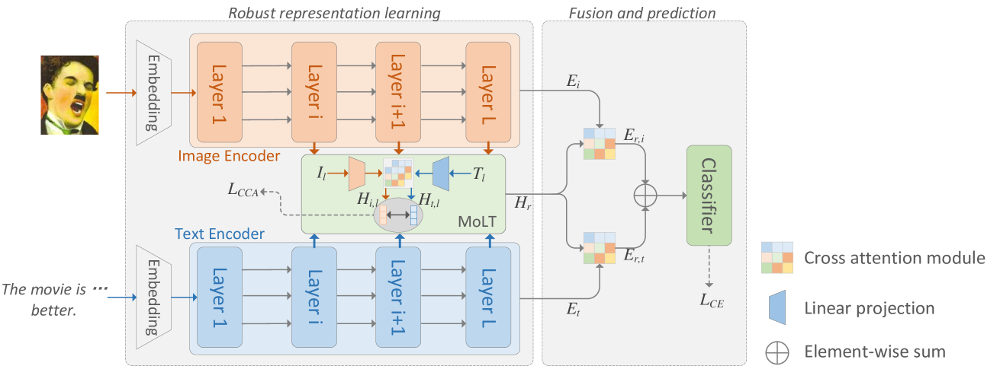
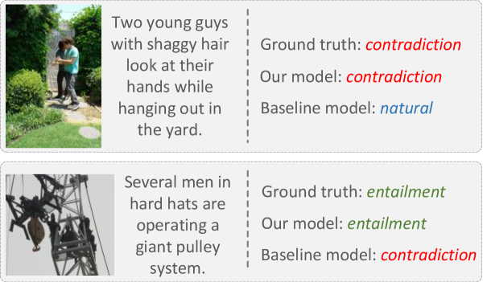

# 图像-文本分类中的鲁棒潜在表示调优

发布时间：2024年06月10日

`RAG

理由：这篇论文主要关注的是大型模型的多模态处理能力，特别是在面对单一模态缺失时的挑战。论文提出了一种鲁棒隐式表示调整策略，通过模态隐式翻译模块和融合模块来强化模态间的关联和信息交流。这与RAG（Retrieval-Augmented Generation）模型的目标相似，即通过增强模型的信息检索和融合能力来提升处理多模态数据的能力。因此，这篇论文更适合归类于RAG。` `计算机视觉`

> Robust Latent Representation Tuning for Image-text Classification

# 摘要

> 大型模型在计算机视觉和自然语言处理中展现出非凡的泛化能力，近期研究致力于提升其多模态处理能力。然而，面对单一模态缺失的挑战，我们仍面临难题。为此，我们提出了一种针对大型模型的鲁棒隐式表示调整策略。该策略通过引入模态隐式翻译模块，强化模态间的关联，并利用创新设计的融合模块促进模态间信息交流。此框架不仅在训练中优化了共同语义，还能在缺失模态时生成稳健的表示。尤为关键的是，我们保持了图像和文本基础模型的冻结状态，确保其大规模预训练所得能力不受影响。通过在多个公共数据集上的实验，我们的方法展现了显著的有效性。

> Large models have demonstrated exceptional generalization capabilities in computer vision and natural language processing. Recent efforts have focused on enhancing these models with multimodal processing abilities. However, addressing the challenges posed by scenarios where one modality is absent remains a significant hurdle. In response to this issue, we propose a robust latent representation tuning method for large models. Specifically, our approach introduces a modality latent translation module to maximize the correlation between modalities. Following this, a newly designed fusion module is employed to facilitate information interaction between the modalities. In this framework, not only are common semantics refined during training, but the method also yields robust representations in the absence of one modality. Importantly, our method maintains the frozen state of the image and text foundation models to preserve their abilities acquired through large-scale pretraining. We conduct experiments on several public datasets, and the results underscore the effectiveness of our proposed method.

[Arxiv](https://arxiv.org/abs/2406.06048)