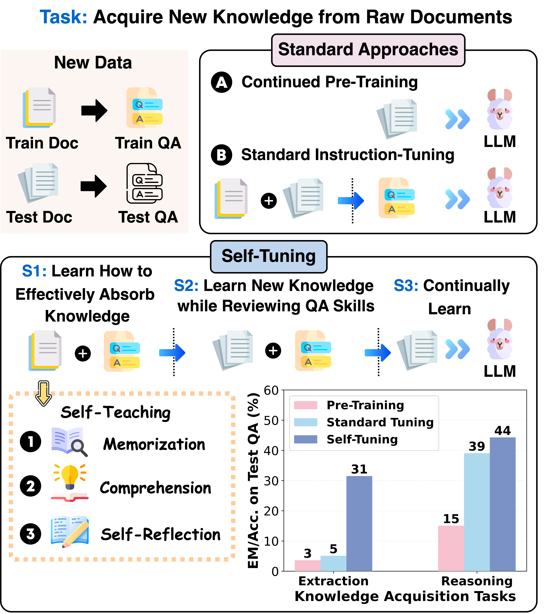
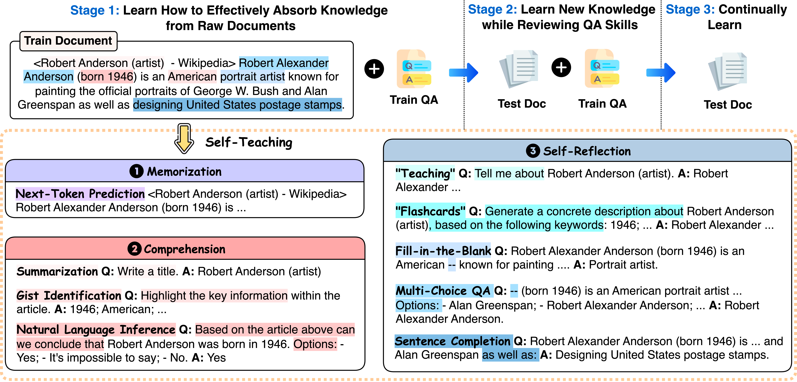
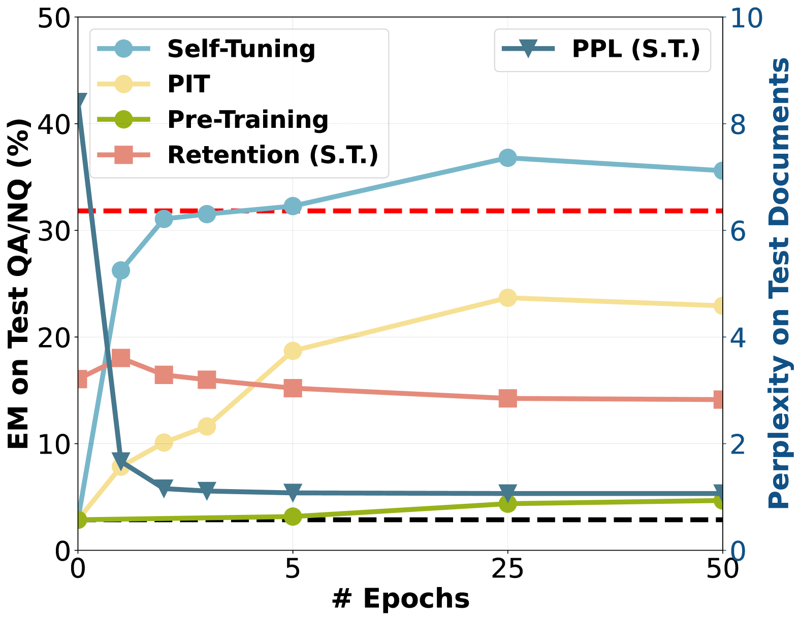
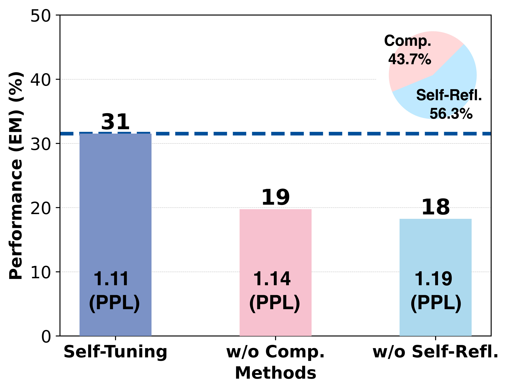
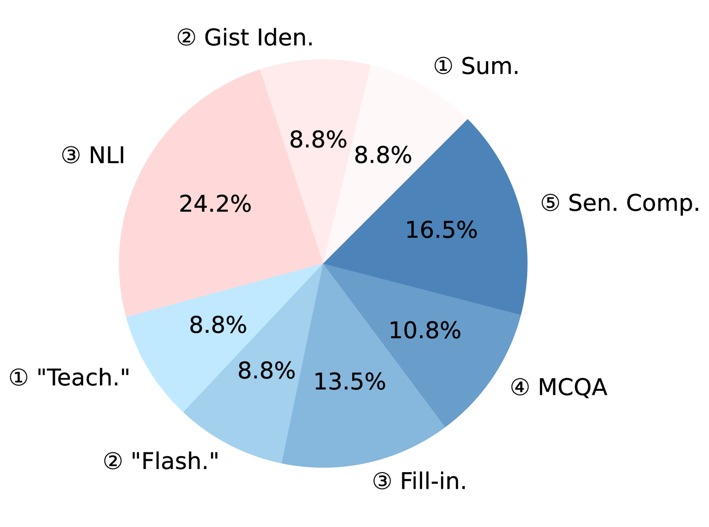

# 自我调优：引导大型语言模型通过自我教学，有效吸收新知

发布时间：2024年06月10日

`LLM应用

这篇论文摘要描述了一种名为自调优（Self-Tuning）的新框架，旨在提升大型语言模型（LLMs）从原始文档中获取新知识的能力。该框架受到费曼技巧的启发，通过自我教学策略来强化LLM的知识获取能力。此外，论文还推出了特定的数据集来评估LLM在知识获取方面的表现。这种方法和框架的应用性质，以及其专注于提升LLM的实际应用能力，使得这篇论文适合归类为LLM应用。` `知识管理`

> Self-Tuning: Instructing LLMs to Effectively Acquire New Knowledge through Self-Teaching

# 摘要

> 大型语言模型（LLMs）因一次性训练和世界持续变化，难以提供最新信息。为保持LLMs的时效性，现有方法多采用在新文档上持续预训练，但常在提取知识上遇到挑战。受费曼技巧在人类学习中高效应用的启发，我们提出了自调优（Self-Tuning）框架，旨在通过自我教学提升LLM从原始文档中获取新知识的能力。我们开发了一种自我教学策略，通过自我监督创建知识密集型任务，强化文档，专注于记忆、理解和自我反思三个关键领域。同时，我们推出了三个Wiki-Newpages-2023-QA数据集，以深入分析LLM在记忆、提取和推理方面的知识获取能力。实验结果显示，自调优在Llama2系列模型上的知识获取任务中表现卓越，且能有效保留先前知识。

> Large language models (LLMs) often struggle to provide up-to-date information due to their one-time training and the constantly evolving nature of the world. To keep LLMs current, existing approaches typically involve continued pre-training on new documents. However, they frequently face difficulties in extracting stored knowledge. Motivated by the remarkable success of the Feynman Technique in efficient human learning, we introduce Self-Tuning, a learning framework aimed at improving an LLM's ability to effectively acquire new knowledge from raw documents through self-teaching. Specifically, we develop a Self-Teaching strategy that augments the documents with a set of knowledge-intensive tasks created in a self-supervised manner, focusing on three crucial aspects: memorization, comprehension, and self-reflection. Additionally, we introduce three Wiki-Newpages-2023-QA datasets to facilitate an in-depth analysis of an LLM's knowledge acquisition ability concerning memorization, extraction, and reasoning. Extensive experimental results on Llama2 family models reveal that Self-Tuning consistently exhibits superior performance across all knowledge acquisition tasks and excels in preserving previous knowledge.

[Arxiv](https://arxiv.org/abs/2406.06326)