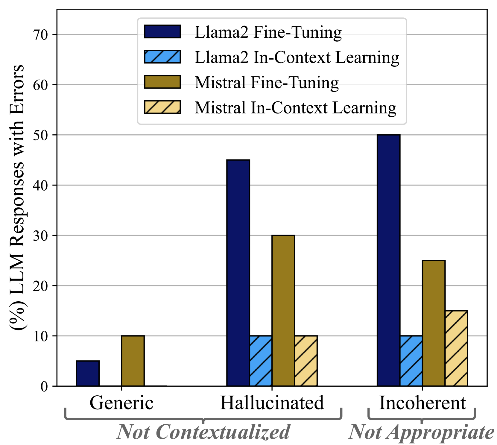
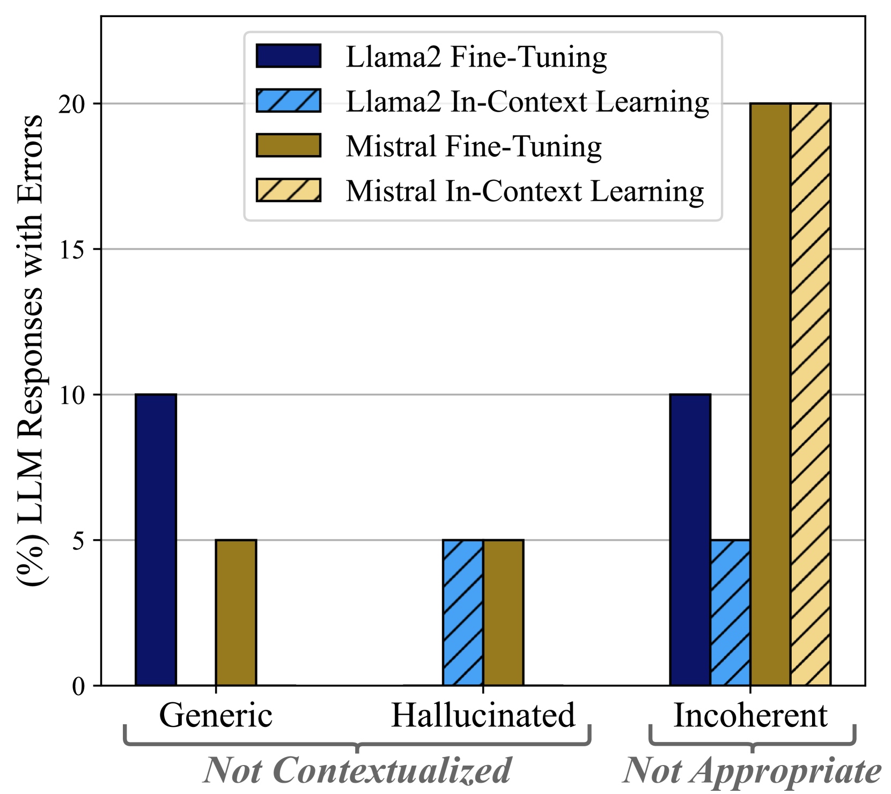
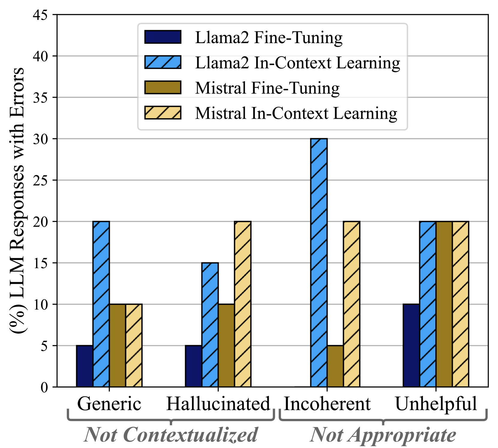
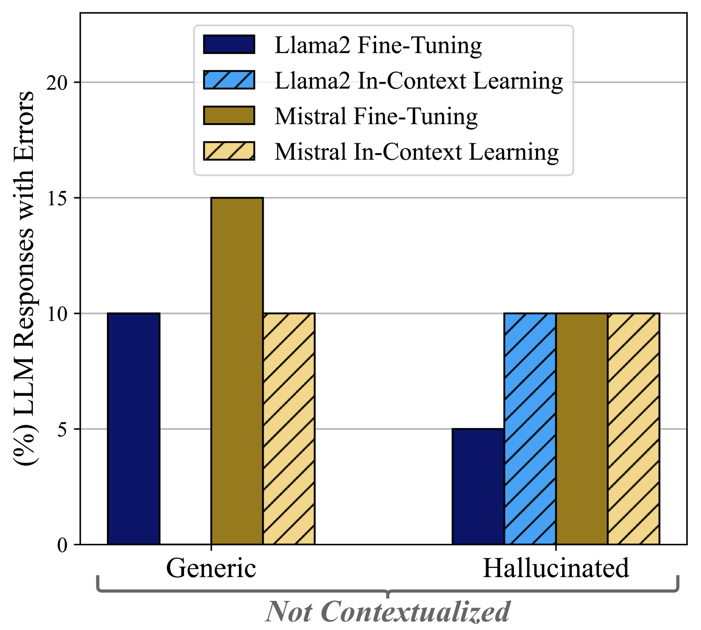
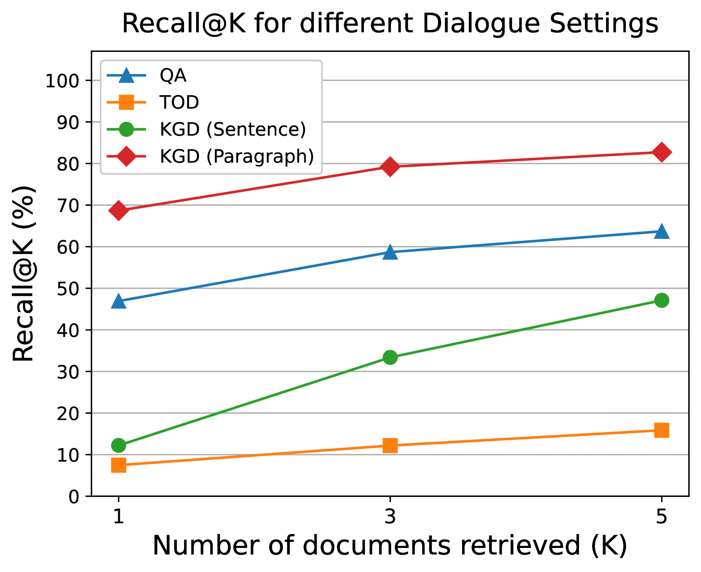

# 对话应用中，大型语言模型（LLMs）应选择微调还是RAG技术？本文将评估这两种方法的适应性。

发布时间：2024年06月10日

`RAG

理由：这篇论文主要探讨了大型语言模型（LLMs）在人机对话响应生成中的应用，特别是在检索增强生成（RAG）情境下，引入外部知识对生成质量的影响。论文通过评估不同技术和模型在特定对话场景下的表现，强调了RAG技术在提升LLM应用效果中的重要性。因此，这篇论文更符合RAG分类，因为它专注于LLM在特定生成任务中的应用和技术改进。` `人机对话`

> Should We Fine-Tune or RAG? Evaluating Different Techniques to Adapt LLMs for Dialogue

# 摘要

> 本研究深入探讨了大型语言模型（LLMs）在人机对话响应生成中的局限性，并针对不同对话类型（如开放域）分析了多种适应技术的效果。我们选取了Llama-2和Mistral两种基础模型，以及开放域、知识基础、任务导向和问答四种对话场景，评估了上下文学习和微调技术在特定数据集上的表现。同时，我们探讨了在检索增强生成（RAG）和黄金知识两种情境下，引入外部知识对生成质量的影响。研究采用了统一的评估和解释标准，涵盖自动指标和人类评估协议。结果显示，最佳的LLM适应技术并非一成不变，其效果受基础模型和对话类型的双重影响。因此，为避免自动指标可能带来的误导，最佳技术的评估必须包含人类评估。

> We study the limitations of Large Language Models (LLMs) for the task of response generation in human-machine dialogue. Several techniques have been proposed in the literature for different dialogue types (e.g., Open-Domain). However, the evaluations of these techniques have been limited in terms of base LLMs, dialogue types and evaluation metrics. In this work, we extensively analyze different LLM adaptation techniques when applied to different dialogue types. We have selected two base LLMs, Llama-2 and Mistral, and four dialogue types Open-Domain, Knowledge-Grounded, Task-Oriented, and Question Answering. We evaluate the performance of in-context learning and fine-tuning techniques across datasets selected for each dialogue type. We assess the impact of incorporating external knowledge to ground the generation in both scenarios of Retrieval-Augmented Generation (RAG) and gold knowledge. We adopt consistent evaluation and explainability criteria for automatic metrics and human evaluation protocols. Our analysis shows that there is no universal best-technique for adapting large language models as the efficacy of each technique depends on both the base LLM and the specific type of dialogue. Last but not least, the assessment of the best adaptation technique should include human evaluation to avoid false expectations and outcomes derived from automatic metrics.

[Arxiv](https://arxiv.org/abs/2406.06399)