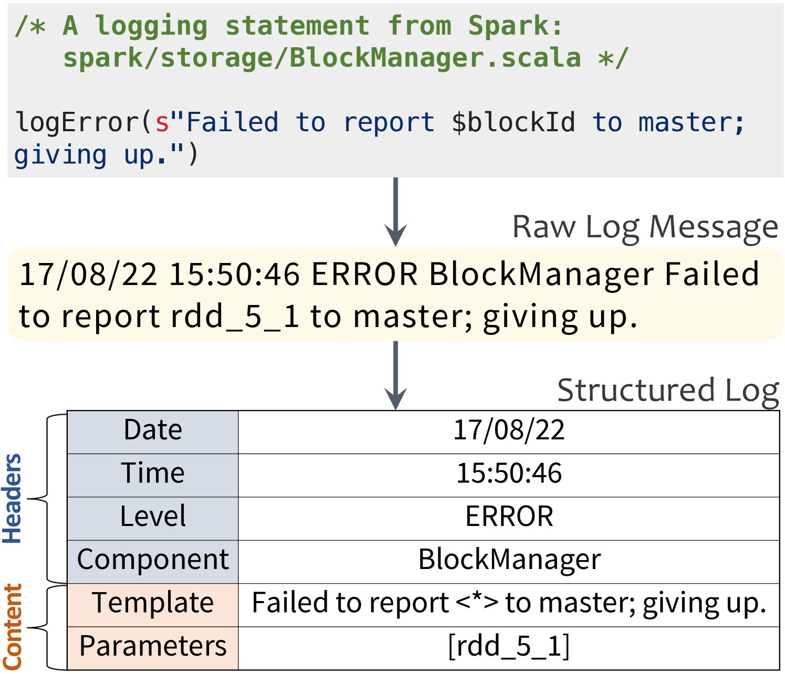
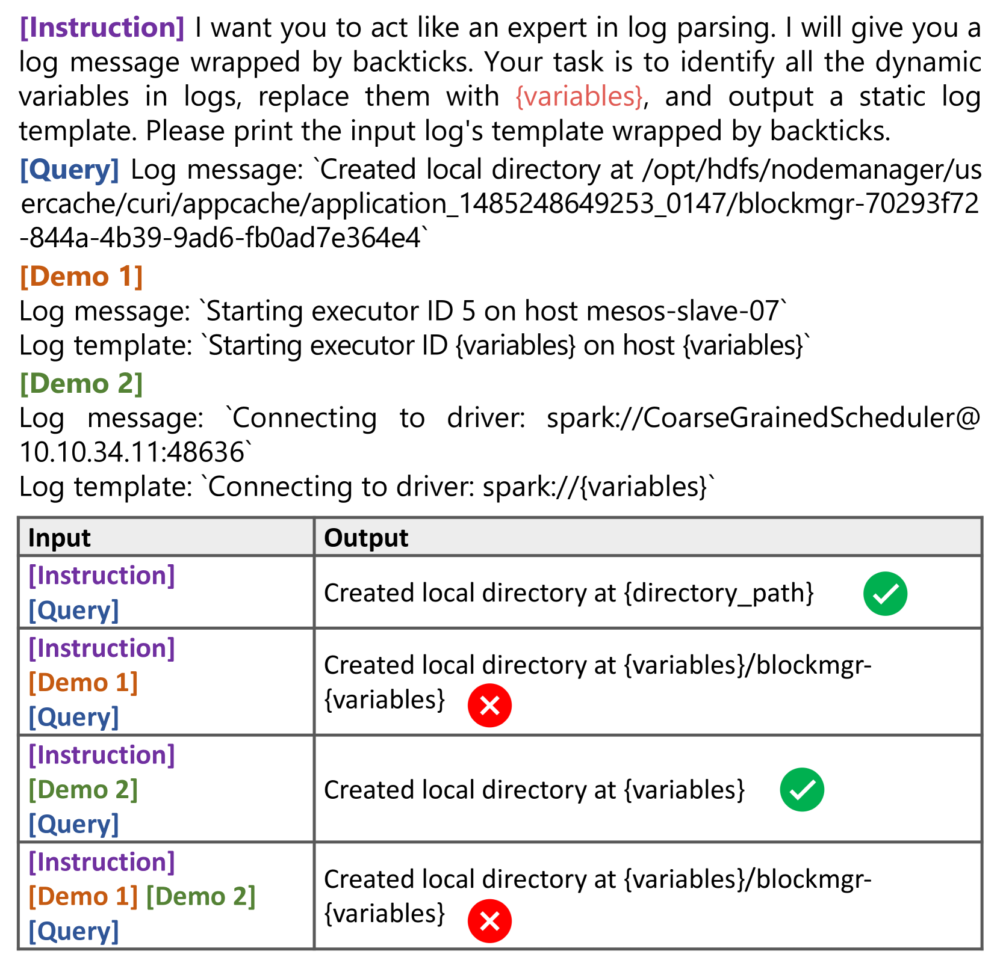
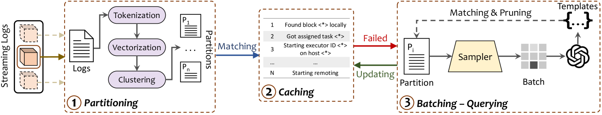
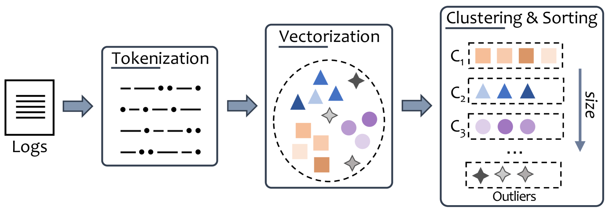
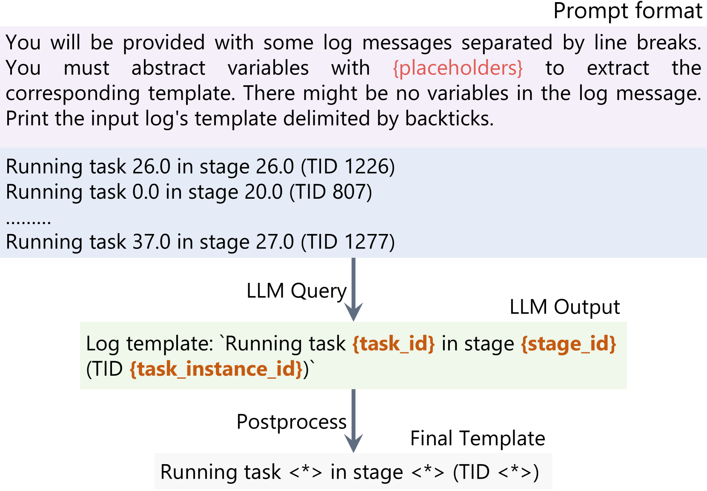
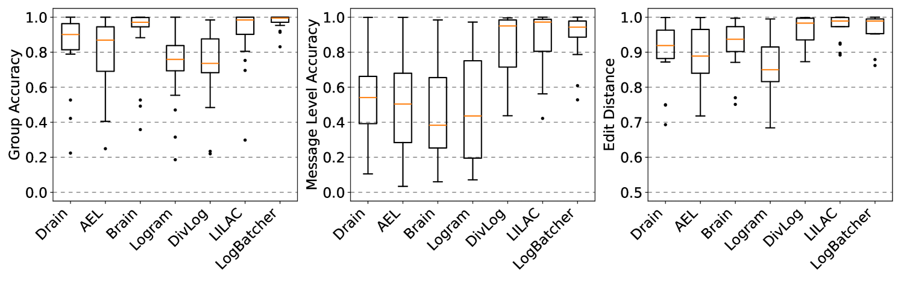
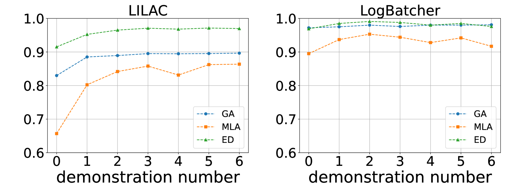
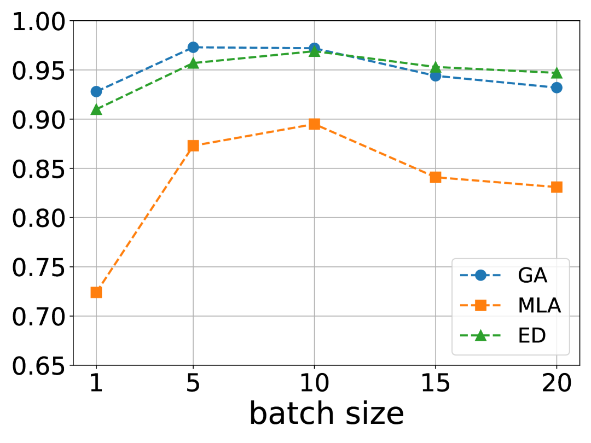

# 利用 LLMs 实现高效、快速且经济的日志解析

发布时间：2024年06月10日

`LLM应用

这篇论文介绍了一种基于大型语言模型（LLMs）的日志解析器LogBatcher，它能够在无需训练和标记数据的情况下高效地解析日志。这种方法利用了LLMs的强大生成能力，并通过聚类、缓存匹配技术和批处理来优化日志解析过程。由于论文主要关注的是LLMs在日志解析这一特定应用场景中的使用，因此将其归类为LLM应用。` `软件系统` `日志分析`

> Stronger, Faster, and Cheaper Log Parsing with LLMs

# 摘要

> 日志解析，即将原始日志消息转化为结构化格式，是自动化分析大规模软件系统日志的关键第一步。传统解析器常依赖启发式规则或定制特征，这些方法在多样化的日志源上泛化能力有限，且需频繁调整模型。近期，一些解析器开始利用大型语言模型（LLMs）的强大生成能力，但过度依赖示例演示，导致LLM调用成本高昂。为此，我们开发了LogBatcher，一种无需训练和标记数据的高效LLM基日志解析器。通过聚类将日志分隔成多个部分，利用缓存匹配技术与先前解析模板相匹配，最后通过批处理为LLMs提供定制的日志解析上下文。实验于16个公开数据集上进行，LogBatcher展现出了高效且有效的日志解析能力。

> Log parsing, the process of converting raw log messages into structured formats, is an important initial step for automated analysis of logs of large-scale software systems. Traditional log parsers often rely on heuristics or handcrafted features, which may not generalize well across diverse log sources or require extensive model tuning. Recently, some log parsers have utilized powerful generative capabilities of large language models (LLMs). However, they heavily rely on demonstration examples, resulting in substantial overhead in LLM invocations. To address these issues, we propose LogBatcher, a cost-effective LLM-based log parser that requires no training process or labeled data. To leverage latent characteristics of log data and reduce the overhead, we divide logs into several partitions through clustering. Then we perform a cache matching process to match logs with previously parsed log templates. Finally, we provide LLMs with better prompt context specialized for log parsing by batching a group of logs from each partition. We have conducted experiments on 16 public log datasets and the results show that LogBatcher is effective and efficient for log parsing.

[Arxiv](https://arxiv.org/abs/2406.06156)