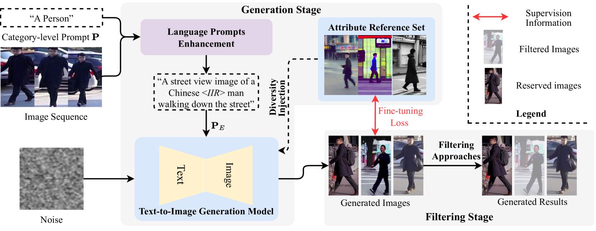

# 借助扩散模型，我们合成了高效数据，以优化行人再识别的预训练过程。

发布时间：2024年06月10日

`Agent

理由：这篇论文介绍了一种名为Diffusion-ReID的新方法，用于生成多样化的图像，以构建大规模的行人重识别数据集。该方法通过语言提示增强确保身份一致性，并通过多样性注入模块提升属性多样性。此外，还引入了Re-ID置信度阈值过滤，以剔除低质量图像。这些特性表明，该方法可以被视为一个智能Agent，因为它能够自主地生成和过滤图像，以满足特定的任务需求（即行人重识别）。因此，这篇论文更适合归类为Agent。` `行人重识别` `计算机视觉`

> Synthesizing Efficient Data with Diffusion Models for Person Re-Identification Pre-Training

# 摘要

> 现有的行人重识别方法常依赖ImageNet-1K数据集进行模型初始化，但领域差异导致性能不尽如人意。构建大规模行人Re-ID数据集耗时且困难，尽管有研究尝试从网络收集数据，如LUPerson，但处理未标记、不可控和噪声数据仍是一大挑战。为此，我们提出了一种创新的Diffusion-ReID方法，它能高效地生成多样化的图像，无需数据收集和标注。该方法分为生成和过滤两个阶段，通过语言提示增强确保身份一致性，并通过多样性注入模块提升属性多样性。我们还引入了Re-ID置信度阈值过滤，以剔除低质量图像。基于此，我们构建了包含5,183个身份、超过777K张图像的大规模数据集Diff-Person，并在此基础上预训练了更强大的Re-ID模型。在六个常用设置下，我们的方法在四个基准测试中均显著优于其他预训练和自监督方法。

> Existing person re-identification (Re-ID) methods principally deploy the ImageNet-1K dataset for model initialization, which inevitably results in sub-optimal situations due to the large domain gap. One of the key challenges is that building large-scale person Re-ID datasets is time-consuming. Some previous efforts address this problem by collecting person images from the internet e.g., LUPerson, but it struggles to learn from unlabeled, uncontrollable, and noisy data. In this paper, we present a novel paradigm Diffusion-ReID to efficiently augment and generate diverse images based on known identities without requiring any cost of data collection and annotation. Technically, this paradigm unfolds in two stages: generation and filtering. During the generation stage, we propose Language Prompts Enhancement (LPE) to ensure the ID consistency between the input image sequence and the generated images. In the diffusion process, we propose a Diversity Injection (DI) module to increase attribute diversity. In order to make the generated data have higher quality, we apply a Re-ID confidence threshold filter to further remove the low-quality images. Benefiting from our proposed paradigm, we first create a new large-scale person Re-ID dataset Diff-Person, which consists of over 777K images from 5,183 identities. Next, we build a stronger person Re-ID backbone pre-trained on our Diff-Person. Extensive experiments are conducted on four person Re-ID benchmarks in six widely used settings. Compared with other pre-training and self-supervised competitors, our approach shows significant superiority.

[Arxiv](https://arxiv.org/abs/2406.06045)