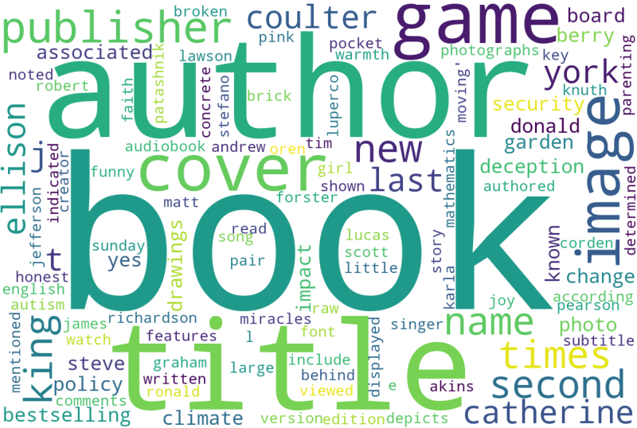
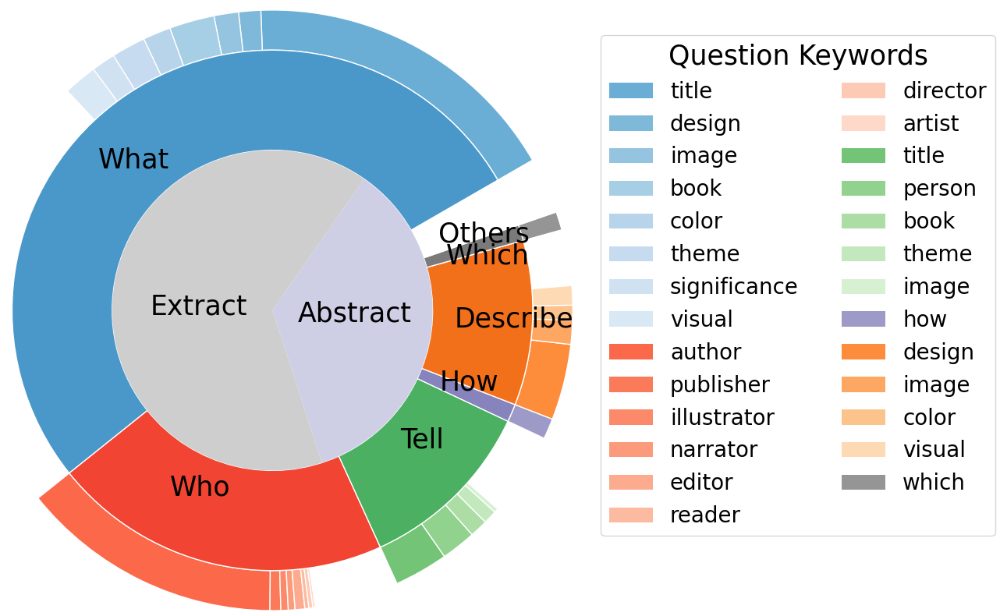
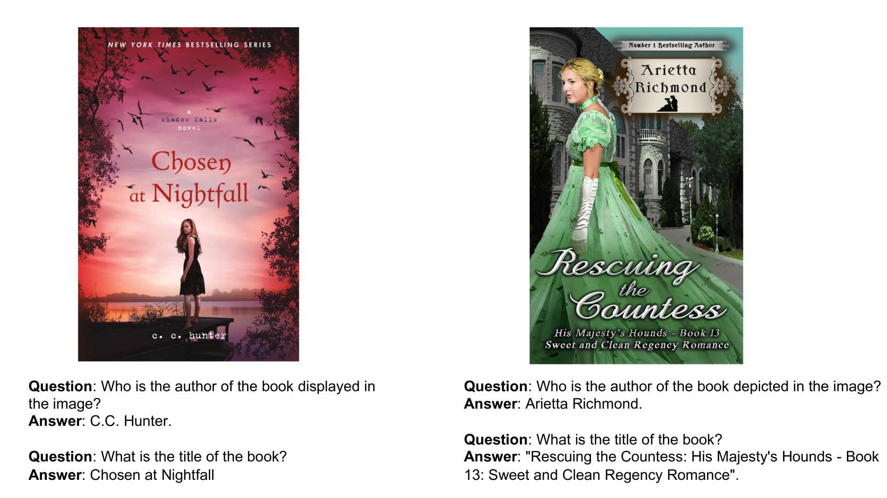

# TRINS：探索能够阅读的多模态语言模型之路

发布时间：2024年06月10日

`LLM应用

这篇论文介绍了TRINS数据集和语言-视觉阅读助手（LaRA）架构，旨在提升大型多模态语言模型在解读图像中文本内容的能力。这属于对大型语言模型（LLM）的应用层面的研究，特别是在多模态理解和图像文本解析方面。因此，它被归类为LLM应用。` `图像处理` `数据集构建`

> TRINS: Towards Multimodal Language Models that Can Read

# 摘要

> 大型多模态语言模型在图像理解和编辑上表现出色，但在解读图像中的文本内容时却显得力不从心，这主要归咎于训练数据的局限。为此，我们推出了TRINS——一个富含文本的图像指令数据集，旨在强化这些模型的阅读技能。TRINS依托LAION，采用机器与人工相结合的标注策略，收录了39,153幅富含文本的图像及102,437个相关问题。特别指出，TRINS的标注文本长度远超同类数据集，带来了新的挑战。我们还设计了一个名为语言-视觉阅读助手（LaRA）的架构，专精于解析图像内的文字信息。LaRA不仅在TRINS数据集上超越了当前顶尖的多模态语言模型，也在其他基准测试中表现卓越。最后，通过在多种文本丰富的图像理解和生成任务上的全面评估，TRINS的有效性得到了验证。

> Large multimodal language models have shown remarkable proficiency in understanding and editing images. However, a majority of these visually-tuned models struggle to comprehend the textual content embedded in images, primarily due to the limitation of training data. In this work, we introduce TRINS: a Text-Rich image INStruction dataset, with the objective of enhancing the reading ability of the multimodal large language model. TRINS is built upon LAION using hybrid data annotation strategies that include machine-assisted and human-assisted annotation processes. It contains 39,153 text-rich images, captions, and 102,437 questions. Specifically, we show that the number of words per annotation in TRINS is significantly longer than that of related datasets, providing new challenges. Furthermore, we introduce a simple and effective architecture, called a Language-vision Reading Assistant (LaRA), which is good at understanding textual content within images. LaRA outperforms existing state-of-the-art multimodal large language models on the TRINS dataset, as well as other classical benchmarks. Lastly, we conducted a comprehensive evaluation with TRINS on various text-rich image understanding and generation tasks, demonstrating its effectiveness.

[Arxiv](https://arxiv.org/abs/2406.06730)