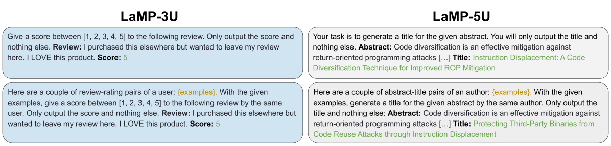
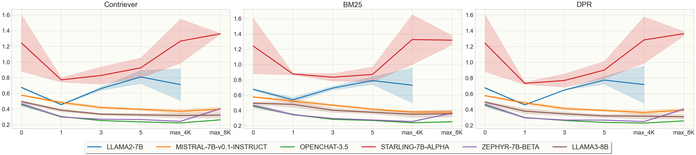
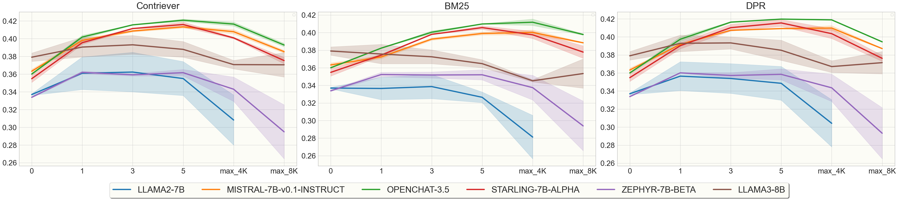

# 量化技术对小型LLMs增强检索生成能力的影响分析

发布时间：2024年06月10日

`RAG

这篇论文主要探讨了量化对小型LLMs在长上下文中执行检索增强生成（RAG）任务的影响。研究重点在于量化如何影响小型LLMs在特定任务（个性化评估挑战）上的表现，特别是在跨多文档的长上下文推理中。因此，这篇论文的内容与RAG（检索增强生成）紧密相关，属于RAG分类。` `机器学习`

> The Impact of Quantization on Retrieval-Augmented Generation: An Analysis of Small LLMs

# 摘要

> 后训练量化虽减轻了大型语言模型（LLMs）的计算负担，却可能削弱其部分功能。鉴于LLM的能力随规模增长，小型LLMs对量化更为敏感。本文深入探讨了量化对小型LLMs在长上下文中执行检索增强生成（RAG）任务的影响。我们选取个性化作为评估挑战，因其需跨多文档进行长上下文推理。通过比较原始FP16与量化至INT4的7B和8B LLMs在两项任务上的表现，并逐步增加检索文档量，我们测试了量化模型在长上下文中的适应性。为洞察检索的影响，我们评估了三种检索模型。研究显示，若7B LLM任务表现良好，量化不会影响其性能及长上下文推理能力。因此，我们确认使用量化的小型LLMs进行RAG是可行的。

> Post-training quantization reduces the computational demand of Large Language Models (LLMs) but can weaken some of their capabilities. Since LLM abilities emerge with scale, smaller LLMs are more sensitive to quantization. In this paper, we explore how quantization affects smaller LLMs' ability to perform retrieval-augmented generation (RAG), specifically in longer contexts. We chose personalization for evaluation because it is a challenging domain to perform using RAG as it requires long-context reasoning over multiple documents. We compare the original FP16 and the quantized INT4 performance of multiple 7B and 8B LLMs on two tasks while progressively increasing the number of retrieved documents to test how quantized models fare against longer contexts. To better understand the effect of retrieval, we evaluate three retrieval models in our experiments. Our findings reveal that if a 7B LLM performs the task well, quantization does not impair its performance and long-context reasoning capabilities. We conclude that it is possible to utilize RAG with quantized smaller LLMs.

[Arxiv](https://arxiv.org/abs/2406.10251)