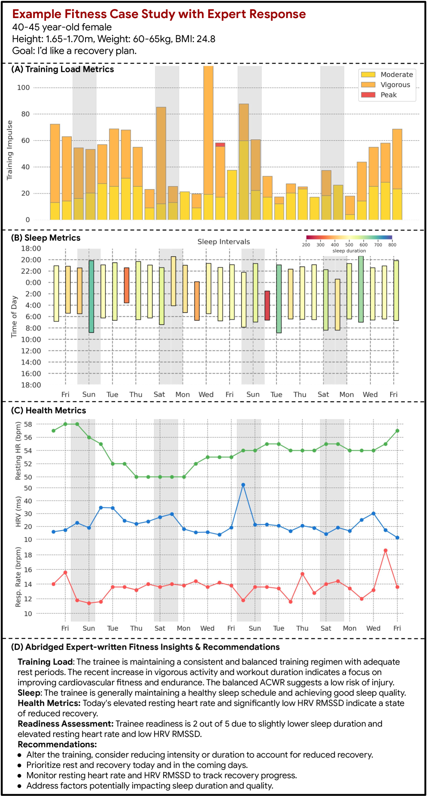
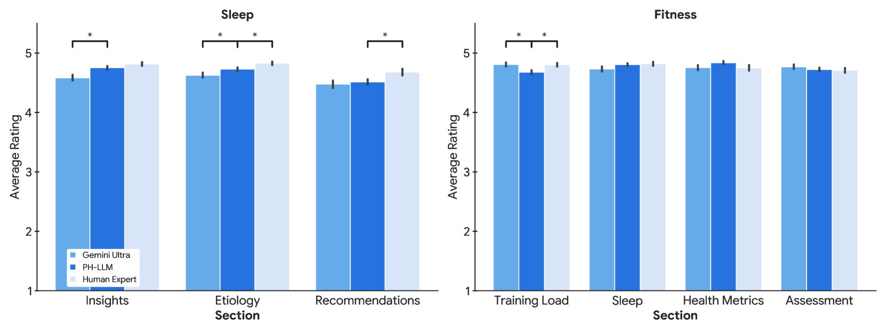
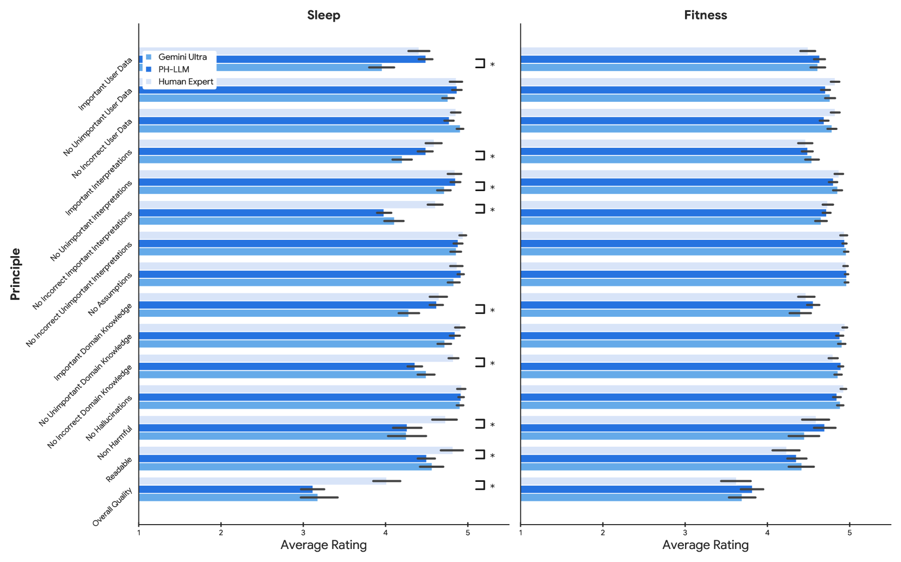
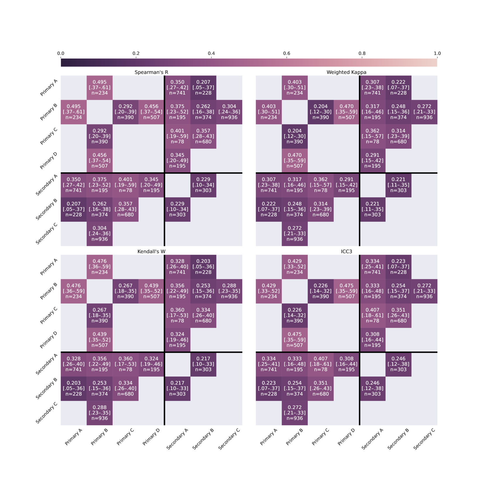

# 探索个人健康领域的大型语言模型

发布时间：2024年06月10日

`LLM应用

这篇论文介绍了个人健康大型语言模型（PH-LLM），它是基于Gemini模型的精细调整，专门用于理解和推理个人健康数据的数字时间序列。论文详细描述了PH-LLM在处理睡眠模式、身体活动和生理反应等数据方面的应用，并通过与领域专家的合作，评估了其在实际应用中的性能。此外，论文还探讨了PH-LLM在预测睡眠质量方面的能力，并强调了多模态编码在提升模型性能中的重要性。这些内容表明，该论文主要关注于大型语言模型在特定应用领域（即个人健康监测）的实际应用和性能评估，因此属于LLM应用分类。` `健康监测` `可穿戴设备`

> Towards a Personal Health Large Language Model

# 摘要

> 在健康领域，大型语言模型（LLM）的研究多聚焦于临床任务，而移动与可穿戴设备虽鲜少融入这些任务，却为个人健康监测提供了丰富的纵向数据。我们推出的个人健康大型语言模型（PH-LLM），源自Gemini的精细调整，专为理解和推理个人健康数据的数字时间序列。我们精心打造并筛选了三个数据集，旨在测试：1）从睡眠模式、身体活动及生理反应中提炼个性化见解与建议；2）专家领域知识；3）预测自我报告的睡眠结果。首个任务中，我们与领域专家携手，设计了857个案例研究，深入评估睡眠与健身领域的实际应用。通过领域特化的全面评估，我们发现Gemini Ultra 1.0与PH-LLM在健身领域的性能与专家无异，而在睡眠领域，尽管专家依旧领先，但PH-LLM的微调显著提升了运用领域知识与个性化睡眠见解的能力。我们通过多项选择的睡眠医学与健身考试，检验了PH-LLM的领域知识，其得分分别为79%和88%，超越了人类专家的平均水平。最终，我们训练PH-LLM从可穿戴设备数据的文本与多模态编码中预测睡眠质量，证实了多模态编码对于匹配专业判别模型性能的必要性。尽管在个人健康这一安全至关重要的领域还需进一步研发与评估，这些成果已彰显了Gemini模型的广泛知识与能力，以及将生理数据情境化应用于个人健康（如PH-LLM所实践）的显著益处。

> In health, most large language model (LLM) research has focused on clinical tasks. However, mobile and wearable devices, which are rarely integrated into such tasks, provide rich, longitudinal data for personal health monitoring. Here we present Personal Health Large Language Model (PH-LLM), fine-tuned from Gemini for understanding and reasoning over numerical time-series personal health data. We created and curated three datasets that test 1) production of personalized insights and recommendations from sleep patterns, physical activity, and physiological responses, 2) expert domain knowledge, and 3) prediction of self-reported sleep outcomes. For the first task we designed 857 case studies in collaboration with domain experts to assess real-world scenarios in sleep and fitness. Through comprehensive evaluation of domain-specific rubrics, we observed that Gemini Ultra 1.0 and PH-LLM are not statistically different from expert performance in fitness and, while experts remain superior for sleep, fine-tuning PH-LLM provided significant improvements in using relevant domain knowledge and personalizing information for sleep insights. We evaluated PH-LLM domain knowledge using multiple choice sleep medicine and fitness examinations. PH-LLM achieved 79% on sleep and 88% on fitness, exceeding average scores from a sample of human experts. Finally, we trained PH-LLM to predict self-reported sleep quality outcomes from textual and multimodal encoding representations of wearable data, and demonstrate that multimodal encoding is required to match performance of specialized discriminative models. Although further development and evaluation are necessary in the safety-critical personal health domain, these results demonstrate both the broad knowledge and capabilities of Gemini models and the benefit of contextualizing physiological data for personal health applications as done with PH-LLM.

[Arxiv](https://arxiv.org/abs/2406.06474)