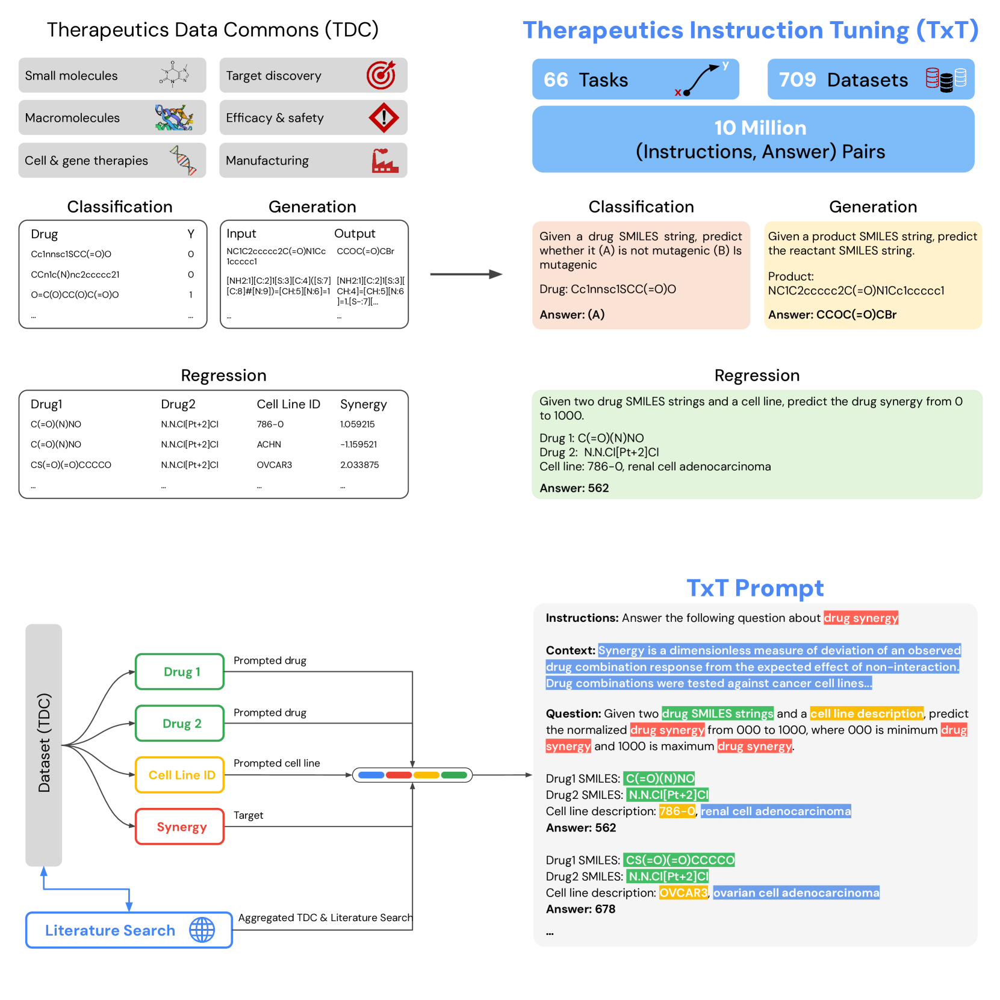
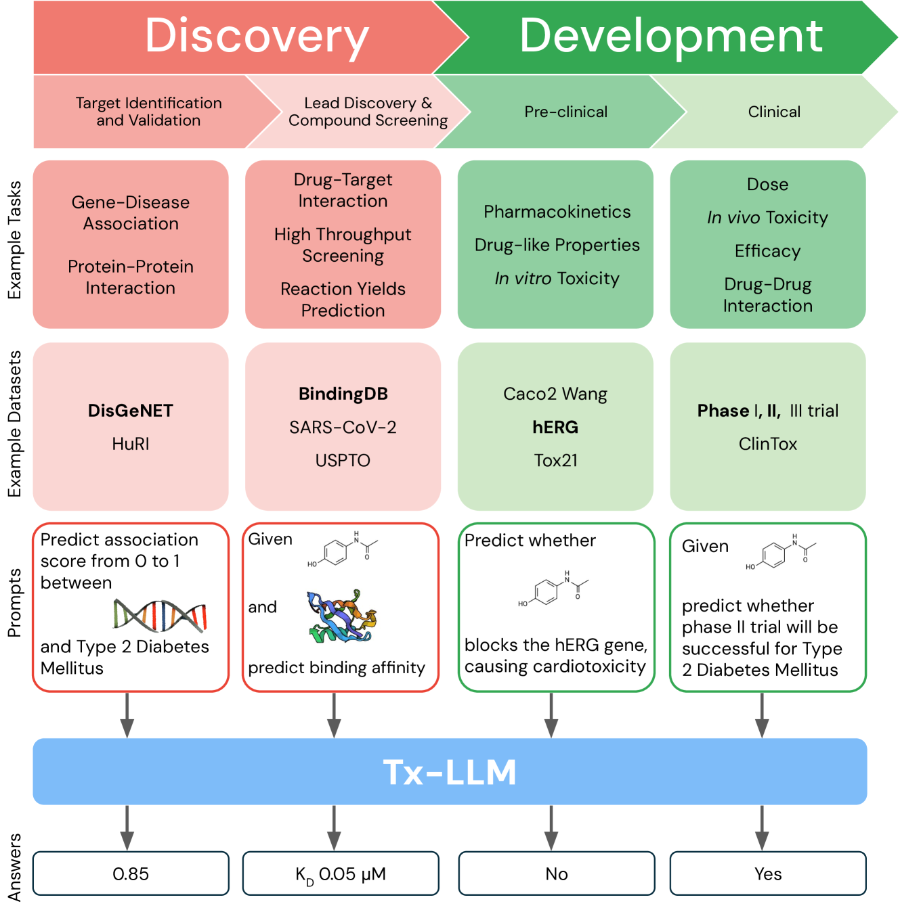
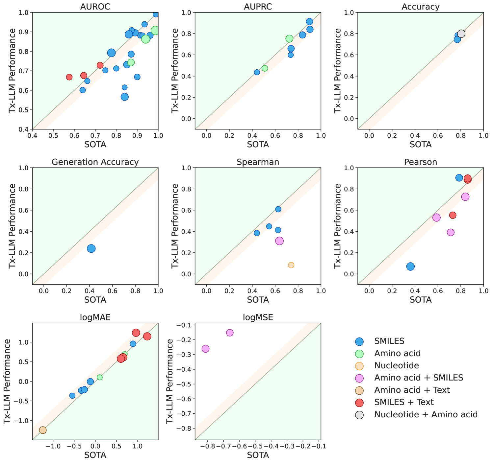
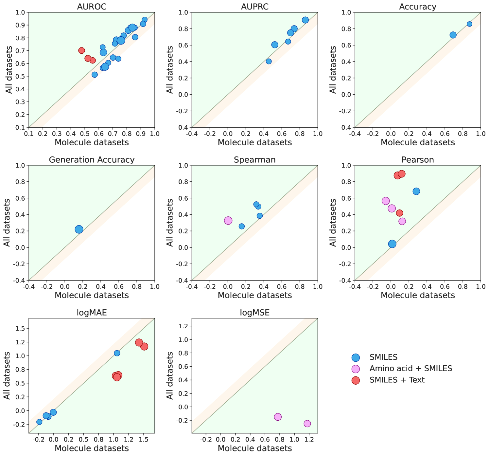
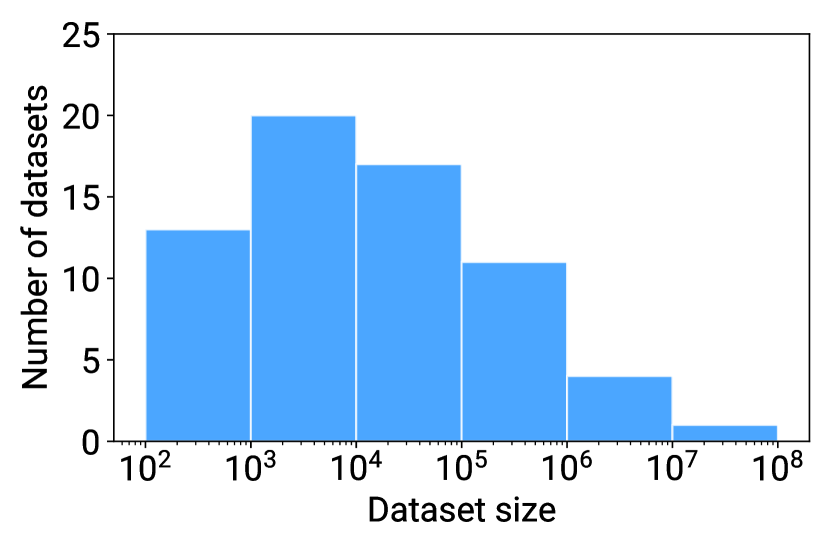
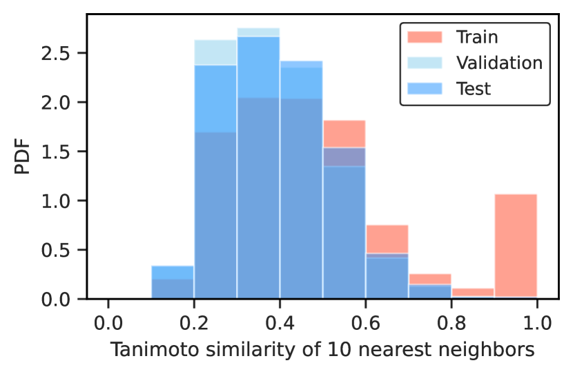
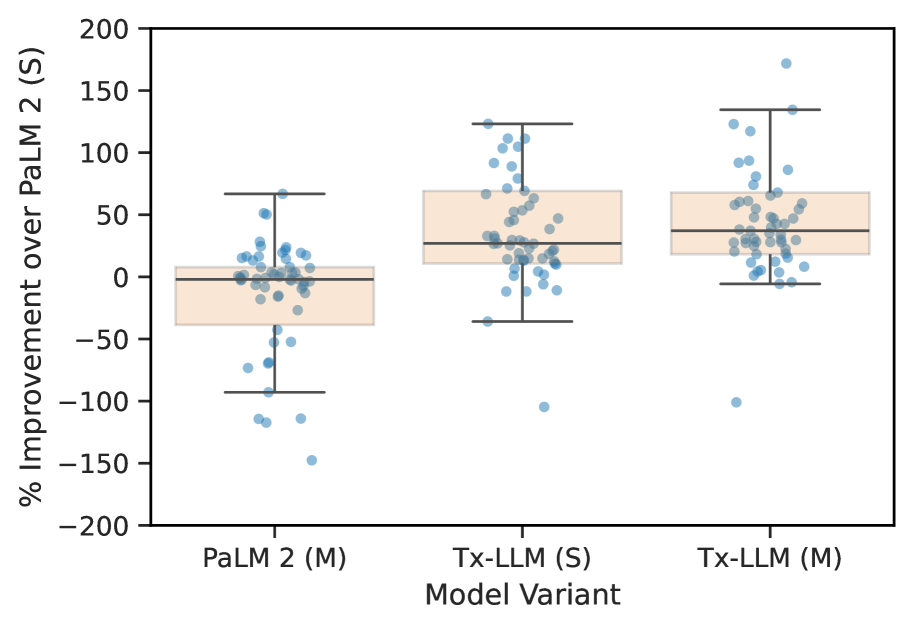
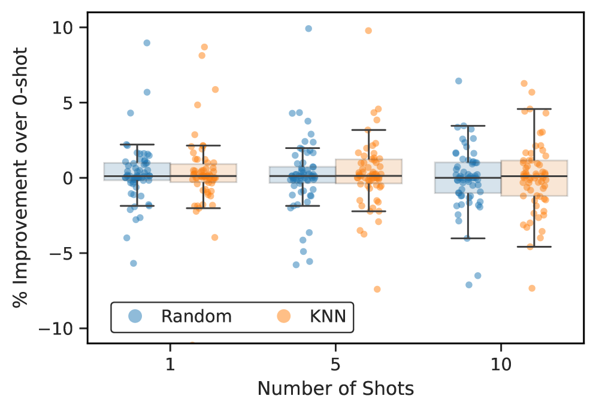

# Tx-LLM：专为治疗学设计的大型语言模型

发布时间：2024年06月10日

`LLM应用

这篇论文介绍了Tx-LLM，一个从PaLM-2微调而来的大型语言模型，专门设计用于加速药物研发过程。Tx-LLM整合了多种治疗方式的知识，并通过训练处理药物发现流程中的多项任务。该模型在多个任务中达到了顶尖水平，特别是在结合分子SMILES与文本的任务中表现卓越。这表明Tx-LLM在将LLM应用于特定领域（如生物化学和药物研发）方面具有显著的应用价值。因此，这篇论文应归类为LLM应用。` `药物研发` `生物信息学`

> Tx-LLM: A Large Language Model for Therapeutics

# 摘要

> 研发新药既耗时又成本高昂，需满足多重标准，而能加速此过程的AI模型无疑价值连城。但目前多数AI方法仅限于特定领域内的狭义任务。为此，我们推出了Tx-LLM，一个从PaLM-2微调而来的通用大型语言模型，它蕴含了多种治疗方式的知识。通过整合709个数据集，Tx-LLM针对药物发现流程中的66项任务进行训练。凭借单一权重集，它能处理化学与生物实体（如小分子、蛋白质、核酸、细胞系、疾病）及自由文本，广泛预测相关属性，在66项任务中，43项达到顶尖水平，22项超越现有最佳技术。特别是在结合分子SMILES与文本（如细胞系或疾病名称）的任务中，Tx-LLM表现卓越，这得益于预训练中习得的上下文。我们发现不同药物类型任务间存在积极知识转移，并探讨了模型规模、领域微调及提示策略对性能的影响。Tx-LLM标志着向LLM融入生物化学知识迈出的关键一步，未来有望成为药物研发全流程的端到端工具。

> Developing therapeutics is a lengthy and expensive process that requires the satisfaction of many different criteria, and AI models capable of expediting the process would be invaluable. However, the majority of current AI approaches address only a narrowly defined set of tasks, often circumscribed within a particular domain. To bridge this gap, we introduce Tx-LLM, a generalist large language model (LLM) fine-tuned from PaLM-2 which encodes knowledge about diverse therapeutic modalities. Tx-LLM is trained using a collection of 709 datasets that target 66 tasks spanning various stages of the drug discovery pipeline. Using a single set of weights, Tx-LLM simultaneously processes a wide variety of chemical or biological entities(small molecules, proteins, nucleic acids, cell lines, diseases) interleaved with free-text, allowing it to predict a broad range of associated properties, achieving competitive with state-of-the-art (SOTA) performance on 43 out of 66 tasks and exceeding SOTA on 22. Among these, Tx-LLM is particularly powerful and exceeds best-in-class performance on average for tasks combining molecular SMILES representations with text such as cell line names or disease names, likely due to context learned during pretraining. We observe evidence of positive transfer between tasks with diverse drug types (e.g.,tasks involving small molecules and tasks involving proteins), and we study the impact of model size, domain finetuning, and prompting strategies on performance. We believe Tx-LLM represents an important step towards LLMs encoding biochemical knowledge and could have a future role as an end-to-end tool across the drug discovery development pipeline.

[Arxiv](https://arxiv.org/abs/2406.06316)