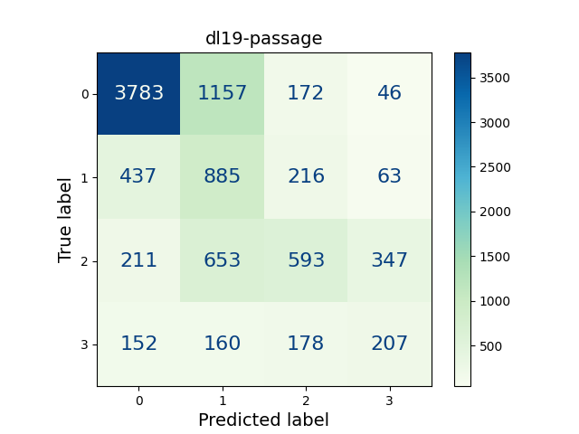
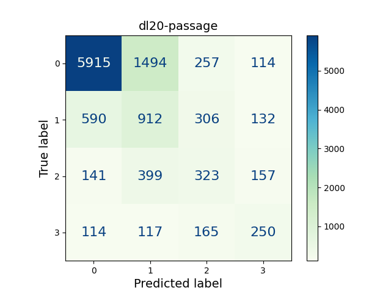
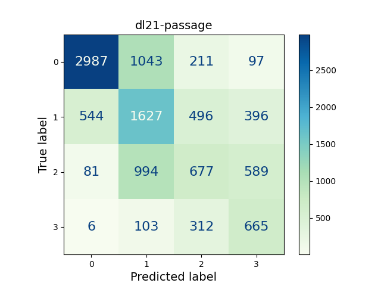
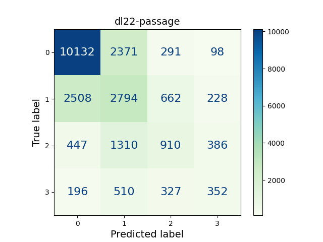
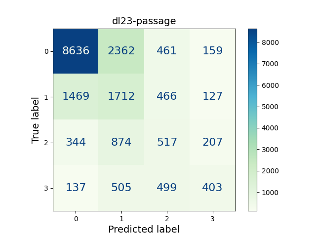
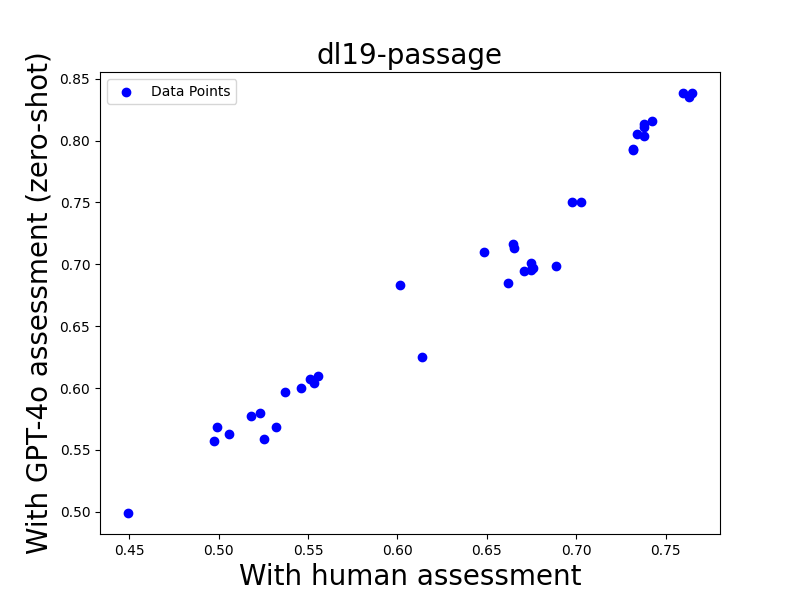
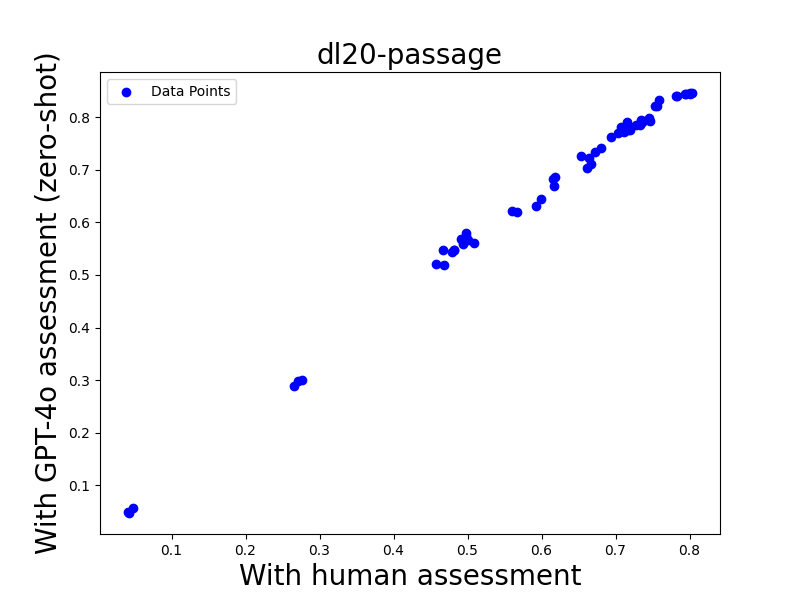
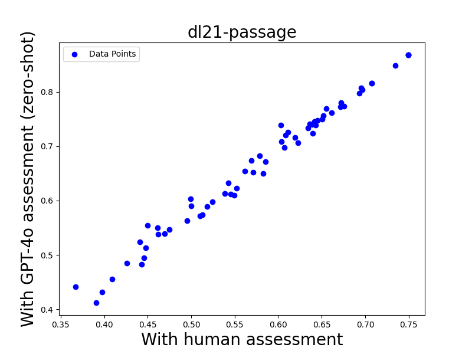
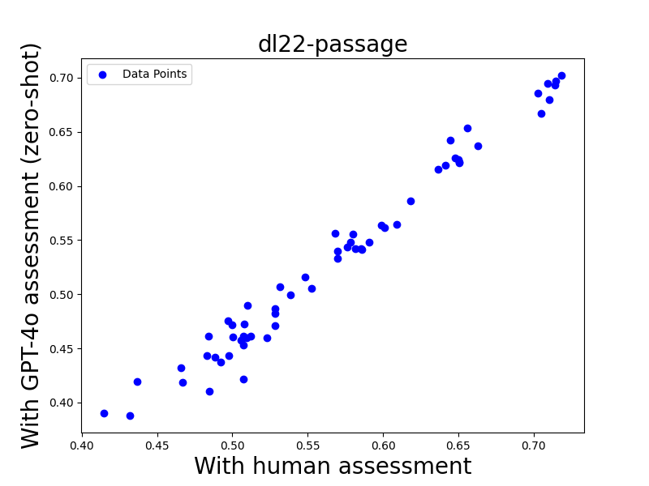
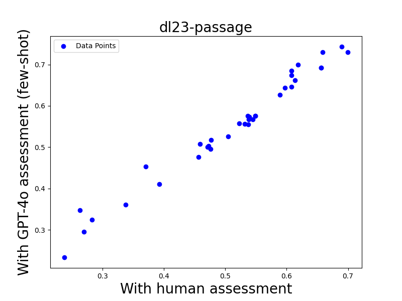

# UMBRELA：UMbrela 作为 Bing 相关性评估器的开源复制品，旨在提供一个透明且可复制的评估工具。

发布时间：2024年06月10日

`RAG

理由：这篇论文介绍了一个名为 UMBRELA 的开源工具包，它利用大型语言模型（LLMs）如 OpenAI 的 GPT-4o 模型来进行相关性评估，这是检索增强生成（RAG）技术的一个应用实例。RAG 技术通常涉及使用大型语言模型来增强信息检索系统的性能，特别是在评估和优化检索结果的相关性方面。UMBRELA 的设计和应用直接关联到 RAG 技术的实践，因此将其分类为RAG。` `检索系统` `信息评估`

> UMBRELA: UMbrela is the (Open-Source Reproduction of the) Bing RELevance Assessor

# 摘要

> 检索系统的有效训练和准确评估依赖于大量的相关性判断，传统上这些判断由人工完成，成本高且耗时。微软必应的Thomas等人近期研究发现，大型语言模型（LLMs）能准确进行相关性评估，提供接近人类的判断质量，但未留下可重用的软件成果。我们开发的UMBRELA（意为“UMbrela是必应相关性评估器”），是一个开源工具包，利用OpenAI的GPT-4o模型复现了Thomas等人的研究，并深化了原论文的细节。在TREC 2019至2023年的深度学习轨道中，我们发现LLM生成的相关性判断与高效多阶段检索系统的排名高度一致。UMBRELA设计灵活，易于融入现有检索和评估流程，为研究者提供了研究检索评估方法的新工具。它将在TREC 2024 RAG轨道中用于辅助相关性评估，并有望成为该领域创新的新基石。UMBRELA的源码可在https://github.com/castorini/umbrela获取。

> Copious amounts of relevance judgments are necessary for the effective training and accurate evaluation of retrieval systems. Conventionally, these judgments are made by human assessors, rendering this process expensive and laborious. A recent study by Thomas et al. from Microsoft Bing suggested that large language models (LLMs) can accurately perform the relevance assessment task and provide human-quality judgments, but unfortunately their study did not yield any reusable software artifacts. Our work presents UMBRELA (a recursive acronym that stands for UMbrela is the Bing RELevance Assessor), an open-source toolkit that reproduces the results of Thomas et al. using OpenAI's GPT-4o model and adds more nuance to the original paper. Across Deep Learning Tracks from TREC 2019 to 2023, we find that LLM-derived relevance judgments correlate highly with rankings generated by effective multi-stage retrieval systems. Our toolkit is designed to be easily extensible and can be integrated into existing multi-stage retrieval and evaluation pipelines, offering researchers a valuable resource for studying retrieval evaluation methodologies. UMBRELA will be used in the TREC 2024 RAG Track to aid in relevance assessments, and we envision our toolkit becoming a foundation for further innovation in the field. UMBRELA is available at https://github.com/castorini/umbrela.

[Arxiv](https://arxiv.org/abs/2406.06519)