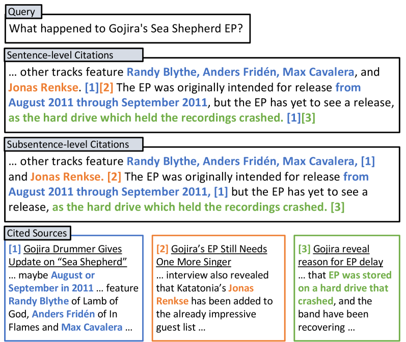
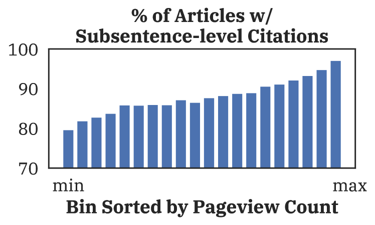

# 细粒度子句级引用的可验证内容生成

发布时间：2024年06月10日

`RAG

这篇论文主要关注的是大型语言模型（LLMs）在生成输出时如何提供更细粒度的引用支持，即子句级别的引用。这与RAG（Retrieval-Augmented Generation）模型的概念相符，因为RAG模型结合了检索和生成两个过程，旨在提高语言模型生成内容的可信度和透明度。论文中提到的SCiFi数据集和相关的实验评估，都是为了改进和验证这种细粒度的引用生成方法，这与RAG模型的应用和改进紧密相关。因此，将这篇论文分类为RAG是合适的。` `数据集`

> Verifiable Generation with Subsentence-Level Fine-Grained Citations

# 摘要

> 为了提升大型语言模型（LLMs）输出的透明度和可信度，需要它们引用支持输出的源文档。以往的研究多集中在句子级引用的生成，但未明确指出句子中哪些部分由引用来源支持。本研究聚焦于子句级细粒度引用的可验证生成，旨在更精确地标定由引用来源支持的内容。我们推出了SCiFi数据集，内含10,000个带有子句级引用的维基百科段落，每个段落均与一组候选源文档及触发内容生成的查询相匹配。通过在SCiFi上的测试，我们评估了顶尖LLMs的性能及处理长文档的策略。实验结果表明，扩大模型可访问的源文档上下文并进行专业模型调优，是提升引用质量的关键。

> Verifiable generation requires large language models (LLMs) to cite source documents supporting their outputs, thereby improve output transparency and trustworthiness. Yet, previous work mainly targets the generation of sentence-level citations, lacking specificity about which parts of a sentence are backed by the cited sources. This work studies verifiable generation with subsentence-level fine-grained citations for more precise location of generated content supported by the cited sources. We first present a dataset, SCiFi, comprising 10K Wikipedia paragraphs with subsentence-level citations. Each paragraph is paired with a set of candidate source documents for citation and a query that triggers the generation of the paragraph content. On SCiFi, we evaluate the performance of state-of-the-art LLMs and strategies for processing long documents designed for these models. Our experiment results reveals key factors that could enhance the quality of citations, including the expansion of the source documents' context accessible to the models and the implementation of specialized model tuning.

[Arxiv](https://arxiv.org/abs/2406.06125)