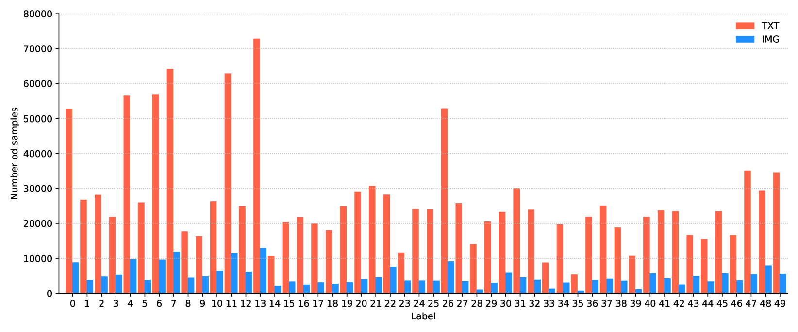
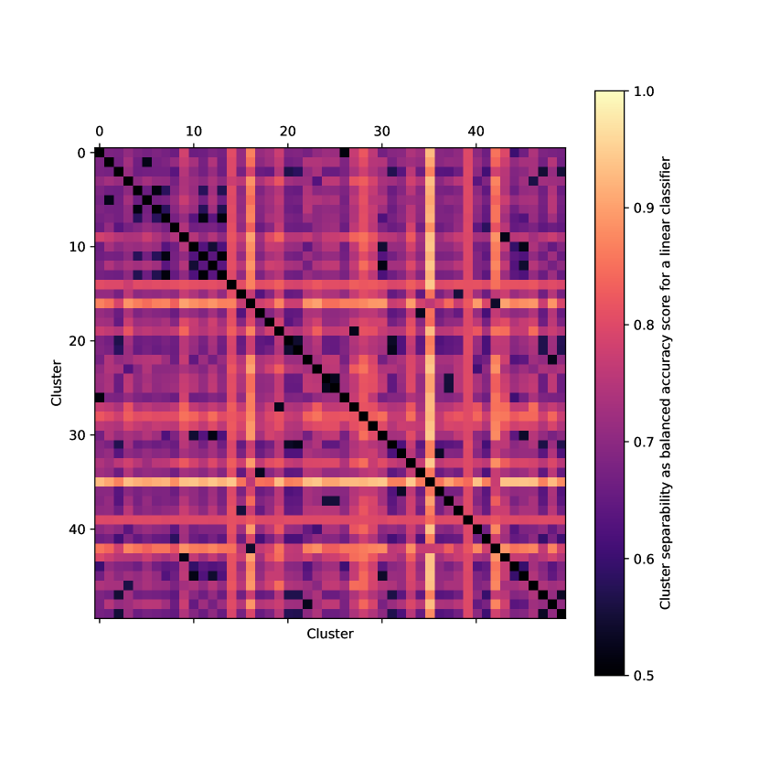
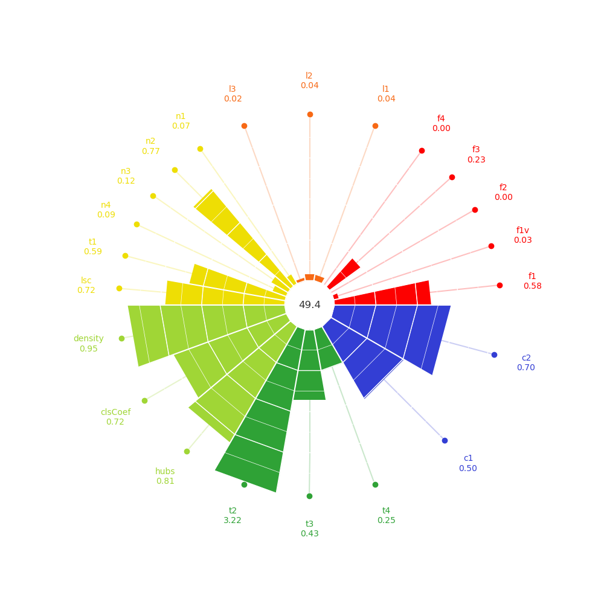
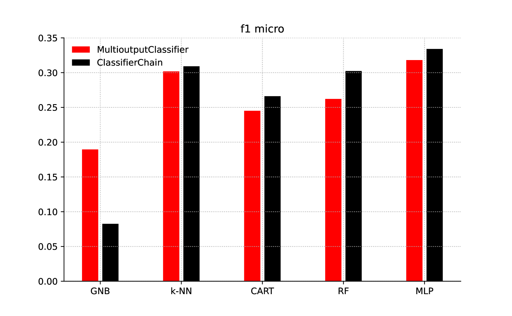
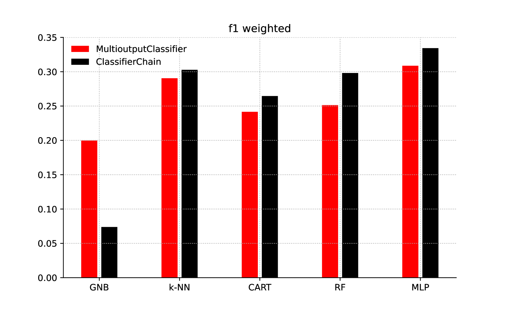
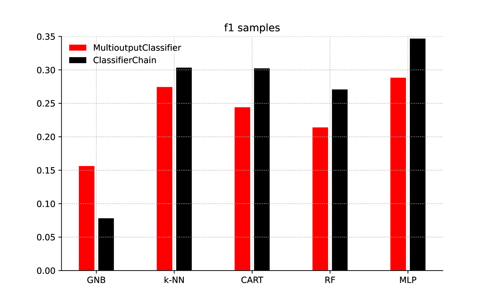
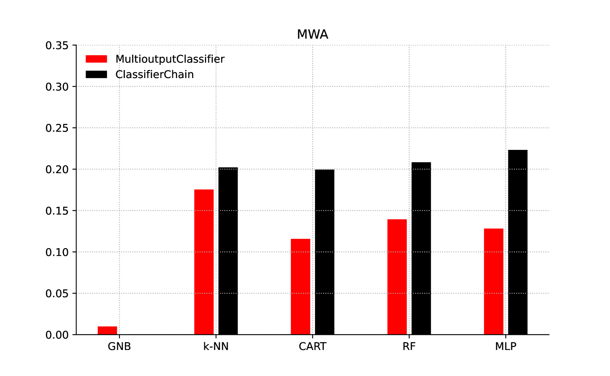
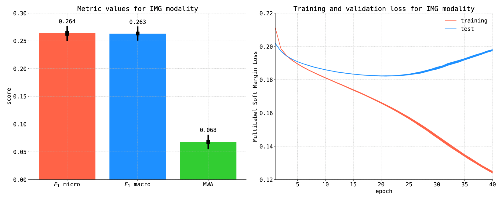
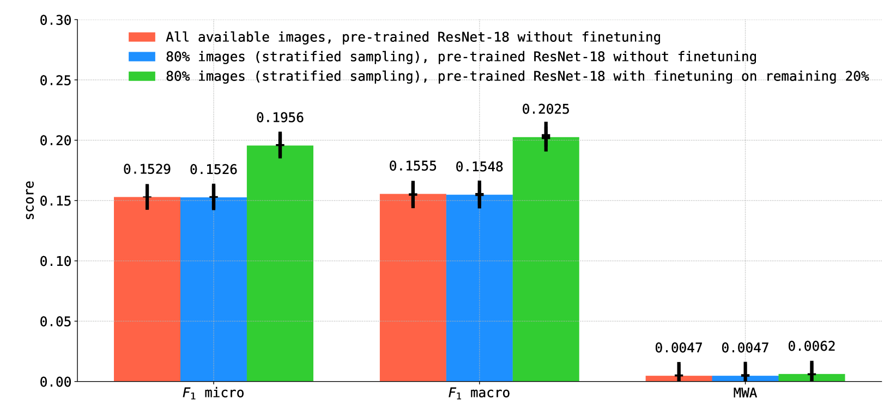
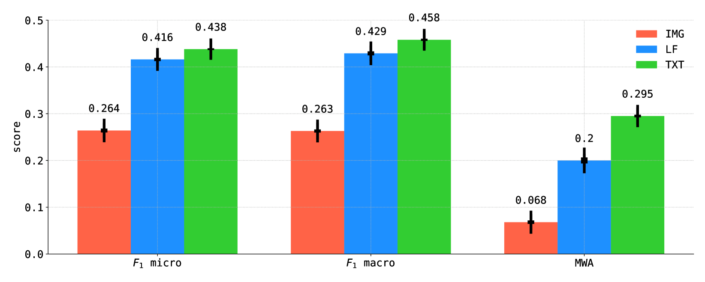

# WarCov：社交平台上的大型多标签与多模态数据集

发布时间：2024年06月10日

`Agent

理由：这篇论文主要关注的是数据采集、整理和标签获取的过程，特别是在自然语言处理领域中创建新的数据集。它描述了如何收集和处理特定社交媒体平台上的数据，并将其用于多模态识别任务。虽然这项工作涉及到了自然语言处理和多模态数据处理，但其核心在于数据集的创建和处理，而不是直接探讨Agent的行为、RAG（检索增强生成）技术、LLM（大型语言模型）的应用或理论。因此，将其归类为Agent是因为它涉及到了数据处理和模型训练的前期工作，这些工作通常是机器学习或人工智能系统（Agent）的一部分。` `社交媒体分析` `多模态数据处理`

> WarCov -- Large multilabel and multimodal dataset from social platform

# 摘要

> 在分类任务中，从原始数据采集到整理出适合评估机器学习模型的数据集，一系列高成本的步骤是必不可少的。在自然语言处理领域，虽然初步的清洗和转换可以自动化，但标签的获取仍需依赖人类专家的智慧。尽管常言道“数据无处不在”，数据科学家却常感数据匮乏，尤其是在不断演变的自然语言应用领域，这些应用需不断适应新概念或事件。例如，COVID-19大流行及其相关词汇在2019年前几乎无人知晓。因此，创建新的数据集，包括非英语语言的数据集，至关重要。本研究收集了2022年在波兰社交媒体平台上发布的关于大流行和乌克兰战争的3~187~105篇帖子，不仅包括预处理的文本，还有图像，适用于多模态识别任务。标签基于伴随帖子的标签创建，定义了帖子主题。本文详细阐述了从数据采集到样本模式识别实验的数据集整理过程。

> In the classification tasks, from raw data acquisition to the curation of a dataset suitable for use in evaluating machine learning models, a series of steps - often associated with high costs - are necessary. In the case of Natural Language Processing, initial cleaning and conversion can be performed automatically, but obtaining labels still requires the rationalized input of human experts. As a result, even though many articles often state that "the world is filled with data", data scientists suffer from its shortage. It is crucial in the case of natural language applications, which is constantly evolving and must adapt to new concepts or events. For example, the topic of the COVID-19 pandemic and the vocabulary related to it would have been mostly unrecognizable before 2019. For this reason, creating new datasets, also in languages other than English, is still essential. This work presents a collection of 3~187~105 posts in Polish about the pandemic and the war in Ukraine published on popular social media platforms in 2022. The collection includes not only preprocessed texts but also images so it can be used also for multimodal recognition tasks. The labels define posts' topics and were created using hashtags accompanying the posts. The work presents the process of curating a dataset from acquisition to sample pattern recognition experiments.

[Arxiv](https://arxiv.org/abs/2406.10255)