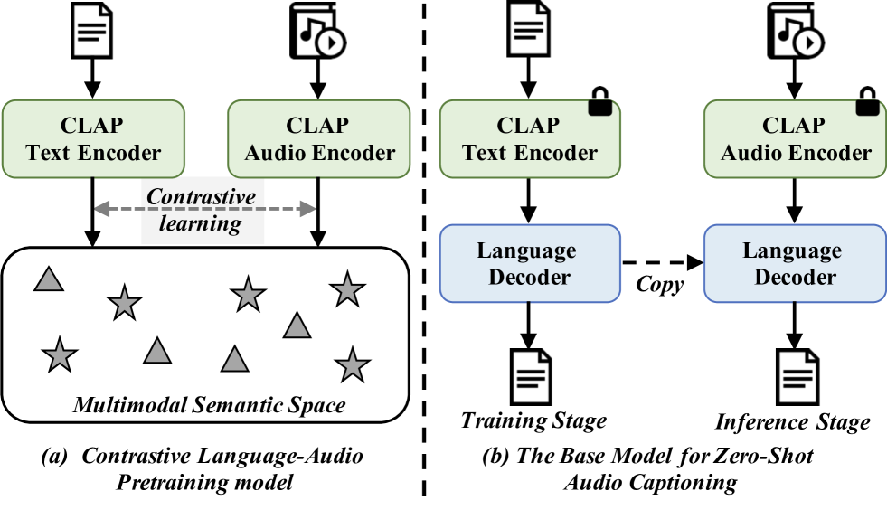
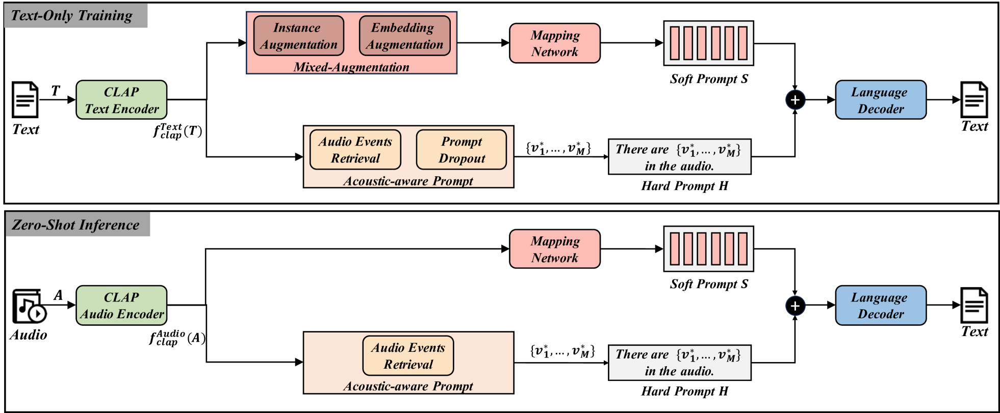

# 零-shot音频字幕生成：软硬提示并用

发布时间：2024年06月10日

`RAG

理由：这篇论文介绍了一种新型的音频字幕生成方法，该方法基于对比语言-音频预训练（CLAP），并利用了音频-文本对齐技术。这种方法的特点在于其跨模态语义空间的应用，以及通过混合增强的软提示和基于检索的声学感知硬提示来提升模型的泛化能力。这些特性与RAG（Retrieval-Augmented Generation）模型的概念相吻合，即通过检索增强生成过程，提高模型在跨域应用中的性能。因此，这篇论文更适合归类于RAG。` `音频处理` `字幕生成`

> Zero-Shot Audio Captioning Using Soft and Hard Prompts

# 摘要

> 传统的音频字幕生成方法依赖于全监督学习，使用人工标注的音频-文本对数据集进行训练和评估，但这种方法存在两大弊端：一是对数据的需求量大，且人工标注成本高昂；二是跨域应用时性能下降，这一问题却未得到足够重视。为此，我们提出了一种基于对比语言-音频预训练（CLAP）的新型音频字幕生成方法。该方法仅需文本数据即可训练，使模型能在跨模态语义空间中生成文本。推理时，模型利用CLAP的音频-文本对齐，从音频特征生成描述文本。我们采用了两种策略来缩小文本与音频嵌入的差异：混合增强的软提示和基于检索的声学感知硬提示，旨在提升模型的泛化能力，使其生成更稳健、准确的字幕。在AudioCaps和Clotho基准的广泛测试中，我们的方法在域内和跨域场景下均表现出色，证明了其卓越的泛化性能。

> In traditional audio captioning methods, a model is usually trained in a fully supervised manner using a human-annotated dataset containing audio-text pairs and then evaluated on the test sets from the same dataset. Such methods have two limitations. First, these methods are often data-hungry and require time-consuming and expensive human annotations to obtain audio-text pairs. Second, these models often suffer from performance degradation in cross-domain scenarios, i.e., when the input audio comes from a different domain than the training set, which, however, has received little attention. We propose an effective audio captioning method based on the contrastive language-audio pre-training (CLAP) model to address these issues. Our proposed method requires only textual data for training, enabling the model to generate text from the textual feature in the cross-modal semantic space.In the inference stage, the model generates the descriptive text for the given audio from the audio feature by leveraging the audio-text alignment from CLAP.We devise two strategies to mitigate the discrepancy between text and audio embeddings: a mixed-augmentation-based soft prompt and a retrieval-based acoustic-aware hard prompt. These approaches are designed to enhance the generalization performance of our proposed model, facilitating the model to generate captions more robustly and accurately. Extensive experiments on AudioCaps and Clotho benchmarks show the effectiveness of our proposed method, which outperforms other zero-shot audio captioning approaches for in-domain scenarios and outperforms the compared methods for cross-domain scenarios, underscoring the generalization ability of our method.

[Arxiv](https://arxiv.org/abs/2406.06295)