# iMotion-LLM：运动预测指令微调

发布时间：2024年06月10日

`Agent

理由：这篇论文介绍了一种名为 iMotion-LLM 的多模态大型语言模型，专门设计用于交互式多代理场景，并具备轨迹预测功能。它通过文本指令作为核心输入来生成相关轨迹，并在实际驾驶场景中进行了测试和优化。这种模型特别关注于多代理环境中的交互和预测，因此更适合归类于Agent分类，因为它涉及到了代理的行为预测和响应。` `自动驾驶` `交互式系统`

> iMotion-LLM: Motion Prediction Instruction Tuning

# 摘要

> 我们推出了 iMotion-LLM，这是一种专为交互式多代理场景设计的，具备轨迹预测功能的多模态大型语言模型。与传统方法不同，iMotion-LLM 通过文本指令作为核心输入，精准生成相关轨迹。我们通过在 Waymo 开放数据集的真实驾驶场景中融入文本指令，打造了 InstructWaymo。借助此数据集，iMotion-LLM 结合预训练 LLM 并经 LoRA 微调，有效将场景特征映射至 LLM 输入空间。iMotion-LLM 在多个方面超越传统模型：它能根据可行指令生成相应轨迹，并在面对不可行指令时选择拒绝，显著提升安全性。这些成果标志着自主导航系统在理解和预测多代理环境动态方面的重要进展，为该领域的未来创新奠定了坚实基础。

> We introduce iMotion-LLM: a Multimodal Large Language Models (LLMs) with trajectory prediction, tailored to guide interactive multi-agent scenarios. Different from conventional motion prediction approaches, iMotion-LLM capitalizes on textual instructions as key inputs for generating contextually relevant trajectories.By enriching the real-world driving scenarios in the Waymo Open Dataset with textual motion instructions, we created InstructWaymo. Leveraging this dataset, iMotion-LLM integrates a pretrained LLM, fine-tuned with LoRA, to translate scene features into the LLM input space. iMotion-LLM offers significant advantages over conventional motion prediction models. First, it can generate trajectories that align with the provided instructions if it is a feasible direction. Second, when given an infeasible direction, it can reject the instruction, thereby enhancing safety. These findings act as milestones in empowering autonomous navigation systems to interpret and predict the dynamics of multi-agent environments, laying the groundwork for future advancements in this field.

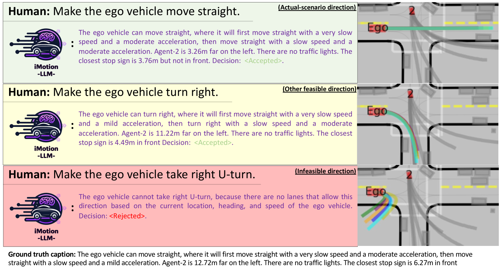

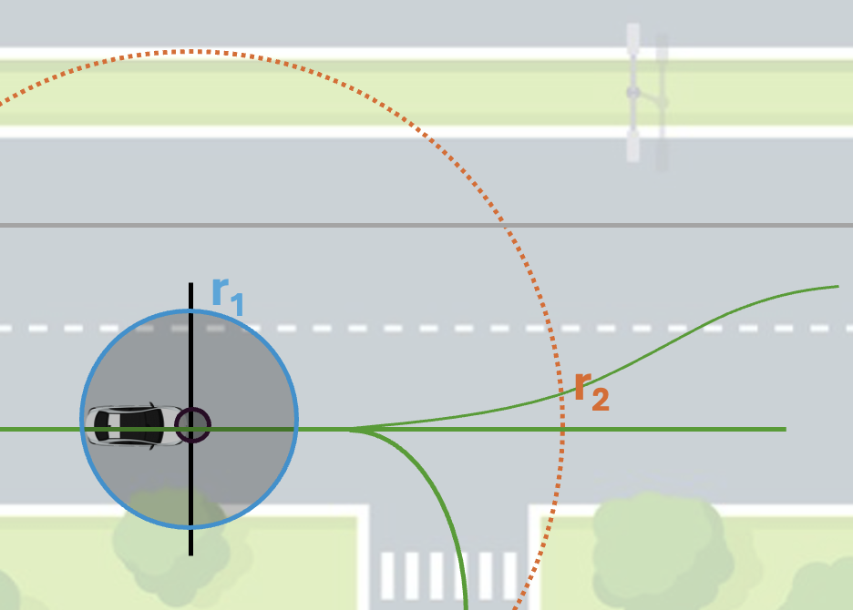

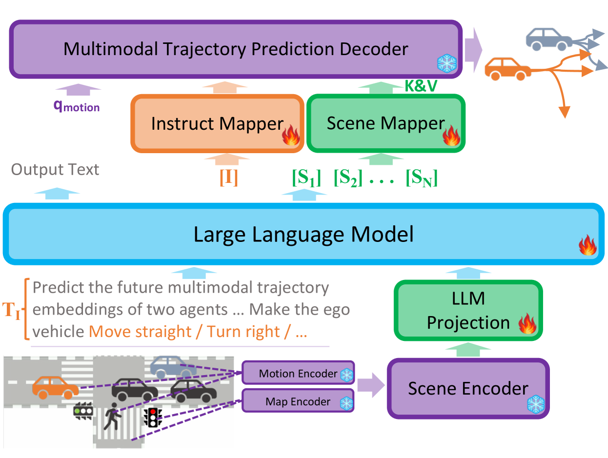

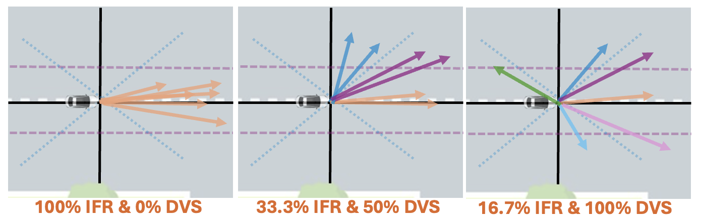

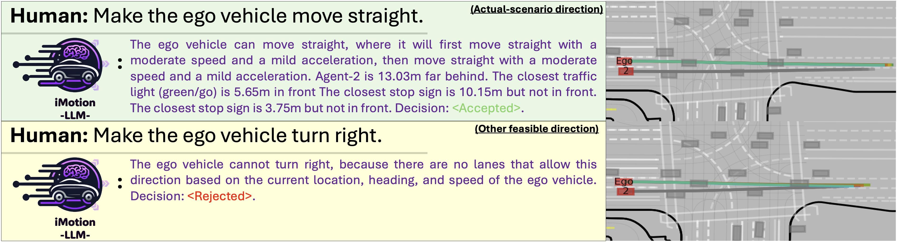

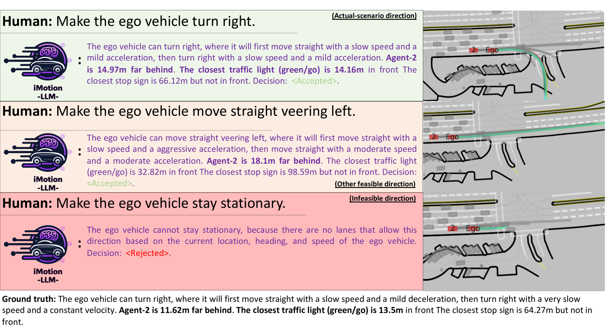

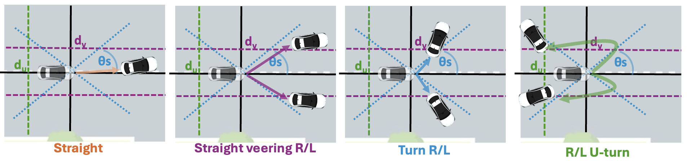

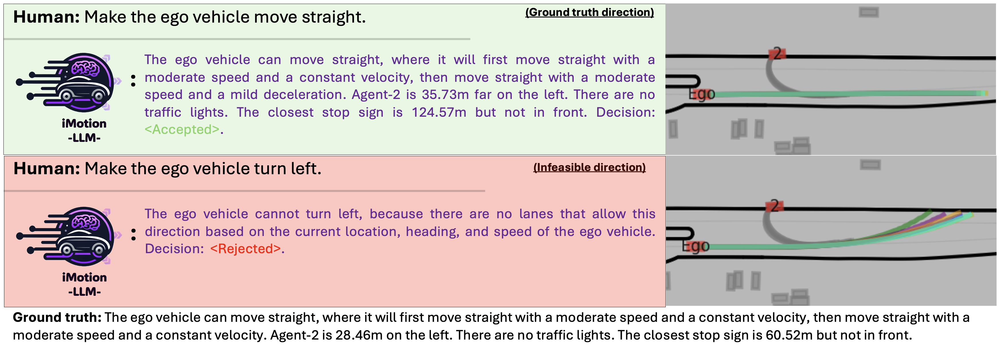

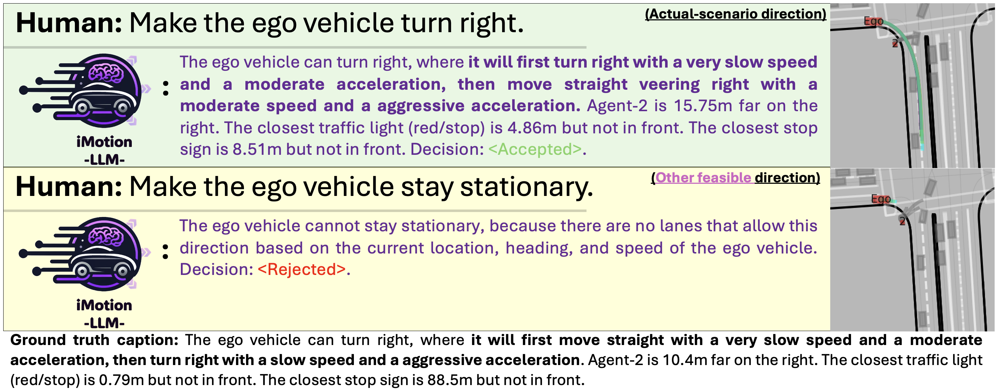

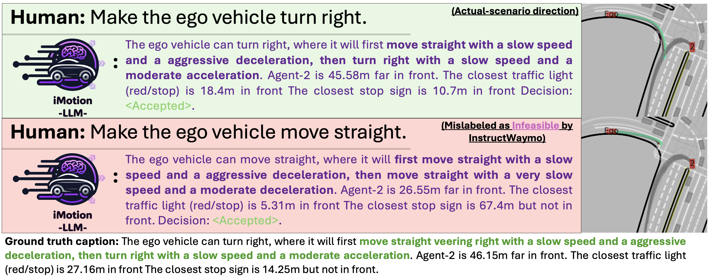

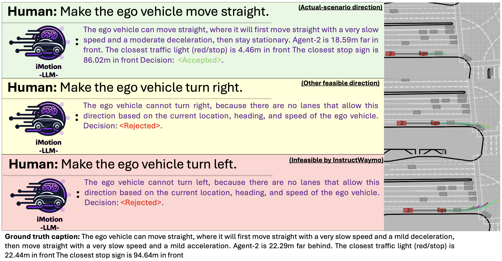

[Arxiv](https://arxiv.org/abs/2406.06211)