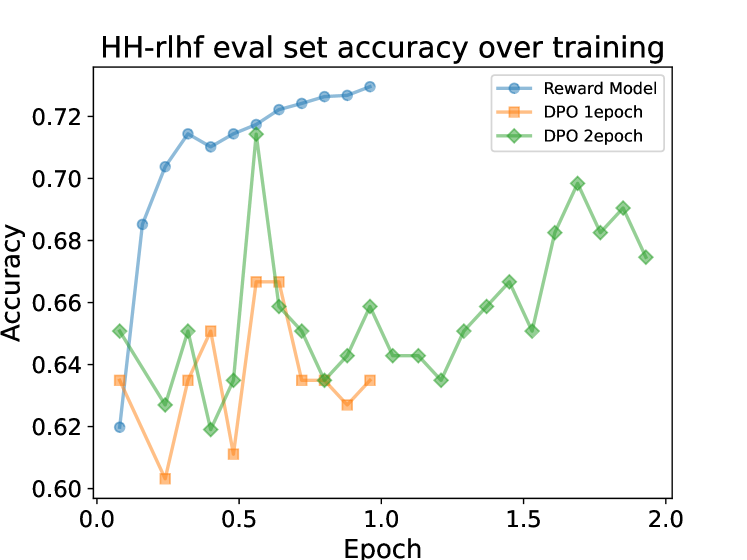

# 三维特性：探索DPO难题，绘制未来发展蓝图

发布时间：2024年06月11日

`LLM理论

理由：这篇论文主要探讨了大型语言模型（LLMs）与人类偏好对齐的方法，特别是直接偏好优化（DPO）的特性和问题，并提出了理论解释和改进方法。这些内容涉及LLM的理论层面，包括模型学习机制、稳定性以及性能优化，因此属于LLM理论分类。` `人工智能` `机器学习`

> 3D-Properties: Identifying Challenges in DPO and Charting a Path Forward

# 摘要

> 近期，将大型语言模型（LLMs）与人类偏好对齐成为研究热点，RLHF-PPO和直接偏好优化（DPO）是其中的两种方法。尽管DPO效率高，但在顶尖的生产级LLMs中应用不多，暗示其可能存在问题。本研究通过实验，包括在数学问题解决和指令遵循等任务上使用精心设计的玩具模型和实际LLMs，揭示了DPO的“3D”特性：拒绝响应的可能性急剧下降、LLM学习退化、以及对未见响应的分散效应。我们不仅与相关研究建立了内在联系，还提供了一个理论解释。为此，我们提出了简单的正则化方法，以改善DPO的稳定性和性能。此外，我们还探讨了配对偏好数据分布对DPO有效性的影响。我们期望这项工作能为缩小无奖励偏好学习方法与基于奖励的方法之间的差距提供新的研究视角。

> Aligning large language models (LLMs) with human preference has recently gained tremendous attention, with the canonical yet costly RLHF-PPO and the simple and straightforward Direct Preference Optimization (DPO) as two examples. Despite the efficiency, DPO has rarely be used in the state-of-the-art production-level LLMs, implying its potential pathologies. In this work, we revisit DPO with a comprehensive examination of its empirical efficacy and a systematic comparison with RLHF-PPO. We identify the \textbf{3D}-properties of DPO's learning outcomes: the \textbf{D}rastic drop in the likelihood of rejected responses, the \textbf{D}egradation into LLM unlearning, and the \textbf{D}ispersion effect on unseen responses through experiments with both a carefully designed toy model and practical LLMs on tasks including mathematical problem-solving and instruction following. These findings inherently connect to some observations made by related works and we additionally contribute a plausible theoretical explanation for them. Accordingly, we propose easy regularization methods to mitigate the issues caused by \textbf{3D}-properties, improving the training stability and final performance of DPO. Our contributions also include an investigation into how the distribution of the paired preference data impacts the effectiveness of DPO. We hope this work could offer research directions to narrow the gap between reward-free preference learning methods and reward-based ones.

[Arxiv](https://arxiv.org/abs/2406.07327)