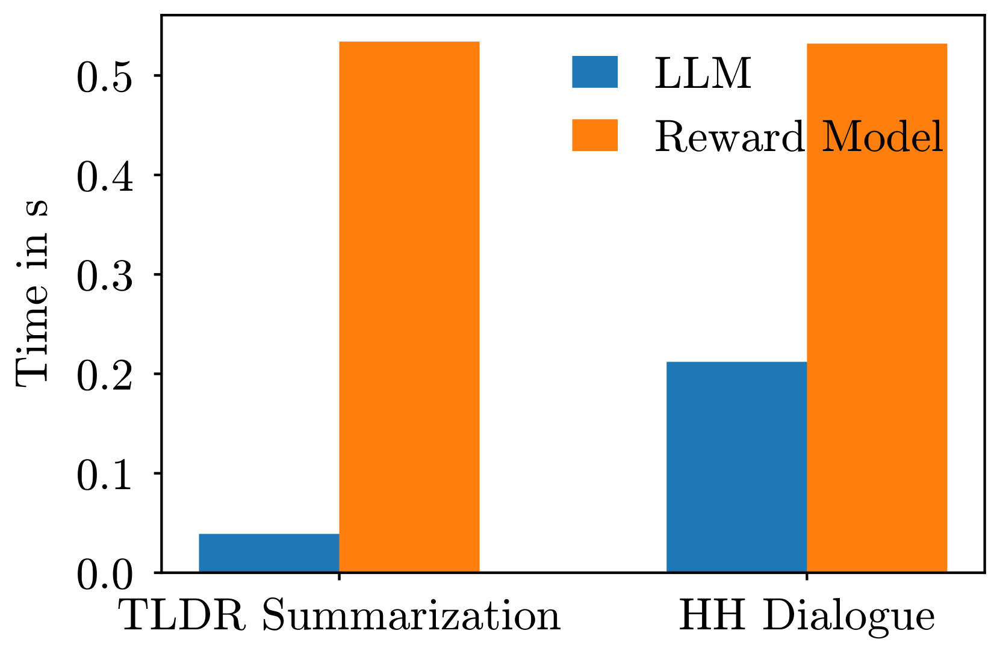

# 深入剖析：基于令牌级奖励的文本生成之批判性分析

发布时间：2024年06月11日

`LLM理论

理由：这篇论文探讨了大型语言模型（LLMs）的性能提升方法，特别是通过改进奖励模型来优化文本生成过程，而不是依赖于微调LLM。论文中提出的新方法涉及在部分序列上训练奖励模型，并分析了其隐含策略的特性。这些内容更多地关注于LLM的理论和内部机制的改进，而不是其应用或特定的Agent行为，因此归类为LLM理论。` `机器学习`

> A Critical Look At Tokenwise Reward-Guided Text Generation

# 摘要

> 大型语言模型（LLMs）通过与人类偏好对齐，即采用从人类反馈中强化学习（RLHF）的方法，性能得以显著提升。但微调LLM的高昂成本让许多用户望而却步。近期，基于令牌级奖励引导的文本生成（RGTG）方法崭露头角，它们无需微调LLM，而是利用在完整序列上训练的奖励模型，在令牌级解码中对部分序列进行评分，以期生成高奖励序列。尽管如此，这些方法的启发式动机和分析仍显不足。在本研究中，我们发现，完整序列训练的奖励模型并不适合评分部分序列。为此，我们提出了一种新方法：在部分序列上训练Bradley-Terry奖励模型，并在解码时自回归地采样隐含的令牌级策略。我们深入探讨了该奖励模型的特性及其隐含策略，发现该策略与两种RLHF策略的比率成正比。实验证明，我们的方法不仅超越了以往的RGTG方法，还达到了与无需大规模LLM微调的强大离线基线相当的性能。

> Large language models (LLMs) can significantly be improved by aligning to human preferences -- the so-called reinforcement learning from human feedback (RLHF). However, the cost of fine-tuning an LLM is prohibitive for many users. Due to their ability to bypass LLM finetuning, tokenwise reward-guided text generation (RGTG) methods have recently been proposed. They use a reward model trained on full sequences to score partial sequences during a tokenwise decoding, in a bid to steer the generation towards sequences with high rewards. However, these methods have so far been only heuristically motivated and poorly analyzed. In this work, we show that reward models trained on full sequences are not compatible with scoring partial sequences. To alleviate this issue, we propose to explicitly train a Bradley-Terry reward model on partial sequences, and autoregressively sample from the implied tokenwise policy during decoding time. We study the property of this reward model and the implied policy. In particular, we show that this policy is proportional to the ratio of two distinct RLHF policies. We show that our simple approach outperforms previous RGTG methods and achieves similar performance as strong offline baselines but without large-scale LLM finetuning.

[Arxiv](https://arxiv.org/abs/2406.07780)