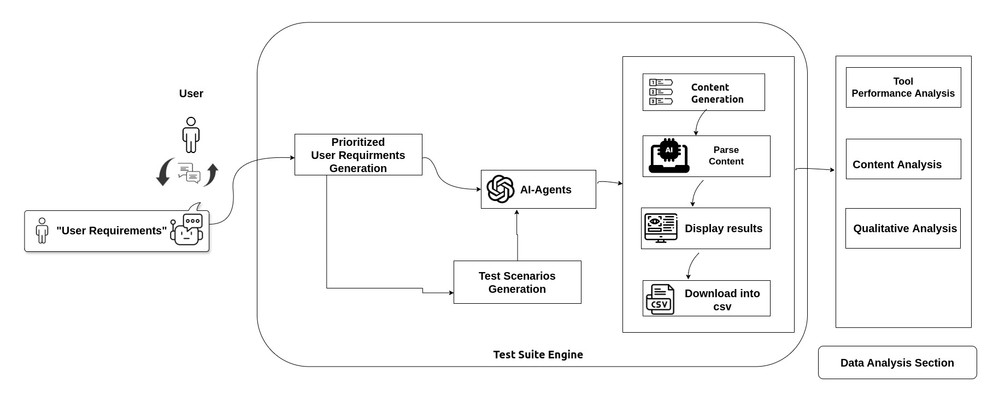
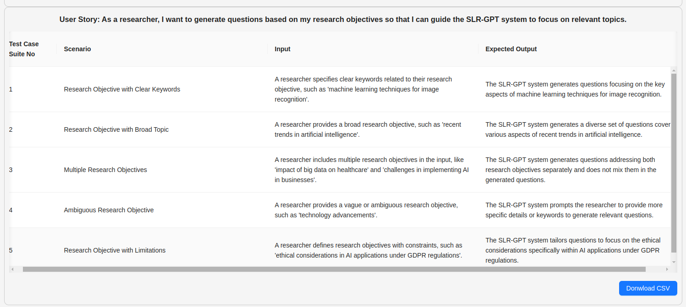

# 利用大型语言模型打造测试用例场景生成工具

发布时间：2024年06月11日

`LLM应用

理由：这篇论文主要探讨了大型语言模型（LLMs）在软件工程领域的应用，特别是在自动化测试案例生成方面的应用。它介绍了一种基于LLM和提示工程的网络工具，用于自动化生成符合用户需求的测试案例场景。这表明论文关注的是LLM在实际应用中的使用，而不是LLM的理论研究或Agent的设计与实现，也不是关于检索增强生成（RAG）的研究。因此，最合适的分类是LLM应用。` `软件工程` `自动化测试`

> A Tool for Test Case Scenarios Generation Using Large Language Models

# 摘要

> 大型语言模型（LLMs）在软件工程领域广泛应用，涵盖代码生成、软件设计与文档、代码注释、审查及测试脚本编写等任务。但在自动化测试案例时，需依赖详尽的测试套件文档，确保在限定条件和时间内全面测试功能需求，尤其在需求与用户需求持续演变的背景下。本文聚焦于从史诗级用户需求和高层次用户故事出发，构建测试案例场景，并介绍了一款基于LLM和提示工程的网络工具，旨在自动化生成符合用户需求的测试案例场景。

> Large Language Models (LLMs) are widely used in Software Engineering (SE) for various tasks, including generating code, designing and documenting software, adding code comments, reviewing code, and writing test scripts. However, creating test scripts or automating test cases demands test suite documentation that comprehensively covers functional requirements. Such documentation must enable thorough testing within a constrained scope and timeframe, particularly as requirements and user demands evolve. This article centers on generating user requirements as epics and high-level user stories and crafting test case scenarios based on these stories. It introduces a web-based software tool that employs an LLM-based agent and prompt engineering to automate the generation of test case scenarios against user requirements.

[Arxiv](https://arxiv.org/abs/2406.07021)