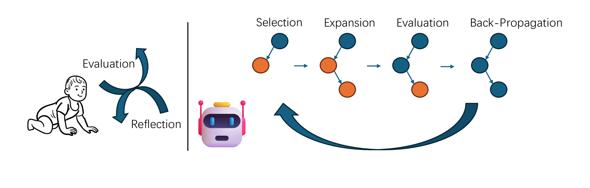

# 借助Monte Carlo树搜索的自我优化与LLaMa-3 8B模型的强大支持，我们得以探索并实现GPT-4级别的数学奥林匹克问题解答。

发布时间：2024年06月11日

`LLM应用

这篇论文介绍了一种名为MCT Self-Refine（MCTSr）的算法，该算法结合了大型语言模型（LLMs）和蒙特卡洛树搜索（MCTS），旨在提高复杂数学推理任务的表现。这种方法通过迭代的选择、自我优化、自我评估和反向传播来构建蒙特卡洛搜索树，并使用改进的上置信界限（UCB）公式来平衡探索与利用。实验结果表明，该算法在解决高难度的数学问题，如奥林匹克级别的数学问题，上表现出色。因此，这篇论文属于LLM应用类别，因为它展示了如何将LLMs应用于特定的实际问题，即数学推理任务，并改进了这些任务的解决方法。` `人工智能`

> Accessing GPT-4 level Mathematical Olympiad Solutions via Monte Carlo Tree Self-refine with LLaMa-3 8B

# 摘要

> 本文创新性地提出了MCT Self-Refine（MCTSr）算法，该算法巧妙结合了大型语言模型（LLMs）与蒙特卡洛树搜索（MCTS），旨在提升复杂数学推理任务的表现。针对LLMs在策略和数学推理中的准确性与可靠性问题，MCTSr通过系统的探索和启发式自我优化机制，强化了LLMs内的决策制定。算法通过迭代的选择、自我优化、自我评估和反向传播构建蒙特卡洛搜索树，并利用改进的上置信界限（UCB）公式平衡探索与利用。实验结果显示，MCTSr在解决奥林匹克级别的数学问题上表现出色，显著提升了多个数据集（如GSM8K、GSM Hard、MATH及奥林匹克基准，包括数学奥德赛、AIME和OlympiadBench）的成功率。此研究不仅拓展了LLMs在复杂推理任务中的应用，也为未来AI的集成奠定了坚实基础，提高了LLM驱动应用中决策的准确性和可靠性。

> This paper introduces the MCT Self-Refine (MCTSr) algorithm, an innovative integration of Large Language Models (LLMs) with Monte Carlo Tree Search (MCTS), designed to enhance performance in complex mathematical reasoning tasks. Addressing the challenges of accuracy and reliability in LLMs, particularly in strategic and mathematical reasoning, MCTSr leverages systematic exploration and heuristic self-refine mechanisms to improve decision-making frameworks within LLMs. The algorithm constructs a Monte Carlo search tree through iterative processes of Selection, self-refine, self-evaluation, and Backpropagation, utilizing an improved Upper Confidence Bound (UCB) formula to optimize the exploration-exploitation balance. Extensive experiments demonstrate MCTSr's efficacy in solving Olympiad-level mathematical problems, significantly improving success rates across multiple datasets, including GSM8K, GSM Hard, MATH, and Olympiad-level benchmarks, including Math Odyssey, AIME, and OlympiadBench. The study advances the application of LLMs in complex reasoning tasks and sets a foundation for future AI integration, enhancing decision-making accuracy and reliability in LLM-driven applications.

[Arxiv](https://arxiv.org/abs/2406.07394)