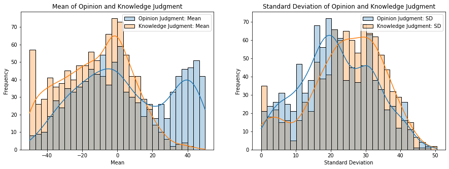
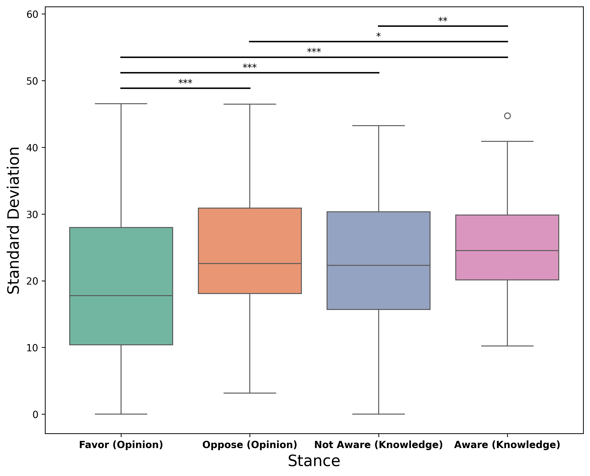
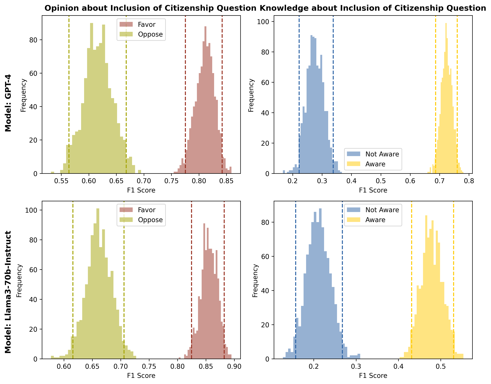

# 社交媒体立场标注的进步与探索：大型语言模型与众包的对比研究

发布时间：2024年06月11日

`LLM应用

这篇论文主要探讨了大型语言模型（LLMs）在社交媒体帖子自动文本标注中的应用，特别是在立场检测方面的效能和准确性。研究通过比较LLMs与人类标注者的表现，分析了LLMs在不同情境下的性能，并提出了结合人类专家精确性与LLM预测可扩展性的综合方法。这表明论文关注的是LLMs在实际应用中的效能和改进方法，因此属于LLM应用分类。` `社交媒体分析`

> Advancing Annotation of Stance in Social Media Posts: A Comparative Analysis of Large Language Models and Crowd Sourcing

# 摘要

> 在NLP领域迅速发展的背景下，LLMs在社交媒体帖子自动文本标注中的应用备受瞩目。尽管ChatGPT等LLMs的开发取得了显著进展，但它们作为标注工具的效能和准确性仍未被充分理解。本文对八种开源和专有LLMs在标注社交媒体立场时的表现进行了分析，并与人类标注者的判断进行了比较。研究发现，文本表达立场的明确性对LLMs与人类判断的一致性至关重要。我们指出，LLMs在人类标注者表现出色时同样表现良好，而在人类标注者难以达成共识的情况下，LLMs也往往表现不佳。最后，我们建议采用一种结合人类专家精确性与LLM预测可扩展性的综合方法，以提升自动立场检测的准确性和全面性，推动社交媒体分析技术的进步。

> In the rapidly evolving landscape of Natural Language Processing (NLP), the use of Large Language Models (LLMs) for automated text annotation in social media posts has garnered significant interest. Despite the impressive innovations in developing LLMs like ChatGPT, their efficacy, and accuracy as annotation tools are not well understood. In this paper, we analyze the performance of eight open-source and proprietary LLMs for annotating the stance expressed in social media posts, benchmarking their performance against human annotators' (i.e., crowd-sourced) judgments. Additionally, we investigate the conditions under which LLMs are likely to disagree with human judgment. A significant finding of our study is that the explicitness of text expressing a stance plays a critical role in how faithfully LLMs' stance judgments match humans'. We argue that LLMs perform well when human annotators do, and when LLMs fail, it often corresponds to situations in which human annotators struggle to reach an agreement. We conclude with recommendations for a comprehensive approach that combines the precision of human expertise with the scalability of LLM predictions. This study highlights the importance of improving the accuracy and comprehensiveness of automated stance detection, aiming to advance these technologies for more efficient and unbiased analysis of social media.

[Arxiv](https://arxiv.org/abs/2406.07483)