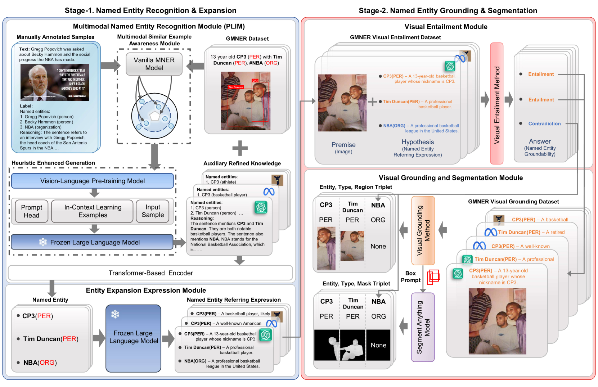

# 借助大型语言模型的重构与框分割技术，推动基于实体的多模态命名实体识别研究

发布时间：2024年06月11日

`Agent

理由：这篇论文主要介绍了一个名为 RiVEG 的框架，该框架通过大型语言模型（LLMs）连接，将 Grounded Multimodal Named Entity Recognition (GMNER) 任务转化为联合 MNER-VE-VG 任务。这个框架优化了 MNER 模块，并引入了实体扩展与视觉蕴涵模块，实现了视觉与实体定位的统一。此外，论文还提出了 SMNER 任务及 Twitter-SMNER 数据集，并验证了基于框提示的 Segment Anything Model (SAM) 的有效性。这些内容主要涉及使用 LLMs 来增强和优化特定的任务（即 GMNER 和 SMNER），并且通过引入新的模型和数据集来解决现有问题，因此更符合Agent分类，即使用 LLMs 作为智能代理来执行和优化特定任务。` `社交媒体` `计算机视觉`

> Advancing Grounded Multimodal Named Entity Recognition via LLM-Based Reformulation and Box-Based Segmentation

# 摘要

> Grounded Multimodal Named Entity Recognition (GMNER) 任务旨在识别命名实体及其视觉对应区域，面临两大挑战：社交媒体上图文关联薄弱，导致许多实体难以识别；以及粗粒度名词短语与细粒度命名实体间的差异。本文提出的 RiVEG 框架，通过 LLMs 连接，将 GMNER 转化为联合 MNER-VE-VG 任务，优化了 MNER 模块，无需预先提取特征，解决了现有方法的两大瓶颈，并通过引入实体扩展与视觉蕴涵模块，实现了视觉与实体定位的统一，增强了数据和模型的可扩展性。为解决 GMNER 中边界框的模糊性，我们提出了 SMNER 任务及 Twitter-SMNER 数据集，专注于生成细粒度分割掩码，并验证了基于框提示的 Segment Anything Model (SAM) 在提升 GMNER 模型完成 SMNER 任务上的有效性。实验结果显示，RiVEG 在多个任务的数据集上均超越了现有最佳方法。

> Grounded Multimodal Named Entity Recognition (GMNER) task aims to identify named entities, entity types and their corresponding visual regions. GMNER task exhibits two challenging attributes: 1) The tenuous correlation between images and text on social media contributes to a notable proportion of named entities being ungroundable. 2) There exists a distinction between coarse-grained noun phrases used in similar tasks (e.g., phrase localization) and fine-grained named entities. In this paper, we propose RiVEG, a unified framework that reformulates GMNER into a joint MNER-VE-VG task by leveraging large language models (LLMs) as connecting bridges. This reformulation brings two benefits: 1) It enables us to optimize the MNER module for optimal MNER performance and eliminates the need to pre-extract region features using object detection methods, thus naturally addressing the two major limitations of existing GMNER methods. 2) The introduction of Entity Expansion Expression module and Visual Entailment (VE) module unifies Visual Grounding (VG) and Entity Grounding (EG). This endows the proposed framework with unlimited data and model scalability. Furthermore, to address the potential ambiguity stemming from the coarse-grained bounding box output in GMNER, we further construct the new Segmented Multimodal Named Entity Recognition (SMNER) task and corresponding Twitter-SMNER dataset aimed at generating fine-grained segmentation masks, and experimentally demonstrate the feasibility and effectiveness of using box prompt-based Segment Anything Model (SAM) to empower any GMNER model with the ability to accomplish the SMNER task. Extensive experiments demonstrate that RiVEG significantly outperforms SoTA methods on four datasets across the MNER, GMNER, and SMNER tasks.

[Arxiv](https://arxiv.org/abs/2406.07268)